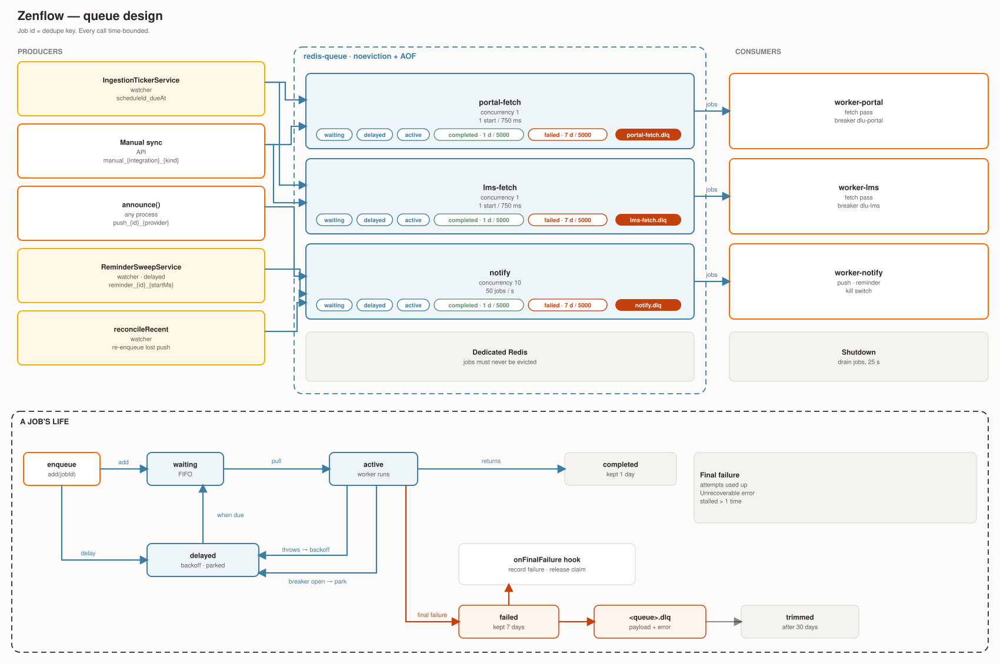
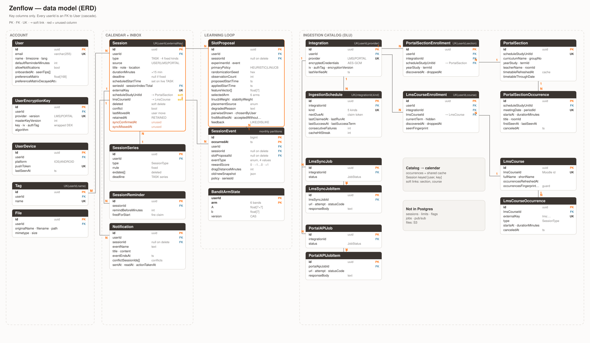

# Zenflow Architecture

Diagram-first companion to [README.md](README.md), for contributors placing a change before reading the detail.

- Conventions and invariants: [AGENTS.md](AGENTS.md)
- Per-app detail: [backend](backend/README.md), [frontend](frontend/README.md), [bandit service](services/bandit/README.md)
- Backend reference: [docs/backend/](docs/backend/)
- Sequence flows: [docs/architecture/scheduler-flows.md](docs/architecture/scheduler-flows.md)
- Decisions behind this shape: [docs/adr/](docs/adr/)
- Guided code reading (backend + bandit): [docs/architecture/backend-trace.html](docs/architecture/backend-trace.html)

## System / container view

- Students use the Web PWA or the mobile app; both call one NestJS API over REST and SSE.
- One backend image runs as several processes, picked by `ROLE` ([ADR-0011](docs/adr/0011-separate-api-worker-processes.md)):
  - `api`: HTTP only, scales by replicas, no cron.
  - `watcher`: exactly one, the only cron runner. It enqueues and consumes nothing.
  - `worker-portal`, `worker-lms`, `worker-notify`: one BullMQ queue each.
  - `all` runs everything in one process (local dev, test stack).
- All placement ranking is delegated to the Bandit service, a stateless Python process called by the API and the watcher.
- Redis is split by workload: sessions/OTP, rate limits (also the manual-sync lock), kill-switch flags, BullMQ jobs, SSE pub/sub ([ADR-0008](docs/adr/0008-redis-topology-and-kill-switch.md)). The `redis-cache` of ADR-0017 is not deployed.
- Ingestion pulls from the university's Portal, DKHP and Moodle systems; native push goes out to FCM/APNs.
- Production also runs an edge proxy and an observability stack (OTel → Tempo, Loki, Prometheus, Grafana).

## Scheduler components

- The scheduler places exactly one task, or one series, per call and touches nothing else.
- `TaskPlacementService` is the only entry `sessions/` uses. `PythonPlacer` gathers inputs, calls `POST /v1/place`, applies the moves and persists the result.
- `ExperimentService` holds the only RNG: the 50/50 policy roll and the pairwise draw.
- A frozen heuristic (`FallbackPlacer`) answers only when the Bandit service is unavailable; the response is marked degraded, never a 503.
- The Bandit service is the only ranking implementation, reached through `/v1/place` and `/v1/update`.
- Delayed reward: the first user move (API) and the 30-minute retained sweep (watcher) call `/v1/update` and persist the arm state. A nightly job decays the preference matrix.

## Ingestion and notifications components

- One rolling ticker (watcher) claims due `IngestionSchedule` rows and enqueues one fetch job each; the claim is the at-most-once guard.
- `worker-portal` / `worker-lms` run a pass: discovery first, then the timetable, exam or LMS watcher. Clients sit behind per-upstream circuit breakers; responses go to pure parsers.
- `MaterializerService` is the single writer of ingested `Session` rows. A student's own move or delete wins over upstream; a removal soft-deletes.
- The cross-student occurrence cache and fan-out are off by default.
- A materializer write creates one `Notification` row, then `announce()` fans it out twice: Redis pub/sub for live SSE, and one `notify` push job per provider.
- Reminders are delayed `notify` jobs armed by the watcher's 5-minute sweep and fired by `worker-notify`.

## Queue design

- Three queues (`portal-fetch`, `lms-fetch`, `notify`), each with a `.dlq`, on a `noeviction` + AOF Redis.
- The job id is the idempotency key; every producer call is time-bounded.
- Retries use exponential backoff; an open upstream breaker parks a job without using an attempt.

## Data model

- Source of truth is [`schema.prisma`](backend/prisma/schema.prisma); table notes are in [docs/backend/data-model.md](docs/backend/data-model.md).
- Four groups: account, calendar and inbox, learning loop (`SlotProposal`, `SessionEvent`, `BanditArmState`), DLU ingestion catalog.
