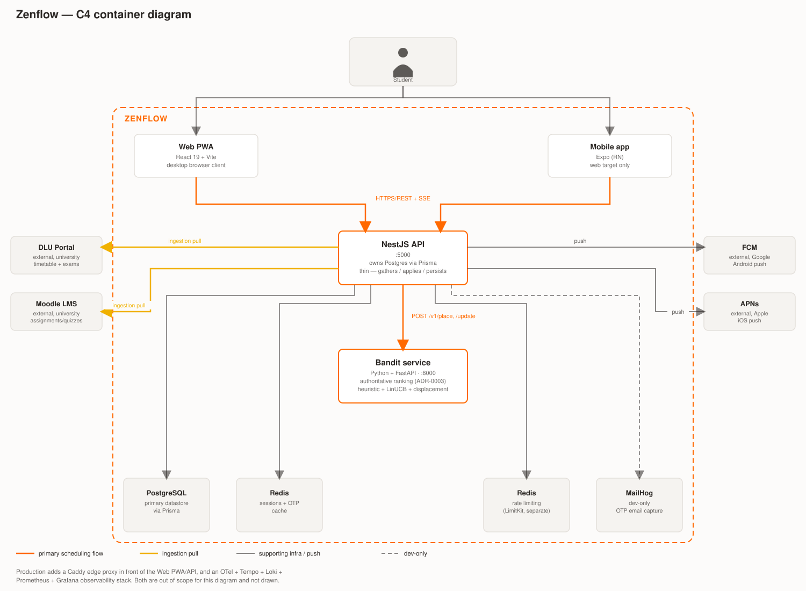
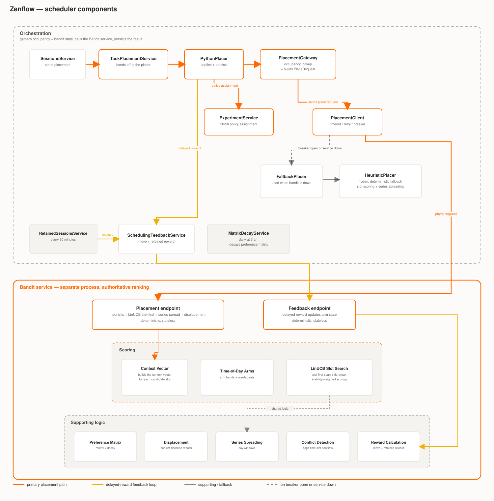
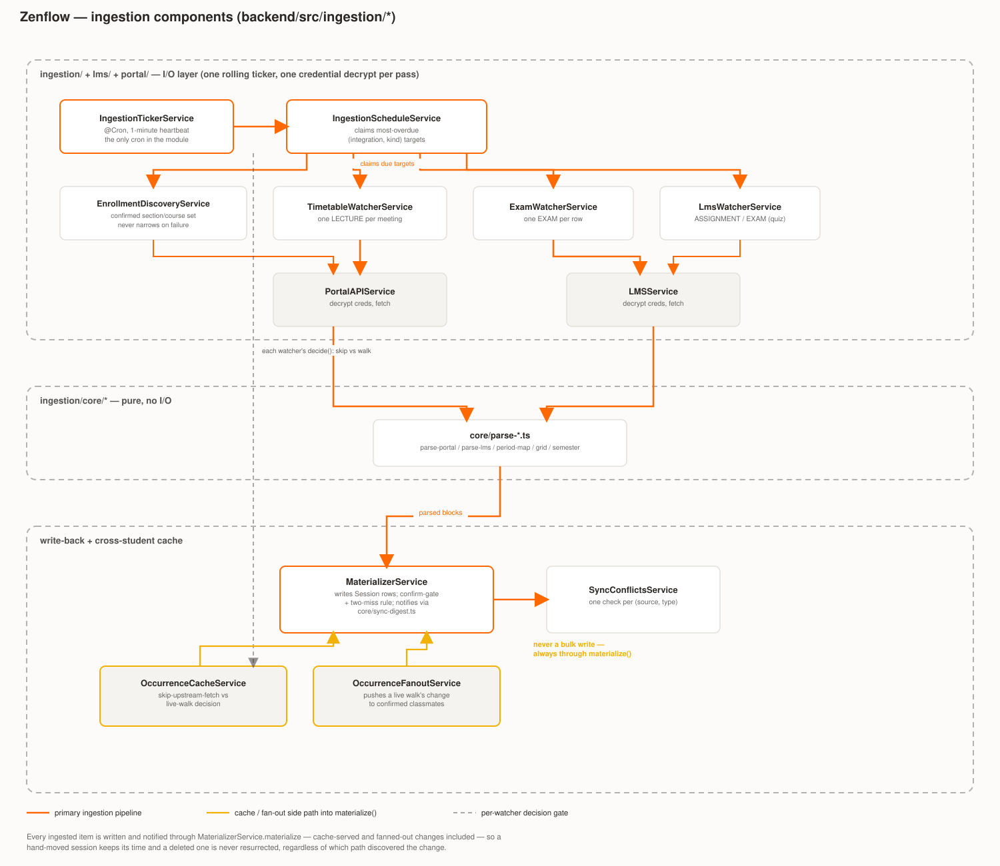

# Zenflow Architecture

This is a diagram-first companion to [README.md](README.md), [CLAUDE.md](CLAUDE.md), and the
per-app READMEs ([backend](backend/README.md), [frontend](frontend/README.md),
[services/bandit](services/bandit/README.md)). It does not duplicate their prose — it shows the
shape of the system so a new contributor can place a change before reading the detail. For the
decisions behind this shape, see [docs/adr/](docs/adr/), particularly
[ADR-0001](docs/adr/0001-linucb-model-design.md) (LinUCB model) and
[ADR-0003](docs/adr/0003-python-authoritative-placement.md) (Python-authoritative placement).

## System / container view

A student reaches Zenflow through the Web PWA or the mobile app, both talking to one NestJS API
over REST + SSE. The API is thin: it owns Postgres and the two Redis instances directly, but
delegates all placement ranking to the Bandit service (a separate, stateless Python process) and
pulls from the university's Portal/Moodle systems on ingestion. Native push goes out to FCM/APNs.
Production adds a Caddy edge proxy and an OTel/Tempo/Loki/Prometheus/Grafana observability stack;
both are omitted here as out of scope for a container-level view.

## Scheduler components

The scheduler places exactly one `TASK` (or one series) per call and never touches anything else.
`backend/src/scheduler/io/*` gathers day loads and bandit state, calls the Bandit service's
`POST /v1/place` (heuristic + LinUCB + displacement — the only ranking implementation, per
ADR-0003) and persists the result; `backend/src/scheduler/core/*` is pure calendar/preference-write
logic plus a frozen TS heuristic used only as `FallbackPlacer` when the breaker is open or Python
is down. A separate delayed-reward loop feeds `MOVE`/`RETAINED` events back to the bandit's
`POST /update`, and a daily cron decays the preference matrix independently of placement.

## Ingestion components

One rolling ticker (`IngestionTickerService`, a 1-minute heartbeat) claims due
`(integration, kind)` targets and dispatches to four watchers, which fetch through
`PortalAPIService`/`LMSService` after decrypting stored credentials, hand the response to pure
parsers, and write through `MaterializerService` — the single path that ever touches a `Session`
row, with a confirm-gate and two-miss rule guarding against one-off upstream blips. The
cross-student occurrence cache and its fan-out both feed the same `materialize()` call rather than
writing in bulk, so a hand-moved or deleted session is never silently overwritten regardless of
which student's walk (or a classmate's) discovered the change.
