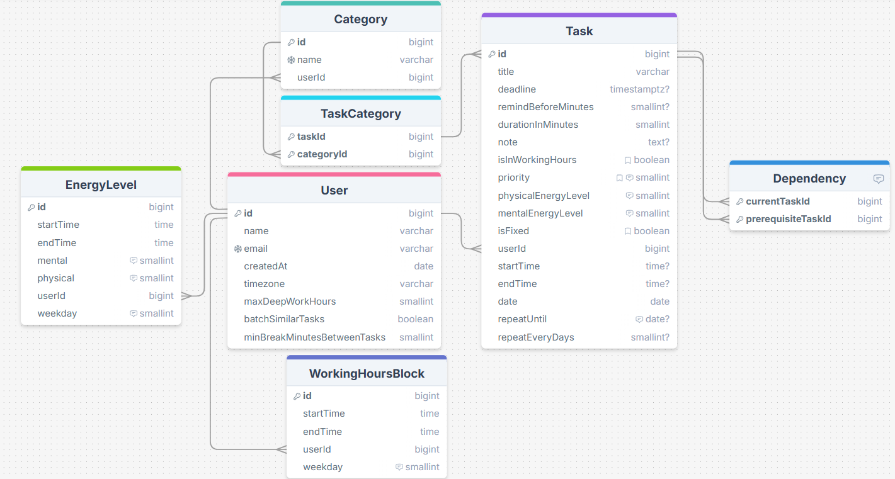

# Zenflow

## Overview

### What it is

Zenflow is a smart planner app that helps users schedule their tasks efficiently to:

- spend less time planning
- boost productivity
- maintain a healthy work-life balance

### Problem it solves

- ***Burnout and stress***: caused by overloading schedules without considering energy levels or realistic task limits.
- ***Poor time management***: users struggle to prioritize, often spending more time planning than doing.
- ***Low productivity***: high-focus tasks get scheduled during low-energy periods, leading to inefficiency and frustration.
- ***Context switching fatigue***: jumping between tasks or tools without a clear plan drains focus and mental energy.
- ***Planning fatigue***: **t**he daily overhead of figuring out what to do next wastes time and mental energy.
- ***Disruptions***: ******Sudden events or schedule changes make traditional plans useless, forcing users to re-plan their entire day.

### Solutions

- **Eliminate planning fatigue and improve time management**

    Just list your tasks and provide a few basic details (like duration, priority, and deadline). Zenflow automatically creates an optimized schedule, so you don’t have to waste time figuring out what to do and when.

- **Boost productivity by aligning tasks with your energy levels**

    Zenflow schedules mentally demanding tasks during your peak focus hours and lighter tasks during low-energy periods, helping you get more done with less mental strain.

- **Reduce context switching by grouping similar tasks**

    Tasks from the same category (e.g., emails, meetings, or design work) are grouped, allowing you to stay in flow and reduce mental friction.

- **Adapt to disruptions with real-time rescheduling**

    If a sudden event changes your day — such as a meeting running late or an unexpected errand — Zenflow will automatically re-optimize the remaining time, so you stay on track without needing manual replanning.

- **Respect fixed-time events**

    Zenflow recognizes time blocks you’ve marked as unavailable and won’t schedule tasks during those periods.

## Features

- Login with email + OTP verification
- Create, view, update (change info, mark as complete) and delete tasks
- Schedule tasks optimally
- Display events in daily, weekly, monthly and yearly views
- Add task recurrence and reminders
- Dashboard showing focus time, task completed
- Change the user’s global scheduling preferences

## Tech stack

- Frontend: React.js with PWA
- Backend: Node, NestJS, Prisma (ORM), Python (to use OR-Tools by Google)
- Database: PostgreSQL, Redis
- Testing: Jest, RTL
- Containerization: Docker
- Deployment: Digital Ocean, NGINX, Netlify
- Domain name: Cloudflare

## Database Design

### Schema

### Elaboration

- `isInWorkingHours` indicates whether the task should be scheduled within working hours blocks.
- `isFixed` indicates whether the task’s time slot is reserved
- `maxDeepWorkHours` limits the number of hours of deep work to avoid stress and burnout.
- `batchSimilarTasks` groups tasks with similar categories together to minimize context switching.
- `minutesBetweenTasks` defines the minimum minutes to take a break between two tasks.

### Constraints

- `physical` and `mental` level can range between 1 and 3, corresponding to low, medium and high.
- `duration`, `startTime` and `endTime` cannot exceed 24 hours, and must be a multiple of 5 minutes.
- `priority` can range between 1 and 3, corresponding to high, medium and low.
- No cycles should be detected in the `dependency`.
- No overlap in working hour blocks and energy levels for a single `user_id`.
- The deadline of a task should not be older than today.
- `minBreakBetweenTasksMinutes` should not exceed 60.
- `maxDeepWorkHours` should not exceed 8.