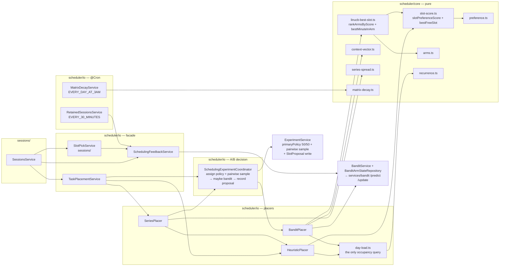
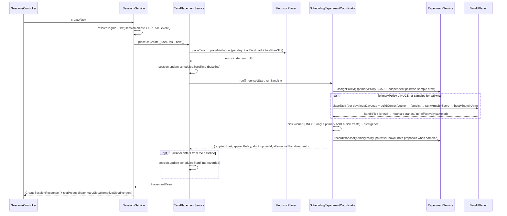
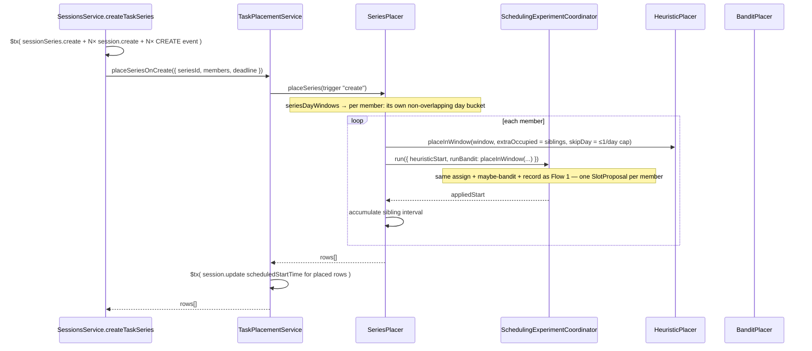

# Zenflow API (backend)

NestJS service that owns persistence, auth, file storage, and task CRUD. Part of the
[Zenflow monorepo](../README.md) — start there for the big picture and quick start.

---

## Tech stack

| Concern              | Choice                                                                                                                            |
| -------------------- | --------------------------------------------------------------------------------------------------------------------------------- |
| Framework            | NestJS 11 (Express platform)                                                                                                      |
| Language             | TypeScript 5.7 (ES2023, `nodenext`)                                                                                               |
| ORM / DB             | Prisma 6 + PostgreSQL                                                                                                             |
| Sessions &amp; cache | Redis via `ioredis` (custom `IoredisSessionStore` for sessions, `@nestjs/cache-manager` + keyv for cache/OTP)                     |
| Auth                 | Passport `local` strategy used for **email OTP** (no passwords)                                                                   |
| Scheduling/time      | `luxon`, `date-fns` / `date-fns-tz`                                                                                               |
| Validation           | `class-validator` + `class-transformer` (global `ValidationPipe`)                                                                 |
| Mail                 | `@nestjs-modules/mailer` + nodemailer + Handlebars templates                                                                      |
| Rate limiting        | [LimitKit](https://github.com/alphatrann/limitkit) (`@limitkit/core` + `nest` + `redis` + `memory`), own dedicated Redis instance |
| API docs             | `@nestjs/swagger` (served at `/api`)                                                                                              |
| Tests                | Jest (unit `*.spec.ts`, e2e via `test/jest-e2e.json`)                                                                             |
| Shared types         | `@zenflow/shared` (`workspace:*`) — the FE/BE contract                                                                            |

## Folder structure

```
backend/
├── prisma/
│   └── schema.prisma          # DB schema (client generated to ../generated/prisma)
├── src/
│   ├── main.ts                # bootstrap: global prefix /api/v1, CORS, ValidationPipe,
│   │                          #   Redis session, passport, Swagger at /api
│   ├── app.module.ts          # root module wiring
│   ├── auth/                  # OTP request/verify, Passport local strategy, guards
│   │   ├── guards/            # CookieAuthGuard (session), LocalAuthGuard (OTP login)
│   │   ├── strategies/        # local.strategy.ts (email + otp)
│   │   ├── serializers/       # session (de)serialization
│   │   └── utils/             # generate-otp, hide-email (+ *.spec.ts)
│   ├── users/                 # profile (no onboarding/preferences endpoints — see below)
│   │   └── decorators/        # @CurrentUser()
│   ├── sessions/               # session CRUD; create/deadline-edit place just the one
│   │   │                       #   TASK (or a series) — nothing else moves (see below)
│   │   ├── session-mapper.ts    # PURE — row → wire DTO / event snapshot
│   │   ├── session-events.ts    # PURE — CREATE / MOVE SessionEvent builders
│   │   ├── prisma-error.ts      # P2025 → 404 / else 500 mapper for update/remove
│   │   ├── types/session-row.ts # SessionRow (tags + series) + WITH_TAGS_AND_SERIES
│   │   └── ...
│   ├── reminders/              # per-session reminders: SchedulerRegistry timers → NotificationsService (see "Session reminders")
│   ├── scheduler/              # places ONE TASK / series — see "Scheduler architecture" below
│   │   ├── core/                # PURE algorithm — no Prisma, no clock, no randomness
│   │   │   ├── preference.ts        # matrixIndex / default+effective matrix / preferenceScoreAt
│   │   │   ├── slot-score.ts        # slotPreferenceScore (overlap-weighted) + bestFreeSlot
│   │   │   ├── linucb-best-slot.ts  # rankArmsByScore (LinUCB-only) + bestMinuteInArm (B1 nudge + stability) + fallback
│   │   │   ├── context-vector.ts    # buildContextVector() — the LinUCB d=22 feature vector (no preference-matrix input)
│   │   │   ├── arms.ts              # 5 time-of-day arm bands, armOfMinute / overlapRate
│   │   │   ├── series-spread.ts     # seriesDayWindows — non-overlapping per-member day buckets
│   │   │   ├── normalize.ts         # minMaxSigned + feature divisors
│   │   │   ├── recurrence.ts        # rrule expand / occurrence-id helpers
│   │   │   ├── matrix-decay.ts      # exponential preference-matrix decay
│   │   │   ├── slot.ts              # 15-min slot grid math, isoWeekday, overlap check
│   │   │   └── horizon.ts           # calendar math (period ceilings, calendar minutes)
│   │   ├── types/               # placement.types.ts, day-load.types.ts, context-vector.types.ts
│   │   └── io/                  # the ONLY Prisma / bandit-HTTP layer
│   │       ├── day-load.ts              # one day's occupied intervals + workload
│   │       ├── heuristic-placer.service.ts # HeuristicPlacer — placeTask / placeInWindow
│   │       ├── bandit-placer.service.ts    # BanditPlacer — per-day /predict + slot pick
│   │       ├── series-placer.service.ts    # SeriesPlacer — per-member bounded 50/50
│   │       ├── task-placement.service.ts   # TaskPlacementService — the facade sessions/ calls
│   │       ├── scheduling-feedback.service.ts # delayed LinUCB MOVE reward
│   │       ├── retained-sessions.service.ts   # @Cron: RETAINED sweep (+ delayed LinUCB +1 reward)
│   │       └── matrix-decay.service.ts        # @Cron: daily preference-matrix decay
│   ├── bandit/                 # BanditService (HTTP client for services/bandit/) +
│   │                           #   BanditArmStateRepository (per-user (A,b) load/save)
│   ├── experiments/            # ExperimentService — 50/50 policy assignment + SlotProposal
│   ├── ingestion/             # DLU LMS/portal ingestion (issues #27/#29/#30)
│   │   ├── core/               # PURE parsers — no Prisma, no clock, no randomness
│   │   │   ├── semester.ts         # resolveSemester / isoWeek(sBetween) / monthsFrom — the portal's (academicYear, semester, tuan)
│   │   │   ├── period-map.ts       # teaching periods ("tiết") → wall-clock minutes
│   │   │   ├── grid.ts             # 15-minute grid snapping (invariant #3)
│   │   │   ├── parse-lms.ts        # Moodle monthly calendar → assignment / quiz blocks
│   │   │   ├── parse-portal.ts     # timetable + exam rows → lecture / exam blocks
│   │   │   └── types.ts            # ParsedBlock / ParsedLmsItem / ParsedPortalItem / SkippedItem
│   │   ├── lms-watcher.service.ts       # @Cron EVERY_HOUR — this month + next
│   │   ├── timetable-watcher.service.ts # @Cron 03:00 — this ISO week + next
│   │   ├── exam-watcher.service.ts      # @Cron 04:00 — the whole term, one request
│   │   ├── materializer.service.ts      # the write-back: Session + Notification, idempotent
│   │   ├── ingestion-jobs.service.ts    # per-run LmsSyncJob / PortalAPIJob + item rows
│   │   ├── ingestion-sync.service.ts    # the POST /integrations/:provider/sync seam
│   │   └── watcher-support.ts           # integration paging, sleep, job-item diagnostics
│   ├── lms/                   # LMSService — fetch-based Moodle client (login → sesskey, calendar)
│   ├── portal/                # PortalAPIService — student-portal client (auth, timetable, exams)
│   ├── integrations/          # encrypted DLU credential storage + live login probe
│   ├── notifications/         # the ingestion inbox — list, read, act-on, dismiss
│   ├── devices/               # native push — POST/DELETE /devices + FCM/APNs fan-out
│   ├── files/                 # multipart upload/download to local disk
│   ├── mail/                  # login email + Handlebars templates
│   ├── prisma/                # PrismaService + Postgres error-code map
│   └── common/                # constants, utils, validators, dto, types
│       ├── redis/             # two connected `redis` clients: REDIS_CLIENT (session/OTP)
│       │                      #   and RATE_LIMIT_REDIS_CLIENT (LimitKit counters)
│       └── rate-limit/        # LimitKit wiring — see "Rate limiting" below
├── compose.{dev,staging,prod,test}.yml
├── Caddyfile.{staging,prod}
├── Dockerfile
└── .env.{dev,staging,prod,test} + docker.{dev,staging,prod,test}.env
```

**Key layering rule:** everything in `scheduler/core/` is **pure and deterministic** — no
database, no `new Date()`, no `Math.random()`; `now` is always passed in. `scheduler/io/*`
(the placers, `day-load`, the A/B facade, the feedback writer, and the two crons) is the
only layer that touches Prisma or the bandit HTTP service. Keep that split: it's what makes
the engine unit-testable and what the personalization work plugs into. The placers only ever
set `scheduledStartTime` on the session being created/edited — no existing session is moved
and no reschedule telemetry is written. Full walkthrough + diagrams:
[**Scheduler architecture**](#scheduler-architecture).

## Database schema

Defined in [`prisma/schema.prisma`](prisma/schema.prisma)

### `User`

| Field                       | Type       | Notes                                                                                                                                                                                                                                                                                                                                                                              |
| --------------------------- | ---------- | ---------------------------------------------------------------------------------------------------------------------------------------------------------------------------------------------------------------------------------------------------------------------------------------------------------------------------------------------------------------------------------- |
| `id`                        | uuid       | PK                                                                                                                                                                                                                                                                                                                                                                                 |
| `name`, `email`             | string     | `email` unique                                                                                                                                                                                                                                                                                                                                                                     |
| `timezone`                  | string     | IANA, default `"UTC"`                                                                                                                                                                                                                                                                                                                                                              |
| `lang`                      | `Language` | `VI_VN` \| `EN_US`, default `EN_US`. Not yet read by any endpoint.                                                                                                                                                                                                                                                                                                                 |
| `preferenceMatrix`          | float[]    | flat 168 signed floats (7 weekdays × 24 hours, row-major). +/−/0 = preferred/disliked/neutral. Read by the engine; decayed nightly; seeded lazily from the cold-start default. |
| `preferenceMatrixDecayedAt` | DateTime?  | last decay-cron pass; null until the first.                        |
| `onboardingComplete`        | bool       | always `true`; no onboarding flow. Unused.                         |

Per-user working-hours (`workStart`/`workEnd`/`workDays`) were dropped — the scheduler
places across the full 24h grid, every day. See [Scheduler architecture](#scheduler-architecture).

### `Session`

| Field                           | Type            | Notes                                                                                                                                                                                                                                                                                                                                                                                                                                                                                                       |
| ------------------------------- | --------------- | ----------------------------------------------------------------------------------------------------------------------------------------------------------------------------------------------------------------------------------------------------------------------------------------------------------------------------------------------------------------------------------------------------------------------------------------------------------------------------------------------------------- |
| `id`                            | uuid            | PK                                                                                                                                                                                                                                                                                                                                                                                                                                                                                                          |
| `title`, `note`                 | string          | `note` is rich text (TipTap)                                                                                                                                                                                                                                                                                                                                                                                                                                                                                |
| `location`                      | string?         | free-text room/building; DLU watchers write the upstream room here. Not read by the scheduler. |
| `durationMinutes`               | int             | always a positive multiple of 15.                                 |
| `deadline`                      | DateTime?       | set for `TASK`, null for fixed types. Placement ordering key.     |
| `tags`                          | `Tag[]`         | implicit m2m (per-user labels).                                   |
| `type`                          | `SessionType`   | `TASK` (engine-placed) \| `ASSIGNMENT` \| `EXAM` \| `LECTURE` \| `DND` (user-pinned). |
| `source`                        | `SessionSource` | `USER` \| `LMS` \| `PORTAL`.                                      |
| `conflict`                      | bool            | overlaps another interval, or unplaced. Overlap is accepted — nothing auto-relocates. |
| `scheduledStartTime`            | DateTime?       | engine placement (`TASK`) / client instant (fixed); null while unplaced. |
| `lastMovedAt` / `retainedAt`    | DateTime?       | move-or-keep bookkeeping (ADR-0002 §2.1).                         |
| `userId`                        | uuid            | FK → `User`, cascade.                                             |
| `seriesId`                      | uuid?           | FK → `SessionSeries`, cascade. Set for a recurring fixed representative and every sitting of a `sessionCount > 1` `TASK` series. |
| `sessionIndex` / `sessionTotal` | int?            | 1-based position / total within a `TASK` series (denormalized).   |
| `externalKey`                   | string?         | upstream DLU item id (`"<source>:<kind>:<id>"`); null for user sessions. Unique per `[userId, externalKey]` — the ingestion idempotency guard. |

Indexes: `[userId, deadline]`, `[userId, scheduledStartTime]`,
`[userId, seriesId, createdAt asc]`; unique `[userId, externalKey]`.

### `SessionReminder`

| Field                 | Type      | Notes                                                                                                   |
| --------------------- | --------- | ------------------------------------------------------------------------------------------------------- |
| `id`                  | uuid      | PK; the timer is named `reminder:<id>` in `SchedulerRegistry`.                                          |
| `remindBeforeMinutes` | int       | 0…10080 (0 = at start) (`MAX_REMINDER_MINUTES`).                                                                       |
| `firedForStart`       | DateTime? | start of the occurrence last fired for — dedupes across restarts/re-arms; per-occurrence for a series. |
| `sessionId`           | uuid      | FK → `Session`, cascade. At most 2 per session (`MAX_REMINDERS_PER_SESSION`); never on `DND`.          |

### `SessionEvent` (append-only audit trail — the ML fuel)

| Field                         | Type               | Notes                                                         |
| ----------------------------- | ------------------ | ------------------------------------------------------------- |
| `id`                          | BigInt             | autoincrement (serialized as decimal string over the wire)    |
| `eventType`                   | `SessionEventType` | `CREATE` \| `MOVE` \| `RESIZE` \| `RETAINED`                  |
| `oldSnapshot` / `newSnapshot` | Json               | `{ scheduledStartTime, durationMinutes, tags }`               |
| `rewardScore`                 | float              | LinUCB reward signal (default 1.0)                            |
| `occurredAt`                  | DateTime           | indexed desc per user                                         |
| `sessionId` / `userId`        | uuid               | FKs, cascade delete (`userId` denormalized for range queries) |

### `Tag`

Per-user label in an implicit many-to-many with `Session`.

| Field       | Type     | Notes                                        |
| ----------- | -------- | -------------------------------------------- |
| `id`        | uuid     | PK                                           |
| `name`      | string   | unique per user (`@@unique([userId, name])`) |
| `userId`    | uuid     | FK → `User`, `onDelete: Cascade`             |
| `createdAt` | DateTime |                                              |

The wire format is `Session.tags: string[]` of names; the backend upserts unknown names
per-user inside the task transaction. The `Tag` table is a backend detail.

### `File`

`id`, `originalName`, `filename`, `path`, `mimetype`, `size`, `userId` (cascade).

### `UserDevice`

`id`, `platform` (`IOS` \| `ANDROID`), `pushToken` (**unique** — the raw FCM/APNs token,
the natural key), `lastSeenAt`, `userId` (cascade). One row per (device, provider);
registration upserts on `pushToken`. See `devices/` and `POST /devices`.

### DLU ingestion tables

| Table                               | Purpose                                                                                                                                                                                                                                                                                                                              |
| ----------------------------------- | ------------------------------------------------------------------------------------------------------------------------------------------------------------------------------------------------------------------------------------------------------------------------------------------------------------------------------------ |
| `LmsCourse`                         | A Moodle course from the LMS calendar response's `course` block. Deduped on `lmsCourseId` (Moodle `course.id`).                                                                                                                                                                                                                      |
| `PortalSection`                     | One student-portal course section — curriculum unit × term × group × teacher × room. Deduped on `scheduleStudyUnitId`; indexed `[yearStudy, termId]`, the access path for a whole-term refresh.                                                                                                                                      |
| `LmsSyncJob` / `LmsSyncJobItem`     | Per-run tracking for the LMS watcher; one item per request (`url`, `attempt`, `statusCode`, `responseBody` kept for diagnosis).                                                                                                                                                                                                       |
| `PortalAPIJob` / `PortalAPIJobItem` | Same shape for the portal poller.                                                                                                                                                                                                                                                                                                   |
| `Notification`                      | Raised by the materializer for a new/changed/removed ingested item. `kind` (`NEW`\|`CHANGE`\|`DROP`), `eventEndsAt` (due/at time; null for grouped rows and drops), `sessionId` (target session). Topics `ASSIGNMENT`\|`EXAM`\|`TIMETABLE`\|`REMINDER`; a term of lectures is one `TIMETABLE` row. |

`LmsCourse` and `PortalSection` are deliberately never joined — no shared identifier, and
each ingestion path uses only its own system's data.

> **Session model.** A `POST /sessions` creates one `Session`, or — for a `TASK` with
> `sessionCount > 1` — a materialized series of N rows sharing a `seriesId`. A recurring
> fixed session (`DND` / `ASSIGNMENT` / `EXAM` / `LECTURE` with an `rrule`) is a virtual
> series: one `SessionSeries` + one representative row, fanned out into occurrences at read
> time. See invariant #4 in [CLAUDE.md](../CLAUDE.md) and
> [ADR-0002](../docs/adr/0002-scheduling-simplification.md) §2.4.

## DLU ingestion

Pulls a student's Moodle assignments/quizzes, class timetable and exam schedule onto their
calendar. **API-only** — the LMS and the portal both expose JSON, so there is no crawling,
no HTML scraping and no headless browser anywhere in the image.

Same layering rule as the scheduler: `ingestion/core/*` is **pure** (no Prisma, no
`new Date()`, no randomness — `now` and the timezone are always parameters), and only the
HTTP clients in `lms/` and `portal/` do I/O.

### Clients

| Call                                                                   | Endpoint                                                                                                                                                                                                                                                                                                                                                                    |
| ---------------------------------------------------------------------- | --------------------------------------------------------------------------------------------------------------------------------------------------------------------------------------------------------------------------------------------------------------------------------------------------------------------------------------------------------------------------- |
| `LMSService.login(username, password)`                                 | 4 steps: `GET /login/index.php` (scrape `logintoken`) → `POST /login/index.php` (`redirect: "manual"`; Moodle **regenerates** `MoodleSession`, so the cookie on _this_ response is the authenticated one) → `GET /my/` → `sesskey` out of the inline `M.cfg`. Returns `{ ok: false, reason: "INVALID_CREDENTIALS" }` for a rejected password; throws only on a real outage. |
| `LMSService.fetchMonthlyView(session, year, month)`                    | `POST /lib/ajax/service.php?sesskey=…&info=core_calendar_get_calendar_monthly_view`. `month` is 1-based.                                                                                                                                                                                                                                                                    |
| `PortalAPIService.authenticate(username, password)`                    | `POST /api/authenticate/authpsc` → `Token`.                                                                                                                                                                                                                                                                                                                                 |
| `PortalAPIService.fetchTimetable(token, academicYear, semester, tuan)` | `GET /api/student/DrawingStudentSchedules` — one ISO week of meetings.                                                                                                                                                                                                                                                                                                      |
| `PortalAPIService.fetchExams(token, academicYear, semester)`           | `GET /api/student/exam` — a whole term.                                                                                                                                                                                                                                                                                                                                     |

`sesskey` is a per-session CSRF token Moodle renders into the page body (`M.cfg`, hidden
inputs, printed URLs) — never a cookie, never a header, which is why it is invisible in the
Network tab. It is bound to `MoodleSession` and rotates with it, so it is held in a local
variable for one watcher run and never cached. Portal calls carry
`Authorization: Bearer <token>`, `Clientid: vhu` and `Apikey` (from `PORTAL_API_KEY`; never
hardcoded, never logged). Timeouts come from `LMS_TIMEOUT_MS` / `PORTAL_API_TIMEOUT_MS`.

### Parsers (`ingestion/core/`)

- **`semester.ts`** — the portal is addressed by academic coordinates, not dates.
  `resolveSemester(now, tz)` → `{ academicYear, semester, startDate, endDate }`. Term
  boundaries are **weeks**, never month ends, so a `tuan` is never split across two terms:
  HK01 opens the last week of July, HK02 the last week of December, HK03 the last week of
  May, and HK03 closes on the week before the next HK01 (`academicYear` only rolls there).
  The term is resolved `SEMESTER_LOOKAHEAD_WEEKS` (2) ahead of `now`, so the watchers move
  onto a new term a fortnight before it opens and nobody sees an empty calendar on day one —
  `startDate` is then legitimately in the future. `isoWeek(date, tz)` → one `tuan`;
  `isoWeeksBetween(from, to, tz)` → every `tuan` in a window, walking the calendar a Monday
  at a time because the numbers wrap 52/53 → 1 inside HK02.
- **`period-map.ts`** — the timetable never returns clock times, only teaching periods.
  1–4 = 07:30–11:10 (20-min break after 2), 7–10 = 13:00–16:30 (10-min break after 8),
  11–14 = 16:40–20:00. **Periods 5–6 are undocumented**, so any span touching them returns
  `null`, the row is skipped, and the reason is returned for the job item — guessing would
  silently put a class on the calendar at the wrong hour.
- **`grid.ts`** — DLU times are routinely off-grid (a 4-period lecture is 220 minutes; the
  evening block starts at 16:40), so every block is snapped **outward** (start down, end up)
  to keep invariant #3: 07:30–11:10 ⇒ 07:30 + 225 min, 16:40–20:00 ⇒ 16:30 + 210 min.
- **`parse-lms.ts`** — keeps `assign` and `quiz` events that sort after `now`; `attendance`
  is explicitly excluded. Moodle's `timestart` **is already a real Unix epoch** — never
  re-zone it into VN time. A quiz emits **two events sharing one `instance`**
  (`eventtype: "open"` / `"close"`) with different event ids, so quizzes are grouped by
  `instance`, which is also the `externalKey` identity (an event id changes when a teacher
  re-creates a due date). Window ≤ 200 min ⇒ one contiguous `EXAM` block; longer, or a lone
  `close`, ⇒ a 15-minute reminder before the close; a lone `open` is skipped (its close
  arrives in the next month's fetch — which is why two months are fetched).
- **`parse-portal.ts`** — timetable rows become one `LECTURE` per meeting; exam rows parse
  `NgayThi` (`dd/MM/yyyy`), `GioThi` (`"07g30"` — `g` for _giờ_) and `ThoiLuong` (minutes,
  rounded up to a multiple of 15). Wall-clock → UTC always goes through
  `common/utils`' `minutesToUtc`, never hand-rolled timezone math.

`externalKey` is what makes a re-run idempotent (`@@unique([userId, externalKey])`):
`lms:assign:<instance>`, `lms:quiz:<instance>`, `portal:meeting:<WeekScheduleID>`,
`portal:exam:<Examination>`.

### Watchers (the three crons)

Same house shape as the scheduler's crons (`scheduler/io/matrix-decay.service.ts`): a thin
`@Cron` delegating to a testable `run(now = new Date(), userId?)` that takes its clock as a
parameter. `userId` narrows the sweep to one student — that is the manual sync endpoint,
running the _same_ code rather than a second path that could drift.

| Service                        | Cron               | Requests per student per run                                                                                                  |
| ------------------------------ | ------------------ | ----------------------------------------------------------------------------------------------------------------------------- |
| `lms-watcher.service.ts`       | `EVERY_HOUR`       | 2 — the current month and the next (a quiz opening on the 30th and closing on the 2nd is only a complete pair in one of them) |
| `timetable-watcher.service.ts` | `EVERY_DAY_AT_3AM` | ≤ 22 — every ISO week left in the resolved `(academicYear, semester)`, from the current week to the term's last               |
| `exam-watcher.service.ts`      | `EVERY_DAY_AT_4AM` | 1 — `/api/student/exam` returns a whole term                                                                                  |

The LMS gets the hourly slot because a deadline can be published or moved at any time; a
timetable and an exam schedule change a handful of times a term, so polling them hourly
would be almost entirely wasted requests. The timetable trades width for that low frequency:
one daily run walks the rest of the term rather than just the next fortnight, so a student
who looks months ahead sees real classes, and a mid-term room or time change still lands.
The sweep shrinks by a week every week. Every run gates on `INGESTION_ENABLED` first.

Each run: page the `Integration` rows for the provider (cursor-paginated, 50 at a time),
process students **sequentially** with a fixed `INGESTION_REQUEST_DELAY_MS` pause between
outbound requests, decrypt via `IntegrationsService.revealCredentials`, **log in once** and
reuse the session/token for the whole run, then parse, upsert the course catalog
(`LmsCourse` by `lmsCourseId`, `PortalSection` by `scheduleStudyUnitId`) and hand the blocks
to the materializer. Politeness is deliberately this trivial — no queue, no rate limiter, no
circuit breaker; those are deferred and the layering is shaped so they land additively.

Portal wall-clock strings are converted using the student's own `User.timezone`, falling
back to `DLU_TZ`; the academic coordinates (`academicYear`, `semester`, `tuan`) are always resolved in
`DLU_TZ`, since they are a property of the university's calendar rather than the student's.

**Job tracking.** One `LmsSyncJob` / `PortalAPIJob` per student per run
(`PENDING → PROCESSING → COMPLETED | FAILED`) tied to the `Integration`, and one `*JobItem`
per outbound request (`url`, `attempt`, `statusCode`, `responseBody`). An item is written
`PROCESSING` _before_ the request, so a process killed mid-flight leaves evidence of which
call hung. `responseBody` holds `{ body, skipped, error? }` — the raw upstream payload plus
the parser's `SkippedItem[]`, because "this payload produced nothing" is a bug report while
"…_because periods 5–6 are undocumented_" is an answer. A failed item stays `FAILED` and the
run continues; only a **login** failure fails the job, because without a session there is no
request to attach the failure to. These rows are not mere diagnostics: they are what
`IntegrationStatus.lastSyncedAt` / `.lastSyncStatus` are derived from.

Nothing wraps N writes in one interactive `$transaction` — `PrismaService` sets a 20s
timeout and warns about exactly that; every item is its own small transaction.

### Write-back (`materializer.service.ts`)

An ingested item lands on the calendar **and** raises a notification, whose call to action
is "plan work around this", not "confirm this item" — it already exists upstream.

- **Session** — inserted through `sessions/fixed-session-writer.ts`'s `insertFixedSession`,
  the same insert `SessionCrudService` uses for a user-pinned fixed session, so `source`,
  `externalKey` and the `CREATE` `SessionEvent` cannot drift between the two paths. The HTTP
  DTO is not reusable here: `CreateSessionDto` has no `source` field and sits behind
  `forbidNonWhitelisted`. `ParsedBlock.location` is written straight to the `Session.location`
  column; an ingested fixed session carries no `note` (the portal exam format `HinhThucThi`
  is dropped on parse).
- **Idempotent** on `[userId, externalKey]`, so an hourly re-run of the same window is a
  no-op; `P2002` is the race signal for two runs overlapping on one item.
- **Never clobbers a student's edit.** If the row has `lastMovedAt != null`, an upstream
  change does not overwrite it — the session is left exactly as they left it and a
  `TIMETABLE` notification says the two now disagree (#30's open question, resolved in the
  student's favour). That warning is deduplicated on its content, which embeds the upstream
  instant, because unlike a normal change this disagreement never resolves itself; a
  _further_ upstream move still speaks up.
- **Follows** an upstream change on a session the student never touched — without writing a
  `SessionEvent` and without setting `lastMovedAt`. Both mean "the user did this", and
  fabricating one would feed the LinUCB reward signal a move nobody made.
- **A quiet re-run is quiet**: notifications are raised only for genuinely new, changed or
  removed items.
- **Every row is categorised and time-stamped.** `raise()` stamps a `kind` (`NEW` for a
  fresh calendar item, `CHANGE` for an upstream edit, `DROP` for a removal — the inbox
  badge) and, for a per-item assignment/exam/lecture, an `eventEndsAt` (its
  `scheduledStartTime + durationMinutes`, the "due"/"at" time the inbox shows). Grouped and
  dropped rows leave `eventEndsAt` null. User-facing copy says **"semester 1/2/3"**
  (`termLabel`), never the portal's `HK0x`.
- **A term's timetable is one notification.** Lecture creates/updates are held back and
  folded into a single per-term row: once ≥ 10 lectures are on the calendar for the term it
  is `"Timetable for semester 1 is available"` (raised once, then deduplicated on its title
  so the ~20 weekly batches of a first-of-term sync do not each mint one), and its
  `sessionId` is the earliest meeting so the row still lands the calendar on the term.
  Below the threshold it lists the class names (`"New lectures: A, B, C +2 more"`).
  Assignments and exams stay one notification each — those are individually actionable.
- **Handles upstream deletion** (`reconcileDeleted`). Each watcher accumulates every
  `externalKey` it saw across its whole run and, **only if every fetch succeeded**, hands
  them here; any ingested `(source, type)` session that starts inside the run's forward
  window (term end for the portal, the last fetched month for the LMS) but is not in that
  set has been dropped upstream — a cancelled class, a withdrawn exam, a deleted assignment
  — and is deleted (no `SessionEvent`; the `Notification` FK is `SetNull`). The removal
  notification groups exactly like a creation does for lectures, one-per-item for
  assignments/exams. A session the student had hand-moved is kept (invariant #2) with a
  single deduplicated "removed at DLU" warning instead.

## API endpoints

Global prefix `**/api/v1**`. All routes except `POST /auth/otp/*` require
`CookieAuthGuard` (a valid Redis session cookie). Success responses use the
`@zenflow/shared` envelope `{ success: true, message?, data }`; errors use
`{ success: false, message, statusCode?, field? }`.

### Auth (`/auth`)

| Method | Path                | Purpose                                                                                                               |
| ------ | ------------------- | --------------------------------------------------------------------------------------------------------------------- |
| POST   | `/auth/otp/request` | email a 6-digit OTP (no guard; rate-limited)                       |
| POST   | `/auth/otp/verify`  | verify, create user if new, start session. Reads `x-timezone`. (`LocalAuthGuard`; rate-limited) |
| GET    | `/auth/me`          | current user                                                       |
| POST   | `/auth/logout`      | destroy session                                                    |

### Users (`/users`)

| Method | Path                          | Purpose                                                                                                                                            |
| ------ | ----------------------------- | -------------------------------------------------------------------------------------------------------------------------------------------------- |
| GET    | `/users/me`                   | profile                                                            |
| PATCH  | `/users/update/basic-info`    | update name/email                                                  |
| GET    | `/users/me/preference-matrix` | the 168-float preference matrix for the Insights heatmap (`PreferenceMatrixResponse`). |

No onboarding or preferences-update endpoint. `timezone` is captured once at OTP signup
(`x-timezone` header) and never edited after.

A brand-new signup also seeds 4 daily-recurring `DND` blocks (Breakfast 06:00–07:00, Lunch
11:00–13:00, Evening 17:00–19:00, Sleep 22:00–06:00) via the normal `DND` + `rrule` path,
so the scheduler avoids them from day one. Best-effort — a failure is logged and swallowed.

### Sessions (`/sessions`)

`@Controller("sessions")` — no `/tasks` route. Drag, resize and reschedule are all one
`PATCH /sessions/:id` (recorded as a `MOVE` signal). No status/completion, `/reschedule`,
`/resize`, `/optimize` or `/undo`.

`POST` and `PATCH` accept `reminders?: number[]` (minutes before start, max 2 distinct ints in
0…10080 (0 = at start), not for `DND`); every `Session` response carries `reminders: number[]` (descending;
`[]` for DND). On create, omitted → one default reminder at 60 min (non-DND), `[]` → none. On
PATCH, omitted → unchanged, an array replaces. On a materialized `TASK` series the list applies
to every sitting; on a recurring fixed occurrence id it edits the series' representative (so
all occurrences). Violations → 400.

| Method | Path                                         | Purpose                                                                                                                                                                                                                                                                                                                                                                                                          |
| ------ | -------------------------------------------- | ---------------------------------------------------------------------------------------------------------------------------------------------------------------------------------------------------------------------------------------------------------------------------------------------------------------------------------------------------------------------------------------------------------------- |
| POST   | `/sessions`                                  | Create. A `TASK` → its best free slot (or, `sessionCount > 1`, a materialized series across `now…deadline`); a fixed/`DND` session at the given `scheduledStartTime` + optional `rrule`. Never displaces. |
| GET    | `/sessions?view=&date=`                      | List the `day`/`week`/`month` window + unplaced. Recurring series fanned to virtual rows. |
| GET    | `/sessions/suggestions?q=&limit=`            | Title autocomplete (newest first, deduped by normalized title — a series' sittings, or a re-created title, collapse to the most recent). `limit` 1–50, default 10. |
| GET    | `/sessions/deadline-options?anchor=`         | The six deadline quick-chip instants relative to `anchor`.        |
| GET    | `/sessions/:id`                              | Detail. Recurring occurrence id: `"<seriesId>::<startISO>"` (URL-encoded). |
| PATCH  | `/sessions/:id`                              | `UpdateSessionDto` — metadata, drag/resize, `rrule`, `sessionCount`. `scope` + `skipConflicting` narrow a series change; `sessionCount` grows/shrinks a `TASK` series (or promotes a plain `TASK` into one); may return `sessions[]` + `skippedSessionIds`. |
| DELETE | `/sessions/:id`                              | Delete one; on an occurrence id, add the date to `exdates`. Returns `{ id }`. |
| DELETE | `/sessions/series/:seriesId`                 | Delete the whole series.                                          |
| DELETE | `/sessions/series/:seriesId/truncate?from=`  | Recurring series only — pull the rrule's `UNTIL` back to just before `from` ("this and following").                                                                                                                                                                                                                                                                                                              |
| DELETE | `/sessions/series/:seriesId/from/:sessionId` | Materialized `TASK` series only — delete that sitting and every later one by `sessionIndex`; earlier sittings kept.                                                                                                                                                                                                                                                                                              |
| POST   | `/sessions/:id/slot-pick`                    | `{ slotProposalId, chose: "primary" \| "alternative" }` — records which side of a pairwise-sampled `SlotProposal` the user picked (`pairwiseShown` events only); `"alternative"` applies that start as an ordinary `MOVE`. Idempotent, best-effort — never blocks the flow. See [LinUCB scheduling](#linucb-scheduling-ab-experiment). |

### Tags (`/tags`)

| Method | Path    | Purpose                                                                                 |
| ------ | ------- | --------------------------------------------------------------------------------------- |
| GET    | `/tags` | list the current user's tags (`{ tags: { id, name }[] }`, name-sorted) for the combobox |

### Files (`/files`)

`POST /files/upload` (multipart, ≤100 MB × 5), `POST /files/remove`,
`GET /files/metadata/:id`, `GET /files/:id` (download stream).

### Integrations (`/integrations`)

Stores a student's DLU LMS / student-portal login for the ingestion watcher.
`CookieAuthGuard` + `@CurrentUser()`, own rows only. Credentials are never returned —
only connection status. Types in `@zenflow/shared` (`ConnectIntegrationInput`,
`IntegrationStatus`, `IntegrationStatusListResponse`).

| Method | Path                           | Purpose                                                                                                                                                                                                                                                                                                                                                                                                                                        |
| ------ | ------------------------------ | ---------------------------------------------------------------------------------------------------------------------------------------------------------------------------------------------------------------------------------------------------------------------------------------------------------------------------------------------------------------------------------------------------------------------------------------------- |
| POST   | `/integrations`                | Connect. Body `{ provider, username, password }`. Live-login probe first (`400` rejected / `503` unreachable, no write), then encrypt + upsert. |
| GET    | `/integrations`                | `[{ provider, connected, lastVerifiedAt, lastSyncedAt, lastSyncStatus }]` — the sync pair comes from the newest job row. |
| PATCH  | `/integrations/:provider`      | Update credentials. Body `{ username?, password? }`. Same probe-then-write. |
| DELETE | `/integrations/:provider`      | Disconnect. Idempotent; keeps the `UserEncryptionKey`.              |
| POST   | `/integrations/:provider/sync` | Run this student's watchers now. `404` if not connected. Returns that provider's `IntegrationStatus`. |

### Notifications (`/notifications`)

The ingestion inbox — written by the materializer, never a client (no create route).
`CookieAuthGuard` per route, own rows only. Types: `NotificationTopic`, `NotificationKind`,
`NotificationDto`, `NotificationsListResponse`. Each row has a `kind` (`NEW`/`CHANGE`/`DROP`)
and, for a per-item assignment/exam/lecture, an `eventEndsAt` (the "due"/"at" time; null for
grouped rows and drops).

| Method | Path                              | Purpose                                                     |
| ------ | --------------------------------- | --------------------------------------------------------- |
| GET    | `/notifications?limit=&offset=`   | One page, newest first. `unreadCount` counts the whole inbox. |
| PATCH  | `/notifications/:id/read`         | Stamp `readAt`. Idempotent; `404` if not the caller's.   |
| PATCH  | `/notifications/:id/action-taken` | Stamp `actionTakenAt` (distinct from read). Idempotent.  |
| DELETE | `/notifications/:id`              | Dismiss (hard delete, caller-scoped).                    |
| POST   | `/notifications/dev/raise`        | **Dev only** (`404` when `NODE_ENV=production`), no guard. Body `{ userId, count? }` — raises fake rows in-process so the SSE stream + push fire. Driven by `scripts/send-test-notification.ts`. |

The live channel is SSE — see [Live notifications](#live-notifications-sse).

### Devices (`/devices`)

Native-push device registry. `CookieAuthGuard`; no list route. Types: `RegisterDeviceInput`,
`UnregisterDeviceInput`, `PushDataPayload`.

| Method | Path       | Purpose                                                                          |
| ------ | ---------- | ------------------------------------------------------------------------------- |
| POST   | `/devices` | Register/refresh. Body `{ platform, pushToken }`. Upserts on `pushToken` (idempotent). |
| DELETE | `/devices` | Unregister by token. Body `{ pushToken }`. Idempotent, caller-scoped.          |

`PushService` subscribes to `NotificationsService.notificationEmitter` (alongside the SSE
stream) and fans each notification out via `FcmSender` (Android) / `ApnsSender` (iOS). Both
self-disable when their env is unset (`FCM_SERVICE_ACCOUNT`; the four `APNS_*`). Dead tokens
(FCM `registration-token-not-registered`, APNs `410` / `Unregistered` / `BadDeviceToken`)
are pruned on send.

### Live notifications (SSE)

`GET /notifications/stream` — `@Sse`, `text/event-stream`, cookie-auth. The materializer
emits on `NotificationsService.notificationEmitter`; the stream forwards each new
`NotificationDto` for the current user. Used by the web bell for live updates; mobile
consumes it for foreground delivery.

`notificationEmitter` is a plain in-process `EventEmitter2` — a separate Node process (a
standalone script, another instance) that emits on its own copy reaches no SSE client here.

To exercise the inbox + stream + push without a DLU sync or cron changes, with
`start:dev` already running:

```bash
pnpm --filter backend exec ts-node scripts/send-test-notification.ts <userId> [count]
```

It `POST`s to the dev-only `/notifications/dev/raise`, which writes real `Notification`
rows and emits `NEW_SESSION` **inside the running server**, so the SSE stream and
`PushService` both fire. Set `API_URL` if the server isn't on `:5000`.

`IntegrationAuthService` only does a pass/fail probe; parsing belongs to `ingestion/core/`.
The probe's return/throw split is what produces the two status codes: it returns `false`
when DLU answers and **rejects** the credentials (`400`), and throws only when DLU is
unreachable or answers incomprehensibly (`503`). `LMSService.login` therefore reports a
wrong password as `{ ok: false, reason: "INVALID_CREDENTIALS" }` rather than throwing.

Full live schema: **Swagger UI at `<API_URL>/api`**.

## Local development

**Prerequisites:** [Docker](https://docs.docker.com/get-docker/) (with Compose) and
Node 20+ with pnpm `10.32.1` (see the root [CLAUDE.md](../CLAUDE.md) toolchain section).

Step by step, from a clean checkout:

```bash
# 1. Install workspace deps + build @zenflow/shared (repo root, once)
pnpm install && pnpm shared:build

# 2. Bootstrap Postgres/Redis (x2 — session/OTP + rate-limit)/MailHog in the
#    background (from backend/)
docker compose -f compose.dev.yml up -d

# 3. Apply the Prisma schema to the dev DB
pnpm prisma:dev:migrate

# 4. Start the API in watch mode
pnpm start:dev            # http://localhost:5000, Swagger at /api
```

Other backend scripts (run inside `backend/`, or `pnpm --filter backend <script>`):

```bash
pnpm typecheck           # tsc --noEmit
pnpm lint                # eslint --fix
pnpm test                # jest unit tests (*.spec.ts)
pnpm test:e2e            # jest e2e (needs .env.test DB)

# Prisma (dev DB via .env.dev):
pnpm prisma:dev:studio   # browse the DB
pnpm prisma:gen:dev      # regenerate the Prisma client → ../generated/prisma
```

### Environment

`.env.{dev,staging,prod,test}` hold app config; the matching `docker.{dev,staging,prod,test}.env`
holds Postgres credentials for that Compose file. Required app vars (validated at boot via
`@hapi/joi`):

Copy `.env.example` to `.env.{dev,staging,prod,test}`:

```bash
cp .env.example .env.dev # same for .env.staging, .env.test, .env.prod
```

DLU ingestion config (all validated with defaults, so a deployment that omits them still
boots): `LMS_URL` / `PORTAL_API_URL` (upstream base URLs — read with `getOrThrow` at
service construction, which is why they must always resolve), `LMS_TIMEOUT_MS` (15000) /
`PORTAL_API_TIMEOUT_MS` (10000) per-request timeouts, `DLU_TZ` (`Asia/Ho_Chi_Minh` — the
timezone the upstream wall-clock strings are in, not the user's), and `INGESTION_ENABLED`
(kill switch for the watcher crons; `false` in `.env.test` so a test run can never reach
DLU) and `INGESTION_REQUEST_DELAY_MS` (750; the fixed pause between a watcher's outbound
requests — the entirety of the baseline's politeness policy, so it is config rather than a
constant; `0` in `.env.test`). `PORTAL_API_KEY` stays required with no default.

`BANDIT_SERVICE_URL` (optional, dev `http://localhost:8100`) points at the stateless Python
bandit service (`services/bandit/`). When unset, LinUCB scheduling is disabled and every
scheduling event falls back to the heuristic.

Native push config (all optional, each provider self-disables when its vars are unset —
same pattern as `BANDIT_SERVICE_URL`; unset in `.env.test`): `FCM_SERVICE_ACCOUNT` (base64
of the Firebase service-account JSON) enables Android/FCM; `APNS_KEY` (base64 of the `.p8`
auth key) + `APNS_KEY_ID` + `APNS_TEAM_ID` + `APNS_BUNDLE_ID` (+ `APNS_PRODUCTION`, default
`false`) enable iOS/APNs. A VAPID-style `_V<n>` suffix is deliberately absent — rotating
either credential just forces the mobile app to re-register, it is not a decrypt-old-rows
concern.

## LinUCB scheduling (A/B experiment)

`docs/adr/0001-linucb-model-design.md` + `docs/scheduler/{reranking,ab-testing}.md`, and
the [Scheduler architecture](#scheduler-architecture) walkthrough below. On `POST /sessions`
(a single `TASK`) and a `TASK` deadline change, `TaskPlacementService` places the one
session via `HeuristicPlacer.placeTask`, then hands the A/B decision to
`SchedulingExperimentCoordinator`, which calls `ExperimentService.assignPolicy()` for a 50/50
`primaryPolicy` **and** an independent `PAIRWISE_SAMPLE_RATE` (20%) pairwise-sample draw:

- **HEURISTIC, not sampled** (the common case) — keep the heuristic placement; the bandit
  never runs; record a `SlotProposal` with `modelProposal` null, `pairwiseShown` false.
- **LINUCB** — `BanditPlacer.placeTask()` builds one `d=22` context vector per candidate day
  (`core/context-vector.ts` — the preference matrix isn't an input feature at all), calls
  the bandit service `/predict` once, then picks a slot in two steps
  (`core/linucb-best-slot.ts`, Item 3B2):
  `rankArmsByScore` ranks the 5 `SchedulingArm`s by LinUCB's own per-arm score alone (no
  preference/stability influence), then `bestMinuteInArm` searches only the minutes whose
  local time falls in the top-ranked arm's band, scored by a small duration-normalized
  preference nudge (`PREFERENCE_NUDGE_WEIGHT`) plus the stability term — falling through to
  the next-ranked arm when the current one has zero feasible slots. A slot may run past local
  midnight up to the deadline. If it produces a pick, THIS session's `scheduledStartTime` is
  overridden (no other session moves); otherwise the heuristic placement stands.
- **sampled for pairwise** (independent of `primaryPolicy`) — the bandit runs too, even when
  HEURISTIC is primary, purely for comparison: nothing about which slot gets applied changes,
  but the `SlotProposal` gets `pairwiseShown = true` plus both proposals, so
  `POST /sessions/:id/slot-pick` (`docs/scheduler/ab-testing.md` §3) has something to offer. A
  bandit failure here degrades to the non-sampled case — `pairwiseShown` is only ever true
  when a real bandit pick exists.

A `sessionCount > 1` series is placed by `SeriesPlacer`, going through the **same
coordinator per member**, with each member's candidate-day window clamped to
`± max(1, floor(X/N))` days around its even-spread target day (`X` = whole days to the
deadline, `N` = member count). Members never overlap, at most `MAX_SERIES_PER_DAY` (1) per
calendar day, and one `SlotProposal` is recorded per member. A deadline edit re-runs the same
path over the still-upcoming sittings. (Per-member divergence isn't surfaced on the series
response yet — the pairwise picker's series surface is designed in #41 — but the sampling and
`SlotProposal` writes happen identically to the single-task path.)

Delayed reward (ADR-0001 §9): the first user `MOVE` of a LinUCB-placed session — including a
`POST /sessions/:id/slot-pick` pick of the alternative, which applies exactly like a drag —
sends a graded penalty (`dragDistanceReward`, `core/reward.ts`:
`-min(1, |dragMin| / 240)`) to that arm's `/update`
(`SchedulingFeedbackService.onFirstMove` → shared `applyDelayedReward`); the `RETAINED` sweep
(`RetainedSessionsService`, also via `applyDelayedReward`) sends `+1`. The returned `(A, b)`
is persisted to `BanditArmState`; the `SessionEvent` links back via `slotProposalId`. The same
first-modification call also stamps `SlotProposal.firstModifiedAt` /
`firstModificationType` / `acceptedWithoutModification` (a `"primary"`/blank slot-pick sets
`acceptedWithoutModification = true` instead). Every part is best-effort — a bandit failure
never breaks session create/update.

## Scheduler architecture

The scheduler places **one `TASK`** (or the members of one `TASK` series) into an empty
15-minute slot and never moves anything else. An existing `TASK` series' sitting count can
also be resized after creation (`PATCH /sessions/:id` with `sessionCount` — grow/shrink/promote
a plain `TASK` into a series, `SeriesService.resizeSessionCount`/`promoteToSeries`) — see Flow
5. It is split into a **pure core**
(`scheduler/core/*` — scoring, ranking, arm bands, series math, the LinUCB feature vector,
recurrence, decay; no Prisma, no `new Date()`, no `Math.random()`) and an **I/O layer**
(`scheduler/io/*` — the placers, the one occupancy query, the A/B facade, the delayed-reward
writer, and the two crons). `sessions/` talks to exactly two of them.

### Module map



### Flow 1 — create a single `TASK`



A pairwise-sampled event's `alternativeSlot`/`divergent` let the client offer a pick via
`POST /sessions/:id/slot-pick` (`docs/scheduler/ab-testing.md` §3) — `SlotPickService`
(`sessions/`) applies the alternative as an ordinary `MOVE` when chosen (reusing
`SchedulingFeedbackService.onFirstMove`'s reward path unchanged), or just records
"kept" otherwise.

### Flow 2 — create a `TASK` series (`sessionCount > 1`)



### Flow 3 — deadline edit → redistribute

```mermaid
sequenceDiagram
  participant S as SessionsService.update
  participant T as TaskPlacementService
  participant SP as SeriesPlacer
  S->>S: $tx( applyFieldDiff detects newDeadline → session.update )
  alt standalone TASK
    S->>T: placeOnDeadlineChange({ task, now })
    Note over T: identical to Flow 1 step 2, trigger "deadline-change"
  else TASK series member
    S->>T: redistributeSeries({ seriesId, members, newDeadline })
    T->>T: partition past / upcoming;  past → fixedOccupied
    T->>SP: placeSeries(upcoming, fixedOccupied, trigger "deadline-change")
    T->>T: $tx( sessionSeries.deadline + session.updateMany deadline + upcoming starts )
  end
```

### Flow 4 — delayed LinUCB reward

```mermaid
sequenceDiagram
  participant S as SessionsService.update / SlotPickService
  participant F as SchedulingFeedbackService
  participant R as RetainedSessionsService (@Cron)
  participant BA as Bandit (/update + BanditArmState)
  Note over S: first user MOVE of a scheduled TASK (a drag, or a slot-pick "alternative")
  S->>S: $tx( MOVE SessionEvent + lastMovedAt );  existing.lastMovedAt == null → firstMove
  S->>F: onFirstMove(userId, sessionId, moveEventId, dragMinutes)
  F->>F: applyDelayedReward(reward = dragDistanceReward(dragMinutes), modificationType = MOVE)
  F->>F: slotProposal.findFirst(primaryPolicy LINUCB, selectedArm != null)
  F->>BA: loadAll → /update(reward) → save → link event
  F->>F: firstModifiedAt still null? stamp firstModifiedAt/firstModificationType/acceptedWithoutModification=false
  Note over R: every 30 min
  R->>R: sweep — elapsed, never-moved USER TASK → RETAINED event (+1)
  R->>F: applyDelayedReward(SESSION_RETAINED_REWARD, modificationType = null)
  F->>BA: same loadAll → /update(+1) → save → link event
```

### Flow 5 — edit-mode `sessionCount` resize/promote

```mermaid
sequenceDiagram
  participant S as SessionUpdateService.update
  participant SR as SeriesService
  participant T as TaskPlacementService
  participant SP as SeriesPlacer
  Note over S: PATCH /sessions/:id with sessionCount
  alt no existing seriesId AND sessionCount > 1
    S->>SR: promoteToSeries(sessionId, deadline, user)
    SR->>SR: $tx( sessionSeries.create + session.update seriesId/sessionIndex=1/sessionTotal=1 )
  end
  S->>SR: resizeSessionCount(seriesId, targetCount, user, now)
  alt grow (targetCount > memberCount)
    SR->>T: canPlaceSeries({ sessionCount: added })  // pre-flight, added sittings only
    T-->>SR: feasible?
    SR->>SR: $tx( session.updateMany sessionTotal + N× session.create + N× CREATE event )
    SR->>T: placeSeriesOnCreate({ seriesId, members: newMembers, deadline })
    T->>SP: placeSeries(trigger "create")
    Note over SP: day-load naturally schedules around the already-persisted existing members
    SP-->>T: rows[]
    T->>T: $tx( session.update scheduledStartTime for placed rows )
  else shrink (targetCount < memberCount)
    Note over SR: candidates = highest-sessionIndex members;<br/>any already started (scheduledStartTime ≤ now) → reject, write nothing
    SR->>SR: $tx( session.deleteMany + session.updateMany sessionTotal )
  end
  SR-->>S: every member, sessionIndex order
```

### Session reminders

`reminders/RemindersService` (I/O) + `scheduler/core/reminder.ts` (pure: fire time, lead-time
formatting, notification copy — takes `now`, covered by `reminder.spec.ts`).

- Each reminder is a one-shot `SchedulerRegistry.addTimeout` named `reminder:<id>`. Timers are
  in-memory, so `sweep()` runs on `OnApplicationBootstrap` and every 5 min (`@Cron`), arming only
  reminders firing within 24 h (`ARM_HORIZON_MS`) — this is the `setTimeout` 32-bit-overflow
  guard — and cancelling timers whose reminder vanished. `SessionsService` calls `syncUser()`
  after every create / update / slot-pick / delete so a move or delete re-arms/cancels at once.
- On fire the service re-reads the DB and only delivers if the plan is unchanged (a stale timer
  re-arms instead), then claims the occurrence via `firedForStart` (idempotent).
- Fire policy: `startsAt - remindBeforeMinutes`; if that is already past but the session has not
  started, fire now (title shows the real time left); a session that already started is skipped.
  A session moved to a new start fires again for the new start.
- Delivery reuses `NotificationsService.create` (topic `REMINDER`, kind `NEW`, title like
  "Standup starts in 1 hour", content "Standup starts at Sat, 20 Sep, 14:00 at Room A1.") and emits
  `NEW_SESSION`, so it reaches the SSE stream and `PushService` unchanged.
- Ingested lectures/assignments/exams get the same 60-minute default (`MaterializerService.create`
  inserts the `SessionReminder`; the next sweep arms it) with type-specific copy — "Exam in 1 hour:
  <title>", "Due in 1 hour: <title>", "Class in 1 hour: <title>". Sessions ingested before this
  change have no reminder.
- Recurring fixed series: reminders live on the representative row and fire once per upcoming
  occurrence (exdates respected). Notification `sessionId` is the representative row id.
- Limitations: single-process timers (multi-instance would double-arm; the `firedForStart` claim
  keeps sends idempotent); a `TASK` series grown later copies the existing sittings' reminders.

### Slot scoring — the overlap-weighted preference score

`slotPreferenceScore` (`core/slot-score.ts`) scores a concrete interval by how much of it
falls in each local **clock-hour block** it touches, weighted by that block's preference
value:

```text
score(slot) = Σ over each hour block [h, h+1) the slot touches:
                overlapFraction(slot ∩ [h, h+1)) · pref[weekday(h)][h]
```

A slot that only partially covers an hour contributes that hour fractionally — e.g. a
**09:15–11:00** slot scores `0.75·pref[..][9] + 1.0·pref[..][10]`. `[start, end)` is
half-open, so the block starting exactly at `end` is never scored. A midnight-spanning slot
is split at local midnight and each side scored against its own day's weekday row. The
matrix is **168 signed floats** — 7 ISO weekdays × 24 one-hour buckets, row-major
(`matrixIndex(isoWeekday, hour) = (isoWeekday−1)·24 + hour`).

### LinUCB slot selection — arm choice, then minute choice (Item 3B1/B2)

`core/linucb-best-slot.ts` splits arm selection from minute selection so the preference
matrix can never bleed a placement into an arm LinUCB's own scores didn't actually favor:

```text
rankArmsByScore(days)   — ranks the 5 SchedulingArms by max(/predict score) over any
                           candidate day; no preference or stability influence at all.

bestMinuteInArm(arm, …) — scans only the 15-min starts whose local minute-of-day falls in
                           `arm`'s ARM_BANDS window (armOfMinute), scored by:
                             (slotPreferenceScore(slot) / durationHours) · PREFERENCE_NUDGE_WEIGHT
                             + STABILITY_WEIGHT · stabilityScore(prevStart, slot)
                           — no arm term, since the arm is already fixed. `null` when this
                           arm has zero feasible slots anywhere in the horizon.

bestLinucbSlot(input)   — tries each ranked arm in turn via bestMinuteInArm, falling through
                           to the next arm on `null`; returns `null` only once every arm is
                           exhausted (same "nothing survives" contract as before).
```

`PREFERENCE_NUDGE_WEIGHT` (`constants.ts`, `0.1`) keeps the preference-matrix rerank small
enough to only break near-ties LinUCB itself can't yet distinguish — it's a post-hoc nudge
on the already-chosen arm's minute, never a second competing signal, and never fed into
LinUCB's own context vector at all (`context-vector.ts` has no preference-matrix input —
the reserved, always-zero slots from Item 3B1 were dropped outright, `d`: 46 → 22). The
preference matrix itself is reinforced by real outcomes — `+1` on a `RETAINED` session,
`-1` on a session's first `MOVE` — via `preference.ts`'s `reinforcePreferenceCell`, called
from both `RetainedSessionsService` and `SessionUpdateService`'s first-move path
unconditionally on which policy placed the session (Item 3B3).

### Series bounded window

For a `sessionCount > 1` `TASK` series, `seriesDayWindows(daySpan, N)` partitions the
`daySpan + 1` days into `N` contiguous, **non-overlapping** buckets — no two members' windows
can ever touch:

```text
totalDays = daySpan + 1
base      = floor(totalDays / N)             // days per member, at minimum
remainder = totalDays % N                    // the LAST `remainder` members get one extra day
```

Member `i`'s window is exactly its bucket: `base` days each, except the last `remainder`
members get `base + 1` (so the series still starts on day 0 and the slack lands closest to the
deadline). This replaced an earlier "even-spread target ± a symmetric clamp" scheme whose
windows could overlap between adjacent members — letting two sessions cluster onto the same
day while a neighboring day the series was supposed to use sat empty.

`daySpan` = whole days from the next 15-min boundary to the deadline day, capped at
`MAX_SCAN_DAYS − 1`. Each member is then placed by the same 50/50 pick as a single task
inside its window; already-placed siblings are fed forward as hard blocks so members never
overlap, and a day already holding `MAX_SERIES_PER_DAY` (1) sitting of this series is
skipped. A member that finds nowhere comes back unplaced without blocking the rest. `N` can
exceed `totalDays` (more sessions than days) — buckets then collapse toward the tail, several
members sharing one day's window; that's an unavoidable overlap the day cap and the series
pre-flight (`TaskPlacementService.canPlaceSeries`) keep safe, not this partition.

### Trace it in the source

| Concept                                                                             | File                                          |
| ----------------------------------------------------------------------------------- | --------------------------------------------- |
| preference matrix helpers (`matrixIndex`, default/effective, `preferenceScoreAt`)   | `scheduler/core/preference.ts`                |
| overlap-weighted slot score + best-free-slot search                                 | `scheduler/core/slot-score.ts`                |
| LinUCB two-step slot selection (`rankArmsByScore` + `bestMinuteInArm`)              | `scheduler/core/linucb-best-slot.ts`          |
| preference-matrix reinforcement (`reinforcePreferenceCell`)                         | `scheduler/core/preference.ts`                |
| the `d = 22` LinUCB context vector                                                  | `scheduler/core/context-vector.ts`            |
| 5 time-of-day arm bands + `overlapRate` (splits at midnight)                        | `scheduler/core/arms.ts`                      |
| series even spread + `± X/N` window                                                 | `scheduler/core/series-spread.ts`             |
| feature normalization (`minMaxSigned`, divisors)                                    | `scheduler/core/normalize.ts`                 |
| rrule expansion + occurrence-id helpers                                             | `scheduler/core/recurrence.ts`                |
| exponential preference-matrix decay                                                 | `scheduler/core/matrix-decay.ts`              |
| pure delayed-reward math (`dragDistanceReward`)                                     | `scheduler/core/reward.ts`                    |
| one day's occupied intervals + workload (the only occupancy query)                  | `scheduler/io/day-load.ts`                    |
| Policy A placer — `placeTask` / `placeInWindow`                                     | `scheduler/io/heuristic-placer.service.ts`    |
| Policy B placer — per-day `/predict` + slot pick                                    | `scheduler/io/bandit-placer.service.ts`       |
| per-member series placement (delegates the A/B decision to the coordinator)         | `scheduler/io/series-placer.service.ts`       |
| the facade `sessions/` calls (heuristic baseline + persist)                         | `scheduler/io/task-placement.service.ts`      |
| the A/B + pairwise-sample decision, shared by single-task and series placement      | `scheduler/io/scheduling-experiment-coordinator.service.ts` |
| `TASK` series lifecycle — create, deadline redistribute, edit-mode `sessionCount` resize/promote | `sessions/series.service.ts`       |
| delayed reward (first-`MOVE` + `RETAINED`) + `SlotProposal` acceptance columns       | `scheduler/io/scheduling-feedback.service.ts` |
| `RETAINED` sweep — finds + marks elapsed sessions, delegates reward to the above     | `scheduler/io/retained-sessions.service.ts`   |
| `POST /sessions/:id/slot-pick`                                                       | `sessions/slot-pick.service.ts`               |
| nightly matrix decay cron                                                           | `scheduler/io/matrix-decay.service.ts`        |
| `primaryPolicy` 50/50 + pairwise-sample draw + `SlotProposal` write                  | `experiments/experiment.service.ts`           |
| tuning constants (`MAX_SCAN_DAYS`, `MAX_SERIES_PER_DAY`, `BANDIT_*`, `PAIRWISE_SAMPLE_RATE`, reward scales) | `scheduler/constants.ts`      |

## Observability

Traces, metrics and logs (issue #53). App-side instrumentation lives in
`src/observability/` + `src/tracing.ts` (preloaded via `node --require ./dist/tracing.js`
in `start:prod`); it is a no-op unless `OTEL_SDK_DISABLED=false`. All of it stays in
`scheduler/io/*` and above — the `core/*` pure functions take no tracer (CLAUDE.md #2).

| Signal      | Emitted by                                                              | Path to Grafana                                            |
| ----------- | --------------------------------------------------------------------- | --------------------------------------------------------- |
| **Traces**  | auto-instrumentations (http/express/nest/undici/pg/redis) + `withSpan()` seams (`otel.ts`) + Prisma | OTLP → OTel Collector → **Tempo**                          |
| **Metrics** | OTel Meter instruments in `observability/metrics.ts` (HTTP RED, outbound RED, ingestion, scheduler/bandit, push, SSE) | OTLP → Collector `prometheus` exporter ← **Prometheus** scrape |
| **Logs**    | `nestjs-pino` JSON (one line, `message` key, `traceId`/`correlationId`/`userId` mixin) | container stdout → **Alloy** → **Loki**                    |

The Grafana stack (Collector, Tempo, Loki, Alloy, Prometheus, node-exporter, cAdvisor,
Grafana) is defined in **`compose.prod.yml`** and, for local use, the standalone
**`compose.observability.yml`**. Config + provisioned datasources + three dashboards
(*API Overview*, *Scheduler & Bandit*, *Ingestion & Watchers*) live in
[`observability/`](observability/README.md) — start there.

```bash
# Standalone stack, then run the API locally against it:
docker compose -f compose.observability.yml up -d          # Grafana → :3000
OTEL_SDK_DISABLED=false OTEL_EXPORTER_OTLP_ENDPOINT=http://localhost:4318 pnpm start:prod
```

## Running staging

**Prerequisites:** Docker (with Compose) and Node 20+ — `build_images.sh` shells out to
`node` to read the image tag from `backend/package.json`; nothing else needs a local
install, the API itself runs inside the container.

`compose.staging.yml` is the fully containerized stack: `api` (built from the
`Dockerfile`), `postgres`, `redis` (sessions/OTP), `redis-ratelimit` (dedicated to
LimitKit's rate-limit counters — see "Rate limiting"), `mail` (MailHog — catches OTP
emails), and a `caddy` reverse proxy on `:80`, configured via `.env.staging` +
`docker.staging.env`. `compose.prod.yml` follows the same shape minus `mail`.

```bash
# From backend/ — build the zenflow-api image (build context is the repo root,
# since the API depends on the @zenflow/shared workspace package)
sh build_images.sh

# Bring the stack up in the background
docker compose -f compose.staging.yml up -d   # API via Caddy → :80, Swagger → :80/api
```

The Dockerfile is a multi-stage `node:20-alpine` build; `start:prod` runs
`prisma migrate deploy` before launching `dist/main` — so migrations are applied
automatically on container start, no separate migrate step needed for staging.

## Contributing

- **Formatter:** ESLint + Prettier (via `eslint-plugin-prettier`) — `pnpm --filter backend lint`
  runs `eslint --fix`. **2-space** indentation, double quotes, semicolons
  ([`.editorconfig`](../.editorconfig)).
- **Commits:** [Conventional Commits 1.0.0](https://www.conventionalcommits.org/en/v1.0.0/),
  e.g. `feat(scheduler): …`, `fix(tasks): …`, `test(backend): …`.

See the repo-wide [**CONTRIBUTING.md**](../CONTRIBUTING.md) for setup, branching, and testing.
