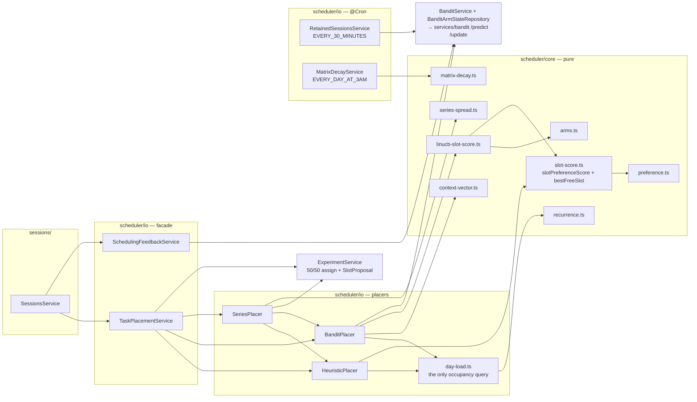
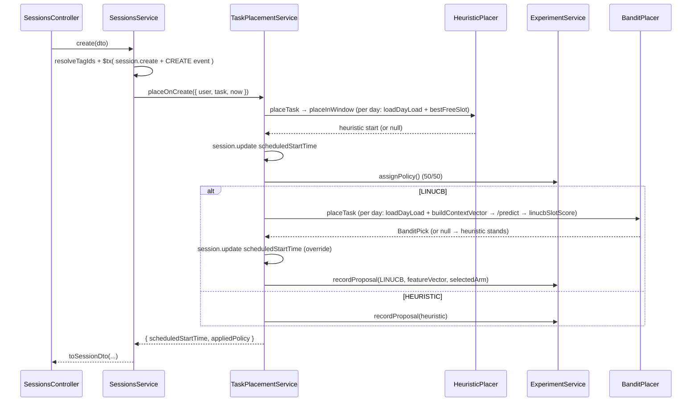
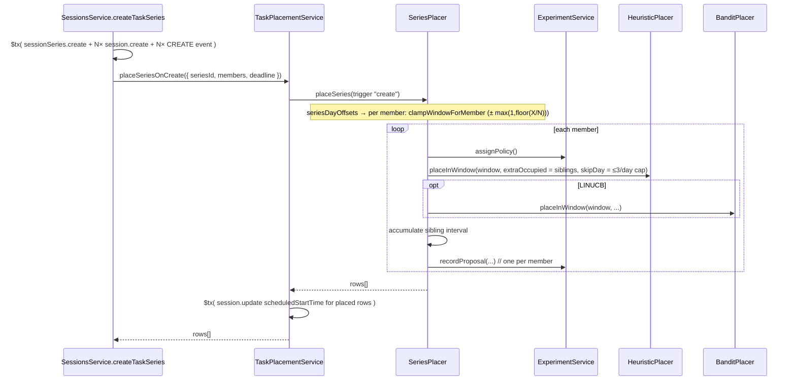

# Zenflow API (backend)

NestJS service that owns persistence, auth, file storage, and task CRUD. Part of the
[Zenflow monorepo](../README.md) — start there for the big picture and quick start.

---

## Tech stack

| Concern              | Choice                                                                                                                            |
| -------------------- | --------------------------------------------------------------------------------------------------------------------------------- |
| Framework            | NestJS 11 (Express platform)                                                                                                      |
| Language             | TypeScript 5.7 (ES2023, `nodenext`)                                                                                               |
| ORM / DB             | Prisma 6 + PostgreSQL                                                                                                             |
| Sessions &amp; cache | Redis (`connect-redis` sessions, `@nestjs/cache-manager` + keyv)                                                                  |
| Auth                 | Passport `local` strategy used for **email OTP** (no passwords)                                                                   |
| Scheduling/time      | `luxon`, `date-fns` / `date-fns-tz`                                                                                               |
| Validation           | `class-validator` + `class-transformer` (global `ValidationPipe`)                                                                 |
| Mail                 | `@nestjs-modules/mailer` + nodemailer + Handlebars templates                                                                      |
| Rate limiting        | [LimitKit](https://github.com/alphatrann/limitkit) (`@limitkit/core` + `nest` + `redis` + `memory`), own dedicated Redis instance |
| API docs             | `@nestjs/swagger` (served at `/api`)                                                                                              |
| Tests                | Jest (unit `*.spec.ts`, e2e via `test/jest-e2e.json`)                                                                             |
| Shared types         | `@zenflow/shared` (`workspace:*`) — the FE/BE contract                                                                            |

## Folder structure

```
backend/
├── prisma/
│   └── schema.prisma          # DB schema (client generated to ../generated/prisma)
├── src/
│   ├── main.ts                # bootstrap: global prefix /api/v1, CORS, ValidationPipe,
│   │                          #   Redis session, passport, Swagger at /api
│   ├── app.module.ts          # root module wiring
│   ├── auth/                  # OTP request/verify, Passport local strategy, guards
│   │   ├── guards/            # CookieAuthGuard (session), LocalAuthGuard (OTP login)
│   │   ├── strategies/        # local.strategy.ts (email + otp)
│   │   ├── serializers/       # session (de)serialization
│   │   └── utils/             # generate-otp, hide-email (+ *.spec.ts)
│   ├── users/                 # profile (no onboarding/preferences endpoints — see below)
│   │   └── decorators/        # @CurrentUser()
│   ├── sessions/               # session CRUD; create/deadline-edit place just the one
│   │   │                       #   TASK (or a series) — nothing else moves (see below)
│   │   ├── session-mapper.ts    # PURE — row → wire DTO / event snapshot
│   │   ├── session-events.ts    # PURE — CREATE / MOVE SessionEvent builders
│   │   ├── prisma-error.ts      # P2025 → 404 / else 500 mapper for update/remove
│   │   ├── types/session-row.ts # SessionRow (tags + series) + WITH_TAGS_AND_SERIES
│   │   └── ...
│   ├── scheduler/              # places ONE TASK / series — see "Scheduler architecture" below
│   │   ├── core/                # PURE algorithm — no Prisma, no clock, no randomness
│   │   │   ├── preference.ts        # matrixIndex / default+effective matrix / preferenceScoreAt
│   │   │   ├── slot-score.ts        # slotPreferenceScore (overlap-weighted) + bestFreeSlot
│   │   │   ├── linucb-slot-score.ts # Σ_arm overlapRate·predicted + slotPreferenceScore  (cold-start blend)
│   │   │   ├── context-vector.ts    # buildContextVector() — the LinUCB d=46 feature vector
│   │   │   ├── arms.ts              # 5 time-of-day arm bands, armOfMinute / overlapRate
│   │   │   ├── series-spread.ts     # seriesDayOffsets + clampWindowForMember (± X/N window)
│   │   │   ├── normalize.ts         # minMaxSigned + feature divisors
│   │   │   ├── recurrence.ts        # rrule expand / occurrence-id helpers
│   │   │   ├── matrix-decay.ts      # exponential preference-matrix decay
│   │   │   ├── slot.ts              # 15-min slot grid math, isoWeekday, overlap check
│   │   │   └── horizon.ts           # calendar math (period ceilings, calendar minutes)
│   │   ├── types/               # placement.types.ts, day-load.types.ts, context-vector.types.ts
│   │   └── io/                  # the ONLY Prisma / bandit-HTTP layer
│   │       ├── day-load.ts              # one day's occupied intervals + workload
│   │       ├── heuristic-placer.service.ts # HeuristicPlacer — placeTask / placeInWindow
│   │       ├── bandit-placer.service.ts    # BanditPlacer — per-day /predict + slot pick
│   │       ├── series-placer.service.ts    # SeriesPlacer — per-member bounded 50/50
│   │       ├── task-placement.service.ts   # TaskPlacementService — the facade sessions/ calls
│   │       ├── scheduling-feedback.service.ts # delayed LinUCB MOVE reward
│   │       ├── retained-sessions.service.ts   # @Cron: RETAINED sweep (+ delayed LinUCB +1 reward)
│   │       └── matrix-decay.service.ts        # @Cron: daily preference-matrix decay
│   ├── bandit/                 # BanditService (HTTP client for services/bandit/) +
│   │                           #   BanditArmStateRepository (per-user (A,b) load/save)
│   ├── experiments/            # ExperimentService — 50/50 policy assignment + SlotProposal
│   ├── files/                 # multipart upload/download to local disk
│   ├── mail/                  # login email + Handlebars templates
│   ├── prisma/                # PrismaService + Postgres error-code map
│   └── common/                # constants, utils, validators, dto, types
│       ├── redis/             # two connected `redis` clients: REDIS_CLIENT (session/OTP)
│       │                      #   and RATE_LIMIT_REDIS_CLIENT (LimitKit counters)
│       └── rate-limit/        # LimitKit wiring — see "Rate limiting" below
├── compose.{dev,staging,prod,test}.yml
├── Caddyfile.{staging,prod}
├── Dockerfile
└── .env.{dev,staging,prod,test} + docker.{dev,staging,prod,test}.env
```

**Key layering rule:** everything in `scheduler/core/` is **pure and deterministic** — no
database, no `new Date()`, no `Math.random()`; `now` is always passed in. `scheduler/io/*`
(the placers, `day-load`, the A/B facade, the feedback writer, and the two crons) is the
only layer that touches Prisma or the bandit HTTP service. Keep that split: it's what makes
the engine unit-testable and what the personalization work plugs into. The placers only ever
set `scheduledStartTime` on the session being created/edited — no existing session is moved
and no reschedule telemetry is written. Full walkthrough + diagrams:
[**Scheduler architecture**](#scheduler-architecture).

## Database schema

Defined in [`prisma/schema.prisma`](prisma/schema.prisma)

### `User`

| Field                       | Type       | Notes                                                                                                                                                                                                                                                                                                                                                                              |
| --------------------------- | ---------- | ---------------------------------------------------------------------------------------------------------------------------------------------------------------------------------------------------------------------------------------------------------------------------------------------------------------------------------------------------------------------------------- |
| `id`                        | uuid       | PK                                                                                                                                                                                                                                                                                                                                                                                 |
| `name`, `email`             | string     | `email` unique                                                                                                                                                                                                                                                                                                                                                                     |
| `timezone`                  | string     | IANA, default `"UTC"`                                                                                                                                                                                                                                                                                                                                                              |
| `lang`                      | `Language` | `VI_VN` \| `EN_US`, default `EN_US`. Not yet read by any endpoint.                                                                                                                                                                                                                                                                                                                 |
| `preferenceMatrix`          | float[]    | flat **168** signed floats — 7 ISO weekdays × 24 one-hour buckets, row-major (`matrixIndex(isoWeekday, hour) = (isoWeekday−1)·24 + hour`). Positive = preferred, negative = disliked, 0 = neutral. **Read by the engine** — both `slotPreferenceScore` (Policy A) and the LinUCB context vector — and eroded nightly by the decay cron. Seeded lazily from the cold-start default. |
| `preferenceMatrixDecayedAt` | DateTime?  | When the daily decay cron last decayed `preferenceMatrix`; null until the first pass                                                                                                                                                                                                                                                                                               |
| `onboardingComplete`        | bool       | schema default `false`, but `UsersService.create()` always writes `true` — there's no onboarding flow left to gate on (see "Users" below). The column itself is unused dead weight pending a follow-up migration to drop it.                                                                                                                                                       |

`workStart`/`workEnd`/`workDays` (a per-user working-hours window/working-days set) were
**dropped with no replacement**. The scheduler now places tasks across the full
24h/`DAILY_HORIZON` (1440 min) grid, every calendar day — see [Scheduler architecture](#scheduler-architecture).

### `Session`

| Field                           | Type            | Notes                                                                                                                                                                                                                                                                                                                                                   |
| ------------------------------- | --------------- | ------------------------------------------------------------------------------------------------------------------------------------------------------------------------------------------------------------------------------------------------------------------------------------------------------------------------------------------------------- |
| `id`                            | uuid            | PK                                                                                                                                                                                                                                                                                                                                                      |
| `title`, `note`                 | string          | `note` is rich text (TipTap)                                                                                                                                                                                                                                                                                                                            |
| `durationMinutes`               | int             | **always a positive multiple of 15**                                                                                                                                                                                                                                                                                                                    |
| `deadline`                      | DateTime?       | EDF ordering key (nulls last)                                                                                                                                                                                                                                                                                                                           |
| `tags`                          | `Tag[]`         | implicit many-to-many with `Tag` (per-user labels)                                                                                                                                                                                                                                                                                                      |
| `manuallyMoved`                 | bool            | true → the user dragged/resized this task. **Purely informational** everywhere automatic (drives the "Manually placed" badge/telemetry) — no automatic path ever freezes/protects a task because of it. The ONE place it gates real behavior is Optimize's `"retainManual"` mode (explicit user opt-in); see "The heuristic scheduler (Optimize)" below |
| `startTime`                     | int             | minutes from midnight of the last manual placement; informational only, not consulted by the scheduler                                                                                                                                                                                                                                                  |
| `status`                        | `SessionStatus` | `PENDING` \| `DONE` \| `ABANDONED`                                                                                                                                                                                                                                                                                                                      |
| `type`                          | `SessionType`   | `MANUAL` \| `ASSIGNMENT` \| `EXAM` \| `LECTURE`, default `MANUAL`. Not yet read by any endpoint.                                                                                                                                                                                                                                                        |
| `source`                        | `SessionSource` | `USER` \| `LMS` \| `PORTAL`, default `USER`. Not yet read by any endpoint.                                                                                                                                                                                                                                                                              |
| `conflict`                      | bool            | true when the task overlaps another task's interval, OR has no valid placement at all (`scheduledStartTime` null). An overlap is now a normal, accepted state — a direct drag/resize can knowingly create one rather than auto-relocating either task; see "The heuristic scheduler (Optimize)" below                                                   |
| `scheduledStartTime`            | DateTime?       | placement assigned by the EDF engine                                                                                                                                                                                                                                                                                                                    |
| `userId`                        | uuid            | FK → `User`, `onDelete: Cascade`                                                                                                                                                                                                                                                                                                                        |
| `seriesId`                      | uuid?           | FK → `SessionSeries`, `onDelete: Cascade`. Set for a recurring fixed-type (`DND`/`ASSIGNMENT`/`EXAM`/`LECTURE`) representative and for every session of a `POST /sessions` `sessionCount > 1` `TASK` series.                                                                                                                                            |
| `sessionIndex` / `sessionTotal` | int?            | 1-based position / total session count within a `TASK` series (null otherwise). Denormalized for cheap per-row rendering.                                                                                                                                                                                                                               |

Indexes: `[userId, deadline]`, `[userId, status]`, `[userId, scheduledStartTime]`,
`[userId, seriesId, createdAt asc]`.

### `SessionEvent` (append-only audit trail — the ML fuel)

| Field                         | Type               | Notes                                                         |
| ----------------------------- | ------------------ | ------------------------------------------------------------- |
| `id`                          | BigInt             | autoincrement (serialized as decimal string over the wire)    |
| `eventType`                   | `SessionEventType` | `CREATE` \| `MOVE` \| `RESIZE` \| `RETAINED`                  |
| `oldSnapshot` / `newSnapshot` | Json               | `{ scheduledStartTime, durationMinutes, tags }`               |
| `rewardScore`                 | float              | Phase-3 reward signal (default 1.0)                           |
| `occurredAt`                  | DateTime           | indexed desc per user                                         |
| `sessionId` / `userId`        | uuid               | FKs, cascade delete (`userId` denormalized for range queries) |

### `Tag`

Per-user label in an implicit many-to-many with `Session`.

| Field       | Type     | Notes                                        |
| ----------- | -------- | -------------------------------------------- |
| `id`        | uuid     | PK                                           |
| `name`      | string   | unique per user (`@@unique([userId, name])`) |
| `userId`    | uuid     | FK → `User`, `onDelete: Cascade`             |
| `createdAt` | DateTime |                                              |

On task create/update the backend resolves an incoming array of tag **names**:
unknown names are upserted (per user) and all are connected to the occurrence(s),
atomically inside the task transaction. The wire format keeps `Session.tags` as a
`string[]` of names — the `Tag` table is a backend detail.

### `File`

`id`, `originalName`, `filename`, `path`, `mimetype`, `size`, `userId` (cascade).

> **Sessions are one-off, and every task is flexible.** A `POST /tasks` always creates
> exactly one `Session` row, placed via the narrow single-task tiered placer (no more "fixed"
> tasks — that isn't the point of a smart scheduler). There is no recurrence: no
> `rrule`, no `seriesId`, no `scope`. True recurrence may be reintroduced later as a
> deliberate feature on top of this simplified scheduler.

## API endpoints

Global prefix `**/api/v1**`. All routes except `POST /auth/otp/*` require
`CookieAuthGuard` (a valid Redis session cookie). Success responses use the
`@zenflow/shared` envelope `{ success: true, message?, data }`; errors use
`{ success: false, message, statusCode?, field? }`.

### Auth (`/auth`)

| Method | Path                | Purpose                                                                                                               |
| ------ | ------------------- | --------------------------------------------------------------------------------------------------------------------- |
| POST   | `/auth/otp/request` | email a 6-digit OTP (no auth guard; rate-limited, see below)                                                          |
| POST   | `/auth/otp/verify`  | verify OTP, create user if new, start session. Reads `x-timezone` header. (`LocalAuthGuard`; rate-limited, see below) |
| GET    | `/auth/me`          | current user                                                                                                          |
| POST   | `/auth/logout`      | destroy session                                                                                                       |

### Users (`/users`)

| Method | Path                          | Purpose                                                                                                                                            |
| ------ | ----------------------------- | -------------------------------------------------------------------------------------------------------------------------------------------------- |
| GET    | `/users/me`                   | profile                                                                                                                                            |
| PATCH  | `/users/update/basic-info`    | update name/email                                                                                                                                  |
| GET    | `/users/me/preference-matrix` | the current user's flat 168-float signed preference matrix for the Insights heatmap (`PreferenceMatrixResponse`; cold-start → all-zero). Read-only |

There is no onboarding endpoint and no preferences-update endpoint. Onboarding was removed
entirely (no flow, no `onboardingComplete` gate — every new user is created with
`onboardingComplete: true`). `timezone` is captured once at OTP signup (`x-timezone` header
on `POST /auth/otp/verify` → `AuthService.createUserIfNotExists` → `UsersService.create()`)
and is otherwise fixed — there is no later edit path.

### Sessions (`/tasks`)

| Method | Path                              | Purpose                                                                                                                                                                                                                                                                                                                                                                                                                                                                                                                                                                                                                                                                                                                                                                                     |
| ------ | --------------------------------- | ------------------------------------------------------------------------------------------------------------------------------------------------------------------------------------------------------------------------------------------------------------------------------------------------------------------------------------------------------------------------------------------------------------------------------------------------------------------------------------------------------------------------------------------------------------------------------------------------------------------------------------------------------------------------------------------------------------------------------------------------------------------------------------------- |
| POST   | `/tasks`                          | create a single task, always placed via the narrow single-task tiered placer (`SchedulerService.placeNewSession` → `place.ts`'s `placeSession`, Tier1→2→3). Only ever picks an already-free slot — **never** displaces another task. `displaced` is always `[]`. Only comes back unplaced (`conflict: true`) in the rare genuinely-saturated-calendar case                                                                                                                                                                                                                                                                                                                                                                                                                                  |
| GET    | `/tasks?view=&date=&status=`      | list within the view window (+ unplaced conflicts). DB-level filter: `scheduledStartTime IS NULL OR BETWEEN displayStart AND displayEnd` — never fetches the user's whole task history                                                                                                                                                                                                                                                                                                                                                                                                                                                                                                                                                                                                      |
| GET    | `/tasks/suggestions?q=&limit=`    | title-autocomplete: the user's existing tasks, **newest first** and **deduped by title** (case-insensitive), optionally filtered by the `q` substring. `limit` 1–50, default 10. Returns `SessionSuggestionsResponse` (`{ suggestions: Session[] }`). Read-only; never reschedules. Declared **before** `/tasks/:id` so it isn't matched as an id                                                                                                                                                                                                                                                                                                                                                                                                                                           |
| GET    | `/tasks/:id`                      | task detail + last events                                                                                                                                                                                                                                                                                                                                                                                                                                                                                                                                                                                                                                                                                                                                                                   |
| PATCH  | `/tasks/:id`                      | metadata only (title/note/deadline/tags) saved immediately. **Never auto-searches.** `tags` is only actually rewritten when the requested set differs (order-insensitive) from the task's current tags — not merely present in the body, since both clients resend the full form on every save. If the new deadline leaves the task's own UNCHANGED slot no longer valid, `UpdateSessionResponse.rationale` explains it's now broken and the frontend/mobile show an Accept/Decline toast — this does **not** set `conflict: true` (that's an "overdue own-slot-vs-own-deadline" case, not a double-booking; `conflict` is reserved for genuine pairwise overlap, see `markConflicts` below). `displaced`/`batchId` are always empty/null; Accept calls the separate resolve endpoint below |
| POST   | `/tasks/:id/reschedule/resolve`   | Edit-accept: re-places a task `update()` just reported as broken, via the same Tier1→2→3 search `placeNewSession` uses (`SchedulerService.resolveInvalidPlacement`) — excludes the task's own stale slot from occupied space. No body. A no-op (task returned as-is) when the task isn't currently flagged conflicting AND its own slot still fits its own deadline (recomputed server-side, since `update()` doesn't persist a flag for this case). Writes a `RESCHEDULED` event + fresh `batchId` (undoable) when it does move something. Returns `RescheduleResponse`                                                                                                                                                                                                                    |
| PATCH  | `/tasks/:id/reschedule`           | manual drag: writes the requested interval **unconditionally** (`SchedulerService.applyDirectPlacement`) — no search, no eviction — and pins `manuallyMoved: true` (informational). If the dropped slot now overlaps another task, BOTH are flagged `conflict: true` (one bounded, indexed-range recheck — `markConflicts`) and `rationale` names the overlap; neither is auto-relocated. `displaced` is always `[]`. Returns `RescheduleResponse`                                                                                                                                                                                                                                                                                                                                          |
| PATCH  | `/tasks/:id/resize`               | edge-resize, snaps to 15-min grid — same direct-write + bounded conflict recheck `reschedule` uses, over the task's own new span                                                                                                                                                                                                                                                                                                                                                                                                                                                                                                                                                                                                                                                            |
| POST   | `/tasks/reschedule/undo/:batchId` | undo one batch (from `resolve`/Optimize-apply's `batchId`): reverts every task it moved back to its prior slot/duration, restored from each tagged `RESCHEDULED` `SessionEvent`'s `oldSnapshot`. Pre-flight "touched since" check: if a batched task was acted on again since, responds `{ requiresConfirmation: true, touchedSessionIds }` (writes nothing) instead — resubmit with body `{ strategy: "all" \| "excludeTouched" }`. 404 when `batchId` matches no event for this user. Returns `UndoBatchResponse`                                                                                                                                                                                                                                                                         |
| DELETE | `/tasks/:id`                      | delete the task, then free the slot it leaves behind (`SchedulerService.freeSlot`) — same bounded conflict-clear as `complete`. No reoptimize, no separate confirm step. Returns `RemoveSessionResponse` (`{ displaced: [], batchId? }` — always empty; kept for wire shape parity)                                                                                                                                                                                                                                                                                                                                                                                                                                                                                                         |
| POST   | `/tasks/optimize/preview`         | the one explicit, opt-in, multi-task action's dry run: `SchedulerService.optimizeWindow(..., { dryRun: true })` returns a **COUNT ONLY** (`OptimizePreviewResponse`) of how many tasks in `[windowStart, windowEnd]` would move under `mode` (`"full"` \| `"retainManual"` \| `"balanced"`) — never a per-task diff, nothing written. `windowEnd - windowStart` is capped server-side by `MAX_SCAN_DAYS` regardless of the client UI's own (tighter) cap                                                                                                                                                                                                                                                                                                                                    |
| POST   | `/tasks/optimize/apply`           | recomputes the window server-side (never trusts the preview's count as stale) and writes every moved task in one batch, undoable via the undo endpoint above. Returns `OptimizeApplyResponse` (`{ count, batchId, fixedCount?, unchangedCount? }` — the `fixedCount`/`unchangedCount` pair is `"retainManual"`-only)                                                                                                                                                                                                                                                                                                                                                                                                                                                                        |

### Tags (`/tags`)

| Method | Path    | Purpose                                                                                 |
| ------ | ------- | --------------------------------------------------------------------------------------- |
| GET    | `/tags` | list the current user's tags (`{ tags: { id, name }[] }`, name-sorted) for the combobox |

### Files (`/files`)

`POST /files/upload` (multipart, ≤100 MB × 5), `POST /files/remove`,
`GET /files/metadata/:id`, `GET /files/:id` (download stream).

### Integrations (`/integrations`)

Stores a student's DLU LMS / student-portal login for the ingestion watcher.
`CookieAuthGuard` + `@CurrentUser()`, own rows only. Credentials are never returned —
only connection status. Types in `@zenflow/shared` (`ConnectIntegrationInput`,
`IntegrationStatus`, `IntegrationStatusListResponse`).

| Method | Path                      | Purpose                                                                                                                                                                                                             |
| ------ | ------------------------- | ------------------------------------------------------------------------------------------------------------------------------------------------------------------------------------------------------------------- |
| POST   | `/integrations`           | Connect a provider. Body `{ provider: "LMS" \| "PORTAL", username, password }`. Probes a live login first (`400` if rejected, `503` if DLU is unreachable, no write either way), then encrypts and upserts the row. |
| GET    | `/integrations`           | `{ integrations: [{ provider, connected, lastVerifiedAt }] }` — one entry per provider.                                                                                                                             |
| PATCH  | `/integrations/:provider` | Update a provider's credentials. Body `{ username?, password? }`. Probes a live login first (`400` if rejected, `503` if DLU is unreachable, no write either way), then encrypts and upserts the row.               |
| DELETE | `/integrations/:provider` | Disconnect. Idempotent; keeps the `UserEncryptionKey`.                                                                                                                                                              |

`DluAuthService` only does a pass/fail probe; scraping belongs to the ingestion service.

Full live schema: **Swagger UI at `<API_URL>/api`**.

## Local development

**Prerequisites:** [Docker](https://docs.docker.com/get-docker/) (with Compose) and
Node 20+ with pnpm `10.32.1` (see the root [CLAUDE.md](../CLAUDE.md) toolchain section).

Step by step, from a clean checkout:

```bash
# 1. Install workspace deps + build @zenflow/shared (repo root, once)
pnpm install && pnpm shared:build

# 2. Bootstrap Postgres/Redis (x2 — session/OTP + rate-limit)/MailHog in the
#    background (from backend/)
docker compose -f compose.dev.yml up -d

# 3. Apply the Prisma schema to the dev DB
pnpm prisma:dev:migrate

# 4. Start the API in watch mode
pnpm start:dev            # http://localhost:5000, Swagger at /api
```

Other backend scripts (run inside `backend/`, or `pnpm --filter backend <script>`):

```bash
pnpm typecheck           # tsc --noEmit
pnpm lint                # eslint --fix
pnpm test                # jest unit tests (*.spec.ts)
pnpm test:e2e            # jest e2e (needs .env.test DB)

# Prisma (dev DB via .env.dev):
pnpm prisma:dev:studio   # browse the DB
pnpm prisma:gen:dev      # regenerate the Prisma client → ../generated/prisma
```

### Environment

`.env.{dev,staging,prod,test}` hold app config; the matching `docker.{dev,staging,prod,test}.env`
holds Postgres credentials for that Compose file. Required app vars (validated at boot via
`@hapi/joi`):

Copy `.env.example` to `.env.{dev,staging,prod,test}`:

```bash
cp .env.example .env.dev # same for .env.staging, .env.test, .env.prod
```

`BANDIT_SERVICE_URL` (optional, dev `http://localhost:8100`) points at the stateless Python
bandit service (`services/bandit/`). When unset, LinUCB scheduling is disabled and every
scheduling event falls back to the heuristic.

## LinUCB scheduling (A/B experiment)

`docs/adr/0001-linucb-model-design.md` + `docs/scheduler/{reranking,ab-testing}.md`, and
the [Scheduler architecture](#scheduler-architecture) walkthrough below. On `POST /sessions`
(a single `TASK`) and a `TASK` deadline change, `TaskPlacementService` places the one
session via `HeuristicPlacer.placeTask`, then `ExperimentService.assignPolicy()` picks a
50/50 `primaryPolicy`:

- **HEURISTIC** — keep the heuristic placement; record a `SlotProposal`.
- **LINUCB** — `BanditPlacer.placeTask()` builds one `d=46` context vector per candidate day
  (`core/context-vector.ts`), calls the bandit service `/predict` once, scores the empty
  hard-constraint-feasible 15-min slots by
  `Σ_arm overlapRate·predicted + slotPreferenceScore` (`core/linucb-slot-score.ts` — the
  preference term is a cold-start blend so a slot ranks sensibly before any arm has learned),
  and picks the earliest top slot. A slot may run past local midnight up to the deadline. If
  it produces a pick, THIS session's `scheduledStartTime` is overridden (no other session
  moves); otherwise the heuristic placement stands. Either way a `SlotProposal` is recorded
  with `featureVector` + `selectedArm`.

A `sessionCount > 1` series is placed by `SeriesPlacer`: each member gets an even-spread
target day, then goes through the **same per-member 50/50 heuristic-or-LinUCB pick**, with
its candidate-day window clamped to `± max(1, floor(X/N))` days around the target (`X` =
whole days to the deadline, `N` = member count). Members never overlap, ≤3 per calendar day,
and one `SlotProposal` is recorded per member. A deadline edit re-runs the same path over
the still-upcoming sittings.

Delayed reward (ADR-0001 §9): the first user `MOVE` of a LinUCB-placed session sends a
graded penalty (`-min(1, |dragMin| / 240)`) to that arm's `/update` (`SchedulingFeedbackService`);
the `RETAINED` sweep sends `+1`. The returned `(A, b)` is persisted to `BanditArmState`; the
`SessionEvent` links back via `slotProposalId`. Every part is best-effort — a bandit failure
never breaks session create/update.

## Scheduler architecture

The scheduler places **one `TASK`** (or the members of one `TASK` series) into an empty
15-minute slot and never moves anything else. It is split into a **pure core**
(`scheduler/core/*` — scoring, ranking, arm bands, series math, the LinUCB feature vector,
recurrence, decay; no Prisma, no `new Date()`, no `Math.random()`) and an **I/O layer**
(`scheduler/io/*` — the placers, the one occupancy query, the A/B facade, the delayed-reward
writer, and the two crons). `sessions/` talks to exactly two of them.

### Module map



### Flow 1 — create a single `TASK`



### Flow 2 — create a `TASK` series (`sessionCount > 1`)



### Flow 3 — deadline edit → redistribute

```mermaid
sequenceDiagram
  participant S as SessionsService.update
  participant T as TaskPlacementService
  participant SP as SeriesPlacer
  S->>S: $tx( applyFieldDiff detects newDeadline → session.update )
  alt standalone TASK
    S->>T: placeOnDeadlineChange({ task, now })
    Note over T: identical to Flow 1 step 2, trigger "deadline-change"
  else TASK series member
    S->>T: redistributeSeries({ seriesId, members, newDeadline })
    T->>T: partition past / upcoming;  past → fixedOccupied
    T->>SP: placeSeries(upcoming, fixedOccupied, trigger "deadline-change")
    T->>T: $tx( sessionSeries.deadline + session.updateMany deadline + upcoming starts )
  end
```

### Flow 4 — delayed LinUCB reward

```mermaid
sequenceDiagram
  participant S as SessionsService.update
  participant F as SchedulingFeedbackService
  participant R as RetainedSessionsService (@Cron)
  participant BA as Bandit (/update + BanditArmState)
  Note over S: first user MOVE of a scheduled TASK
  S->>S: $tx( MOVE SessionEvent + lastMovedAt );  existing.lastMovedAt == null → firstMove
  S->>F: onFirstMove(userId, sessionId, moveEventId, dragMinutes)
  F->>F: slotProposal.findFirst(primaryPolicy LINUCB, selectedArm != null)
  F->>BA: reward = drag==0 ? 0 : -min(1, |drag|/240) → loadAll → /update → save → link event
  Note over R: every 30 min
  R->>R: sweep — elapsed, never-moved USER TASK → RETAINED event (+1)
  R->>BA: same loadAll → /update(+1) → save → link event
```

### Slot scoring — the overlap-weighted preference score

`slotPreferenceScore` (`core/slot-score.ts`) scores a concrete interval by how much of it
falls in each local **clock-hour block** it touches, weighted by that block's preference
value:

```text
score(slot) = Σ over each hour block [h, h+1) the slot touches:
                overlapFraction(slot ∩ [h, h+1)) · pref[weekday(h)][h]
```

A slot that only partially covers an hour contributes that hour fractionally — e.g. a
**09:15–11:00** slot scores `0.75·pref[..][9] + 1.0·pref[..][10]`. `[start, end)` is
half-open, so the block starting exactly at `end` is never scored. A midnight-spanning slot
is split at local midnight and each side scored against its own day's weekday row. The
matrix is **168 signed floats** — 7 ISO weekdays × 24 one-hour buckets, row-major
(`matrixIndex(isoWeekday, hour) = (isoWeekday−1)·24 + hour`).

### LinUCB slot score — cold-start blend

`linucbSlotScore` (`core/linucb-slot-score.ts`) for a candidate 15-min start:

```text
score(slot) = Σ_arm overlapRate(slot, arm) · predicted[day][arm]   (the LinUCB term)
            + slotPreferenceScore(slot)                            (cold-start blend)
```

The bandit service returns `0` for an arm with no accumulated reward, so the preference
addend keeps slots meaningfully ordered before the model has learned anything. This deviates
from `reranking.md` §3 / `ab-testing.md` §1B as originally written (LinUCB's slot score was
the arm term alone); see the ADR-0001 addendum.

### Series bounded window

For a `sessionCount > 1` `TASK` series, `seriesDayOffsets(daySpan, N)` gives each member an
even-spread **target** day offset, and `clampWindowForMember` bounds where that member may
actually land:

```text
clamp  = max(1, floor(daySpan / N))          // wide for a sparse series, ±1 for a dense one
window = [ target − clamp , target + clamp ] clamped to [0, daySpan]
```

`daySpan` = whole days from the next 15-min boundary to the deadline day, capped at
`MAX_SCAN_DAYS − 1`. Each member is then placed by the same 50/50 pick as a single task
inside that window; already-placed siblings are fed forward as hard blocks so members never
overlap, and a day already holding `MAX_SERIES_PER_DAY` (3) sittings of this series is
skipped. A member that finds nowhere comes back unplaced without blocking the rest.

### Trace it in the source

| Concept                                                                             | File                                          |
| ----------------------------------------------------------------------------------- | --------------------------------------------- |
| preference matrix helpers (`matrixIndex`, default/effective, `preferenceScoreAt`)   | `scheduler/core/preference.ts`                |
| overlap-weighted slot score + best-free-slot search                                 | `scheduler/core/slot-score.ts`                |
| LinUCB slot score + cold-start blend                                                | `scheduler/core/linucb-slot-score.ts`         |
| the `d = 46` LinUCB context vector                                                  | `scheduler/core/context-vector.ts`            |
| 5 time-of-day arm bands + `overlapRate` (splits at midnight)                        | `scheduler/core/arms.ts`                      |
| series even spread + `± X/N` window                                                 | `scheduler/core/series-spread.ts`             |
| feature normalization (`minMaxSigned`, divisors)                                    | `scheduler/core/normalize.ts`                 |
| rrule expansion + occurrence-id helpers                                             | `scheduler/core/recurrence.ts`                |
| exponential preference-matrix decay                                                 | `scheduler/core/matrix-decay.ts`              |
| one day's occupied intervals + workload (the only occupancy query)                  | `scheduler/io/day-load.ts`                    |
| Policy A placer — `placeTask` / `placeInWindow`                                     | `scheduler/io/heuristic-placer.service.ts`    |
| Policy B placer — per-day `/predict` + slot pick                                    | `scheduler/io/bandit-placer.service.ts`       |
| per-member bounded 50/50 series placement                                           | `scheduler/io/series-placer.service.ts`       |
| the facade `sessions/` calls (place + persist + A/B)                                | `scheduler/io/task-placement.service.ts`      |
| delayed first-move LinUCB reward                                                    | `scheduler/io/scheduling-feedback.service.ts` |
| `RETAINED` sweep (+1 reward)                                                        | `scheduler/io/retained-sessions.service.ts`   |
| nightly matrix decay cron                                                           | `scheduler/io/matrix-decay.service.ts`        |
| 50/50 policy assignment + `SlotProposal` write                                      | `experiments/experiment.service.ts`           |
| tuning constants (`MAX_SCAN_DAYS`, `MAX_SERIES_PER_DAY`, `BANDIT_*`, reward scales) | `scheduler/constants.ts`                      |

## Running staging

**Prerequisites:** Docker (with Compose) and Node 20+ — `build_images.sh` shells out to
`node` to read the image tag from `backend/package.json`; nothing else needs a local
install, the API itself runs inside the container.

`compose.staging.yml` is the fully containerized stack: `api` (built from the
`Dockerfile`), `postgres`, `redis` (sessions/OTP), `redis-ratelimit` (dedicated to
LimitKit's rate-limit counters — see "Rate limiting"), `mail` (MailHog — catches OTP
emails), and a `caddy` reverse proxy on `:80`, configured via `.env.staging` +
`docker.staging.env`. `compose.prod.yml` follows the same shape minus `mail`.

```bash
# From backend/ — build the zenflow-api image (build context is the repo root,
# since the API depends on the @zenflow/shared workspace package)
sh build_images.sh

# Bring the stack up in the background
docker compose -f compose.staging.yml up -d   # API via Caddy → :80, Swagger → :80/api
```

The Dockerfile is a multi-stage `node:20-alpine` build; `start:prod` runs
`prisma migrate deploy` before launching `dist/main` — so migrations are applied
automatically on container start, no separate migrate step needed for staging.

## Contributing

- **Formatter:** ESLint + Prettier (via `eslint-plugin-prettier`) — `pnpm --filter backend lint`
  runs `eslint --fix`. **2-space** indentation, double quotes, semicolons
  ([`.editorconfig`](../.editorconfig)).
- **Commits:** [Conventional Commits 1.0.0](https://www.conventionalcommits.org/en/v1.0.0/),
  e.g. `feat(scheduler): …`, `fix(tasks): …`, `test(backend): …`.

See the repo-wide [**CONTRIBUTING.md**](../CONTRIBUTING.md) for setup, branching, and testing.
