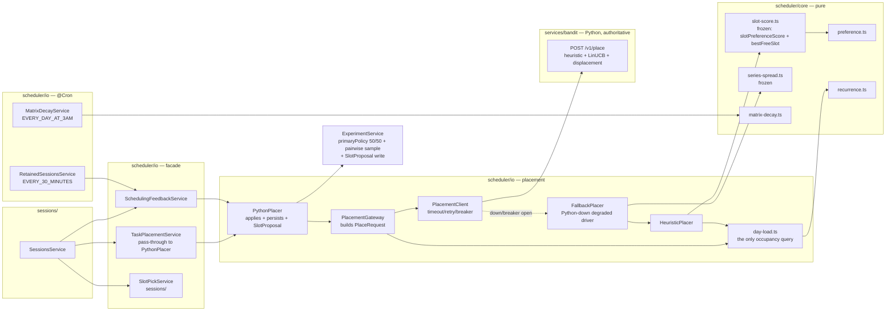

# Zenflow API (backend)

NestJS service that owns persistence, auth, file storage, and task CRUD. Part of the
[Zenflow monorepo](../README.md) — start there for the big picture and quick start, and see
[ARCHITECTURE.md](../ARCHITECTURE.md) for the system diagrams this README doesn't repeat.

---

## Tech stack

| Concern              | Choice                                                                                                                            |
| -------------------- | --------------------------------------------------------------------------------------------------------------------------------- |
| Framework            | NestJS 11 (Express platform)                                                                                                      |
| Language             | TypeScript 5.7 (ES2023, `nodenext`)                                                                                               |
| ORM / DB             | Prisma 6 + PostgreSQL                                                                                                             |
| Sessions &amp; cache | Redis via `ioredis` (custom `IoredisSessionStore` for sessions, `@nestjs/cache-manager` + keyv for cache/OTP)                     |
| Auth                 | Passport `local` strategy used for **email OTP** (no passwords)                                                                   |
| Scheduling/time      | `luxon`, `date-fns` / `date-fns-tz`                                                                                               |
| Validation           | `class-validator` + `class-transformer` (global `ValidationPipe`)                                                                 |
| Mail                 | `@nestjs-modules/mailer` + nodemailer + Handlebars templates                                                                      |
| Rate limiting        | [LimitKit](https://github.com/alphatrann/limitkit) (`@limitkit/core` + `nest` + `redis` + `memory`), own dedicated Redis instance |
| API docs             | `@nestjs/swagger` (served at `/api`)                                                                                              |
| Tests                | Jest (unit `*.spec.ts`, e2e via `test/jest-e2e.json`)                                                                             |
| Shared types         | `@zenflow/shared` (`workspace:*`) — the FE/BE contract                                                                            |

## Folder structure

```
backend/
├── prisma/schema.prisma        # DB schema (client generated to ../generated/prisma)
├── src/
│   ├── main.ts                 # bootstrap: /api/v1 prefix, CORS, ValidationPipe, Redis session, Swagger at /api
│   ├── app.module.ts
│   ├── auth/                   # OTP request/verify, Passport local strategy, guards
│   ├── users/                  # profile (no onboarding/preferences endpoints)
│   ├── sessions/                # session CRUD — create/edit places just the one TASK (or series)
│   │   ├── session-mapper.ts, session-events.ts   # pure: row → DTO, CREATE/MOVE event builders
│   ├── reminders/               # per-session reminders → NotificationsService (see "Session reminders")
│   ├── scheduler/                # places ONE TASK / series — see "Scheduler architecture"
│   │   ├── core/                    # PURE — no Prisma, no clock, no randomness
│   │   ├── types/
│   │   └── io/                      # the ONLY Prisma / bandit-HTTP layer (placers, crons)
│   ├── bandit/                  # HTTP client for services/bandit/ + per-user (A,b) repository
│   ├── experiments/             # ExperimentService — 50/50 policy assignment + SlotProposal
│   ├── ingestion/               # LMS/portal/DKHP ingestion — see "DLU ingestion"
│   │   ├── core/                    # PURE parsers/scheduling math — no Prisma, no clock
│   │   └── *.service.ts             # ticker, discovery, watchers, materializer, cache
│   ├── lms/, portal/             # fetch-based Moodle and portal/DKHP clients
│   ├── integrations/             # encrypted DLU credential storage + live login probe
│   ├── notifications/           # the ingestion inbox
│   ├── devices/                  # native push — POST/DELETE /devices + FCM/APNs fan-out
│   ├── files/                    # multipart upload/download, bytes in S3-compatible storage
│   ├── mail/                     # login email + Handlebars templates
│   ├── prisma/                   # PrismaService + Postgres error-code map
│   └── common/                    # constants, utils, validators, dto, types
│       ├── redis/                    # REDIS_CLIENT (session/OTP), RATE_LIMIT_REDIS_CLIENT (LimitKit)
│       └── rate-limit/               # LimitKit wiring — see "Rate limiting"
├── compose.{dev,staging,prod,test}.yml
├── Caddyfile.{staging,prod}
├── Dockerfile
└── .env.{dev,staging,prod,test} + docker.{dev,staging,prod,test}.env
```

**Key layering rule:** `scheduler/core/*` and `ingestion/core/*` are **pure and
deterministic** — no database, no `new Date()`, no `Math.random()`, `now` always passed in.
Everything Prisma/HTTP touches lives in the matching `io/*` (or service file). See
[ARCHITECTURE.md](../ARCHITECTURE.md) → "Scheduler components" / "Ingestion components" for
the diagrams, and [AGENTS.md](../AGENTS.md) for why this split is a hard invariant.

## Database schema

Source of truth: [`prisma/schema.prisma`](prisma/schema.prisma). Key tables:

| Table | What it's for | Worth knowing |
| ----- | -------------- | ------------- |
| `User` | account + scheduling profile | `preferenceMatrix`: 168 signed floats (7×24, decayed nightly, lazily seeded). `workStart`/`workEnd`/`workDays` were dropped — the scheduler places across the full 24h grid. |
| `Session` | every calendar item | `type`: `TASK` (engine-placed) \| `ASSIGNMENT` \| `EXAM` \| `LECTURE` \| `DND` (user-pinned). `source`: `USER` \| `LMS` \| `PORTAL`. `deleted` is a soft-delete flag — every scheduling/calendar read filters it, except the materializer's idempotency lookup. `scheduledStartTime` is **never null on a live `TASK`** (see "Never unplaced"). `syncConfirmedAt`/`syncMissedAt` implement the two-run confirm/miss gate for ingested rows. |
| `SessionReminder` | up to 2 per session | fire bookkeeping is `SchedulerRegistry` in-memory timers, see "Session reminders". |
| `SessionEvent` | append-only audit trail — the ML fuel | `eventType`: `CREATE` \| `MOVE` \| `RESIZE` \| `RETAINED` \| `SYSTEM_MOVE` (scheduler-initiated, reward 0). `rewardScore` feeds LinUCB. |
| `Tag` | per-user label | wire format is `Session.tags: string[]`; the backend upserts unknown names per-user. |
| `File`, `UserDevice` | uploads, push registrations | `UserDevice.pushToken` is unique — the natural key for upsert. |
| DLU tables (`LmsCourse`, `PortalSection`, `*SyncJob(Item)`, `Notification`, `IngestionSchedule`, `*Enrollment`, `*Occurrence`) | ingestion catalog, job tracking, cross-student cache | see "DLU ingestion" below. |

Indexes worth knowing: `Session` has `[userId, deadline]`, `[userId, scheduledStartTime]`,
`[userId, seriesId, createdAt asc]`, `[userId, scheduleStudyUnitId]`, unique
`[userId, externalKey]`.

> **Session model.** `POST /sessions` creates one row, or — for a `TASK` with
> `sessionCount > 1` — a series of N rows sharing a `seriesId`. A recurring fixed session
> (`rrule`) is one `SessionSeries` + one representative row, fanned into occurrences at read
> time. See invariant #4 in [AGENTS.md](../AGENTS.md) and
> [ADR-0002](../docs/adr/0002-scheduling-simplification.md) §2.4.

## DLU ingestion

Pulls a student's Moodle assignments/quizzes, class timetable and exam schedule onto their
calendar, plus an in-app notification inbox. **API-only** — no scraping, no headless
browser. See [ARCHITECTURE.md](../ARCHITECTURE.md) → "Ingestion components" for the
diagram; this section is the rules that diagram doesn't show.

- **One rolling ticker**, a one-minute heartbeat and the only trigger for ingestion. Each
  integration and kind has its own due time; every tick claims the most overdue batch,
  spreading the daily volume across the day instead of hundreds of logins at once. LMS
  deadlines are checked hourly; timetable and exams run daily.
- **DKHP discovery** reads a student's registration history once per semester, spread
  across students, and keeps the sections whose latest event is a registration. It must
  succeed for the current semester before any timetable fetch, and runs inline if it has
  not. It never narrows the confirmed set on failure.
- **Exams are a plain fetch** of a rolling window. They use no cache and no fanout.
- **Idempotent by external key**, student-independent by design, which is what makes the
  cross-student cache possible.
- **Confirm/miss gate**: a first sighting writes the `Session` immediately
  (visible on the calendar) but raises no notification until a *second* consecutive run
  confirms it. Symmetrically, a single miss only flags the item; a second consecutive
  miss soft-deletes and notifies. A still-unconfirmed item that vanishes is hard-deleted.
- **Cross-student occurrence cache**, off by default: timetable meetings and Moodle items
  are cached once per section or course instead of every enrolled student refetching them.
  A pass is served from cache only if discovery is fresh, the confirmed set is non-empty
  and every unit was read within `INGESTION_CACHE_TTL_MS` (default 7 days) and covers the
  term. Past it, one student's live walk refreshes the section and populates every classmate. See
  [`scripts/fixtures/dlu/README.md`](scripts/fixtures/dlu/README.md) for measurements.
- **Divergence guard.** Items are shared by key but not always by content, so a change is
  fanned out to classmates only once two different students have observed the same
  transition. A student is served from cache only while their own last live view still
  matches.
- **Upstream wins.** A change upstream always applies, a removal always soft-deletes,
  regardless of whether the student moved the item by hand — except a student's own
  deletion, which the materializer's `[userId, externalKey]` lookup respects.
- **Write-back** always goes through the materializer, the one path that touches a
  `Session` row, so ingested and user-pinned sessions never drift apart.

Deep detail (client endpoints, parser rules, semester resolution, job tracking) lives in the
`ingestion/` source.

## API endpoints

Global prefix `**/api/v1**`. All routes except `POST /auth/otp/*` require
`CookieAuthGuard` (a valid Redis session cookie). Success responses use the
`@zenflow/shared` envelope `{ success: true, message?, data }`; errors use
`{ success: false, message, statusCode?, field? }`. Full live schema:
**Swagger UI at `<API_URL>/api`**.

### Auth (`/auth`)

| Method | Path                | Purpose                                                                                         |
| ------ | ------------------- | ----------------------------------------------------------------------------------------------- |
| POST   | `/auth/otp/request` | email a 6-digit OTP (no guard; rate-limited)                                                    |
| POST   | `/auth/otp/verify`  | verify, create user if new, start session. Reads `x-timezone`. (`LocalAuthGuard`; rate-limited) |
| GET    | `/auth/me`          | current user                                                                                    |
| POST   | `/auth/logout`      | destroy session                                                                                 |

### Users (`/users`)

| Method | Path                          | Purpose                                                                                |
| ------ | ----------------------------- | -------------------------------------------------------------------------------------- |
| GET    | `/users/me`                   | profile                                                                                |
| PATCH  | `/users/update/basic-info`    | update name, timezone, lang, defaultReminderMinutes                                    |
| GET    | `/users/me/preference-matrix` | the 168-float preference matrix for the Insights heatmap                              |

No onboarding endpoint. `timezone` is captured at OTP signup (`x-timezone` header) and can be
changed later, with `lang` and `defaultReminderMinutes` (0 = none, default 10; existing users
were migrated to 60), through `PATCH /users/update/basic-info`. Changing `timezone` re-keys each
recurring series' `exdates` so individually deleted occurrences stay deleted. A new signup also seeds 4 daily-recurring `DND` blocks (breakfast/lunch/
evening/sleep) best-effort, so the scheduler avoids them from day one.

### Sessions (`/sessions`)

`@Controller("sessions")` — drag, resize and reschedule are all one `PATCH /sessions/:id`
(a `MOVE` signal). No status/completion, `/reschedule`, `/resize`, `/optimize` or `/undo`.

| Method | Path                                         | Purpose                                                                                                                      |
| ------ | --------------------------------------------- | ----------------------------------------------------------------------------------------------------------------------------- |
| POST   | `/sessions`                                  | Create. `TASK` → best free slot (or a materialized series). Fixed/`DND` → given time + optional `rrule`.                    |
| GET    | `/sessions?view=&date=`                      | `day`/`week`/`month` window + unplaced; series fanned to virtual rows.                                                       |
| GET    | `/sessions/suggestions?q=&limit=`            | title autocomplete, newest-first, deduped.                                                                                    |
| GET    | `/sessions/deadline-options?anchor=`         | the six deadline quick-chip instants.                                                                                        |
| GET    | `/sessions/:id`                              | detail. Occurrence id: `"<seriesId>::<startISO>"` (URL-encoded).                                                             |
| PATCH  | `/sessions/:id`                              | metadata, drag/resize, `rrule`, `sessionCount` (grow/shrink/promote). `scope`/`skipConflicting` narrow a series change.      |
| DELETE | `/sessions/:id`                              | soft-delete; on an occurrence id, adds to `exdates` instead.                                                                 |
| DELETE | `/sessions/series/:seriesId`                 | delete the whole series.                                                                                                     |
| DELETE | `/sessions/series/:seriesId/truncate?from=`  | recurring series — pull `UNTIL` back ("this and following").                                                                 |
| DELETE | `/sessions/series/:seriesId/from/:sessionId` | materialized `TASK` series — delete that sitting and every later one.                                                        |
| DELETE | `/sessions/timetable-group/:sessionId[/from]` | portal-ingested `LECTURE`s only — soft-delete a section's meetings (from a date, or all).                                    |
| POST   | `/sessions/:id/slot-pick`                    | `{ slotProposalId, chose }` — record/apply a pairwise-sampled A/B pick. See [ab-testing.md](../docs/scheduler/ab-testing.md). |

**Infeasible deadlines** (issue #62 B): if a create/deadline-edit has no free slot,
displacement repacks flexible tasks on the deadline day first (EDF, `SYSTEM_MOVE` events,
`displacedSessions[]`). If that also fails: `409 SCHEDULE_INFEASIBLE` with
`options:["ACCEPT_CONFLICTS","ACCEPT_LATE_DEADLINE"]`; the client retries with
`infeasiblePolicy`. Every `Session` carries `late: boolean`.

**Reminders**: `POST`/`PATCH` accept `reminders?: number[]` (minutes before start, max 2,
not for `DND`); every response carries `reminders: number[]`. Omitted on create → one
reminder at the user's `defaultReminderMinutes` (non-`DND`; none if 0); omitted on `PATCH` → unchanged.

### Tags, Files

`GET /tags` — the current user's tags for the combobox. `POST /files/upload` (multipart,
≤100 MB × 5), `POST /files/remove`, `GET /files/metadata/:id`, `GET /files/:id`. Bytes live in an S3-compatible bucket (`S3_*` env;
`File.path` is the object key, `<userId>/<uuid>`); uploads are buffered to `UPLOAD_TMP_DIR`,
streamed to S3, then removed, and the API proxies downloads so stored `/files/<id>` URLs are
unchanged. The compose `storage` service creates the bucket. Move pre-S3 files with
`docker compose exec api node dist/files/migrate-to-s3.cli.js [--dry-run]`
(`pnpm migrate:files-to-s3` locally).

### Integrations (`/integrations`)

Stores a student's LMS/portal login for the ingestion watcher; credentials are never
returned, only status.

| Method | Path                           | Purpose                                                                       |
| ------ | ------------------------------ | ------------------------------------------------------------------------------ |
| POST   | `/integrations`                | connect (`{ provider, username, password }`) — live-login probe, then encrypt + upsert. |
| GET    | `/integrations`                | `[{ provider, connected, lastVerifiedAt, lastSyncedAt, lastSyncStatus }]`.     |
| PATCH  | `/integrations/:provider`      | update credentials — same probe-then-write.                                   |
| DELETE | `/integrations/:provider`      | disconnect (idempotent, keeps the encryption key).                            |
| POST   | `/integrations/:provider/sync` | run this student's watchers now.                                              |

### Notifications (`/notifications`) + live stream

The ingestion inbox — written by the materializer, never a client. `eventName` (a stable
slug like `"assignment.created"`) is the sole machine-readable classification; clients
derive `CREATED`\|`UPDATED`\|`REMOVED`\|`CONFLICT` and category from it via `@zenflow/shared`
helpers.

| Method | Path                                      | Purpose                                                              |
| ------ | ------------------------------------------ | ---------------------------------------------------------------------|
| GET    | `/notifications?limit=&offset=`           | one page, newest first; `unreadCount` for the whole inbox.           |
| PATCH  | `/notifications/:id/read`                 | stamp `readAt`.                                                      |
| PATCH  | `/notifications/:id/action-taken`         | stamp `actionTakenAt`.                                               |
| DELETE | `/notifications/:id`                      | dismiss (hard delete).                                               |
| POST   | `/notifications/:id/reschedule-conflicts` | `*_CONFLICT` rows only — re-place every listed clashing task (EDF).  |
| GET    | `/notifications/stream`                   | `@Sse` live feed for the current user (web bell, mobile foreground). |

Notification copy follows the recipient's `User.lang` (`VI_VN` or `EN_US`) for inbox, SSE and
native push; rows keep canonical English copy and known generated framing is translated on
delivery and read. Reminder dates and lead times use Vietnamese wording for `VI_VN`; user and
upstream titles and locations stay intact. OTP emails follow the saved language too (new
addresses get English). Templates: [`localize-notification.ts`](src/notifications/localize-notification.ts).

`notificationEmitter` is an in-process `EventEmitter2` — a separate Node process won't reach
SSE clients here. Exercise the inbox/stream/push without a real sync:
`pnpm --filter backend exec ts-node scripts/send-test-notification.ts <userId> [count]`.

### Devices (`/devices`)

`POST /devices` (register/refresh, upserts on `pushToken`), `DELETE /devices` (unregister).
`PushService` fans notifications out via FCM/APNs; each provider self-disables when its env
is unset, and dead tokens are pruned on send.

## Local development

**Prerequisites:** [Docker](https://docs.docker.com/get-docker/) (with Compose) and
Node 20+ with pnpm `10.32.1`.

```bash
# 1. Install workspace deps + build @zenflow/shared (repo root, once)
pnpm install && pnpm shared:build

# 2. Bootstrap Postgres/Redis (x2)/Mailpit in the background (from backend/)
docker compose -f compose.dev.yml up -d

# 3. Apply the Prisma schema to the dev DB
pnpm prisma:dev:migrate

# 4. Start the API in watch mode
pnpm start:dev            # http://localhost:5000, Swagger at /api
```

```bash
pnpm typecheck           # tsc --noEmit
pnpm lint                # eslint --fix
pnpm test                # jest unit tests (*.spec.ts)
pnpm test:e2e            # jest e2e (needs .env.test DB)
pnpm prisma:dev:studio   # browse the DB
pnpm prisma:gen:dev      # regenerate the Prisma client → ../generated/prisma
```

### Environment

Copy `.env.example` to `.env.{dev,staging,prod,test}` (each pairs with a
`docker.{env}.env` holding that Compose file's Postgres credentials). All app vars are
validated at boot (`@hapi/joi`) with defaults, except where noted:

| Var | Default | Notes |
| --- | ------- | ----- |
| `LMS_URL` / `PORTAL_API_URL` | — | required — upstream base URLs |
| `PORTAL_API_KEY` | — | required, no default |
| `DKHP_API_URL` / `DKHP_API_KEY` | — | required — DKHP (course registration) base URL and key; the registration history it serves drives enrolment discovery |
| `LMS_TIMEOUT_MS` / `PORTAL_API_TIMEOUT_MS` | 15000 / 10000 | per-request timeouts |
| `DLU_TZ` | `Asia/Ho_Chi_Minh` | upstream wall-clock strings' zone, not the user's |
| `INGESTION_ENABLED` | `true` | kill switch; `false` in `.env.test` |
| `INGESTION_REQUEST_DELAY_MS` | 750 | pause between one watcher's outbound requests |
| `INGESTION_OCCURRENCE_CACHE_ENABLED` | `false` | rollout gate for cache-served timetable/Moodle walks and fan-out; discovery is always on — see "DLU ingestion" |
| `BANDIT_SERVICE_URL` | dev: `http://localhost:8100` | Python placement service; unset ⇒ every placement uses the frozen `FallbackPlacer`. **Required when `NODE_ENV=production`.** |
| `BANDIT_SERVICE_TOKEN` | — | optional bearer secret for `POST /v1/place` |
| `PLACE_TIMEOUT_MS` | 2500 | |
| `FCM_SERVICE_ACCOUNT` | — | optional; enables Android push when set (base64 service-account JSON) |
| `APNS_KEY` / `APNS_KEY_ID` / `APNS_TEAM_ID` / `APNS_BUNDLE_ID` | — | optional; all four enable iOS push |

Deployed environments inject secrets from a managed store, and any variable can be given as
`FOO_FILE=/path` (contents become `FOO`; explicit `FOO` wins; see
`src/common/config/file-secrets.ts`). Inventory, rotation and the Vault container (prod only):
[docs/ops/secrets.md](../docs/ops/secrets.md); CI/CD and rollback: [docs/ops/ci-cd.md](../docs/ops/ci-cd.md).

The remaining issue-#56 ingestion knobs (per-kind periods, tick batch/budget,
fanout cap) are optional with sane defaults — see `.env.example` and "DLU ingestion" above.

## Python-authoritative placement (ADR-0003)

[ADR-0003](../docs/adr/0003-python-authoritative-placement.md): `services/bandit`
(`POST /v1/place`) is the **sole** placement-ranking path — heuristic, LinUCB, series
spreading, displacement, and the two infeasible fallbacks all live there. Nest's job is
thin: gather inputs, call, apply, persist (`scheduler/io/python-placer.service.ts` and
friends). The legacy TS ranking path has been deleted.

**Degraded mode** (Python down/unreachable/contract-mismatched): a free slot is placed by
the frozen TS heuristic (`FallbackPlacer`), the A/B policy is still rolled and recorded, and
the response carries `schedulingDegraded: true` + a `degradedReason`. Never a 503 — a
pre-flight miss still answers `409 SCHEDULE_INFEASIBLE` like Python would.

**Never unplaced.** A `TASK` row is inserted before it's placed, so once it exists a ranking
miss becomes `ACCEPTED_LAST_RESORT` rather than an error: least-conflict start before the
deadline → first free start up to 30 days late → the latest on-grid start ending by the
deadline (pinned past any already-pinned siblings). Rows from before this guarantee existed:
`pnpm --filter backend backfill:unplaced [--dry-run]`.

Golden fixtures narrow the TS/Python parity check to the frozen fallback only
(`pnpm --filter backend golden:export` → `test/golden/scheduler-core.golden.json`, asserted
against by `services/bandit/tests/test_golden_ts.py`) — a fallback bug fix needs both sides
updated; behaviour changes go in `services/bandit` only.

Delayed reward and the live A/B experiment are described in
[ADR-0001](../docs/adr/0001-linucb-model-design.md) and
[docs/scheduler/{reranking,ab-testing}.md](../docs/scheduler/ab-testing.md).

## Scheduler architecture

The scheduler places **one `TASK`** (or one series) into an empty slot and never moves
anything else. All ranking lives in `services/bandit` (ADR-0003); Nest is a pure core
(`scheduler/core/*`) plus an I/O layer (`scheduler/io/*` — the placers, the one occupancy
query, the delayed-reward writer, two crons).

### Module map


```mermaid
flowchart LR
  subgraph sessions["sessions/"]
    SS[SessionsService]
  end

  subgraph facade["scheduler/io — facade"]
    TPS[TaskPlacementService\npass-through to PythonPlacer]
    SFS[SchedulingFeedbackService]
    SPS[SlotPickService\nsessions/]
  end

  subgraph placement["scheduler/io — placement"]
    PG[PlacementGateway\nbuilds PlaceRequest]
    PC[PlacementClient\ntimeout/retry/breaker]
    PP[PythonPlacer\napplies + persists + SlotProposal]
    FB[FallbackPlacer\nPython-down degraded driver]
    HP[HeuristicPlacer]
    DL[day-load.ts\nthe only occupancy query]
  end

  subgraph crons["scheduler/io — @Cron"]
    RSS[RetainedSessionsService\nEVERY_30_MINUTES]
    MDS[MatrixDecayService\nEVERY_DAY_AT_3AM]
  end

  subgraph core["scheduler/core — pure"]
    SC[slot-score.ts\nfrozen: slotPreferenceScore + bestFreeSlot]
    SPREAD[series-spread.ts\nfrozen]
    PREF[preference.ts]
    REC[recurrence.ts]
    MD[matrix-decay.ts]
  end

  subgraph py["services/bandit — Python, authoritative"]
    PLACE["POST /v1/place\nheuristic + LinUCB + displacement"]
  end

  EXP[ExperimentService\nprimaryPolicy 50/50 + pairwise sample\n+ SlotProposal write]

  SS --> TPS
  SS --> SFS
  SS --> SPS
  TPS --> PP
  PP --> PG & EXP
  PG --> DL & PC
  PC --> PLACE
  PC -. down/breaker open .-> FB
  FB --> HP
  HP --> DL & SC
  FB --> SPREAD
  SC --> PREF
  DL --> REC
  SFS --> PP
  RSS --> SFS
  MDS --> MD
```

Full sequence diagrams for create/deadline-edit/reward/resize flows:
[**docs/architecture/scheduler-flows.md**](../docs/architecture/scheduler-flows.md).

### Notes worth knowing

- **Slot scoring** (`core/slot-score.ts`, frozen fallback only): a slot's score is the
  overlap-weighted sum of the per-hour preference matrix it touches; `bestFreeSlot` picks
  the top-scoring free slot in a window. LinUCB's own slot-first scoring is Python's
  (`services/bandit/src/core/linucb_best_slot.py`) and is no longer golden-tested against TS
  (ADR-0003 phase 6 — there is no TS implementation left to compare against).
- **Displacement / sync conflicts** (issue #62 B/D): EDF repack and the two infeasible
  fallbacks are Python's; Nest only applies the response
  (`scheduler/io/displacement.service.ts`) and raises per-source conflict notifications
  (`ingestion/sync-conflicts.service.ts`).
- **Series bounded window** (`core/series-spread.ts`, frozen, ported to Python): partitions
  a series' day span into N non-overlapping buckets so no two members' windows ever touch;
  the tail buckets absorb the remainder days.
- **Session reminders** (`reminders/`): one-shot `SchedulerRegistry` timers, re-armed on
  every create/update/delete via `syncUser()`; a 5-min sweep re-arms anything firing within
  24h (the `setTimeout` overflow guard) and claims fired occurrences via `firedForStart` so
  restarts don't double-send. `replace()` skips a new reminder whose time is past or < 60 s
  away (responses list those leads in `skippedReminders`); a reminder missed by <= 2 min still
  fires after a restart; `arm()` adds a 5-10 s jitter (`REMINDER_RANDOM`, injectable).

### Trace it in the source

| Concept                                                                             | File                                                                                  |
| ------------------------------------------------------------------------------------ | -------------------------------------------------------------------------------------- |
| preference matrix helpers + decay + reinforcement                                    | `scheduler/core/preference.ts`, `scheduler/core/matrix-decay.ts`                      |
| frozen fallback slot score + best-free-slot search                                   | `scheduler/core/slot-score.ts`                                                         |
| frozen fallback series spread                                                        | `scheduler/core/series-spread.ts`                                                      |
| rrule expansion + occurrence-id helpers                                              | `scheduler/core/recurrence.ts`                                                         |
| pure delayed-reward math, conflict detection                                         | `scheduler/core/reward.ts`, `scheduler/core/sync-conflicts.ts`                         |
| one day's occupied intervals + workload (the only occupancy query)                   | `scheduler/io/day-load.ts`                                                             |
| frozen fallback driver — `placeSingle` / `placeSeries`                               | `scheduler/io/heuristic-placer.service.ts`, `scheduler/io/fallback-placer.service.ts` |
| pass-through `sessions/` calls (arithmetic guard + persist)                          | `scheduler/io/task-placement.service.ts`                                               |
| gather → `POST /v1/place` → apply → persist → `SlotProposal`; degraded fallback     | `scheduler/io/python-placer.service.ts`                                                |
| `PlaceRequest` builder + two-phase infeasible call                                   | `scheduler/io/placement-gateway.service.ts`                                            |
| timeout/retry/circuit-breaker HTTP client                                            | `scheduler/io/placement-client.service.ts`, `scheduler/io/circuit-breaker.ts`         |
| `TASK` series lifecycle (create, redistribute, resize/promote)                       | `sessions/series.service.ts`                                                           |
| delayed reward (first-`MOVE` + `RETAINED`)                                           | `scheduler/io/scheduling-feedback.service.ts`, `scheduler/io/retained-sessions.service.ts` |
| `primaryPolicy` 50/50 + pairwise-sample draw + `SlotProposal` write                   | `experiments/experiment.service.ts`                                                    |
| tuning constants (fallback-only — Python owns its own ranking behaviour)             | `scheduler/constants.ts`                                                               |
| Python's authoritative ranking core                                                  | `services/bandit/src/core/*`                                                           |

## Observability

Traces, metrics and logs (issue #53). App-side instrumentation lives in
`src/observability/` + `src/tracing.ts`; it's a no-op unless `OTEL_SDK_DISABLED=false`.

| Signal      | Emitted by                                                                                                            | Path to Grafana                                                |
| ----------- | --------------------------------------------------------------------------------------------------------------------- | --------------------------------------------------------------- |
| **Traces**  | auto-instrumentations (http/express/nest/undici/pg/redis) + `withSpan()` seams + Prisma                              | OTLP → OTel Collector → **Tempo**                                |
| **Metrics** | OTel Meter instruments in `observability/metrics.ts`                                                                  | OTLP → Collector → **Prometheus**                                |
| **Logs**    | `nestjs-pino` JSON                                                                                                     | container stdout → **Alloy** → **Loki**                          |

The Grafana stack is defined in `compose.prod.yml` and `compose.staging.yml`. Config + dashboards live in
[`observability/`](observability/README.md) — start there.

```bash
# Needs GRAFANA_ADMIN_PASSWORD in .env.staging:
docker compose --env-file .env.staging -f compose.staging.yml up -d --build   # Grafana → 127.0.0.1:3000
```

## Running staging

**Prerequisites:** Docker (with Compose) and Node 20+ — the API itself runs inside the
container.

`compose.staging.yml` is the fully containerized stack: `api`, `postgres`, `redis`
(sessions/OTP), `redis-ratelimit`, `mail` (Mailpit), and a `caddy` reverse proxy on `:80`.
`compose.prod.yml` follows the same shape minus `mail`.

```bash
# From backend/ — build context is the repo root (API depends on @zenflow/shared)
sh build_images.sh
docker compose -f compose.staging.yml up -d   # API via Caddy → :80, Swagger → :80/api
```

`start:prod` runs `prisma migrate deploy` before launching `dist/main`, so migrations apply
automatically on container start.

## Contributing

- **Formatter:** ESLint + Prettier — `pnpm --filter backend lint`. **2-space** indentation,
  double quotes, semicolons ([`.editorconfig`](../.editorconfig)).
- **Commits:** [Conventional Commits 1.0.0](https://www.conventionalcommits.org/en/v1.0.0/),
  e.g. `feat(scheduler): …`, `fix(tasks): …`.

See the repo-wide [**CONTRIBUTING.md**](../CONTRIBUTING.md) for setup, branching, and testing.
