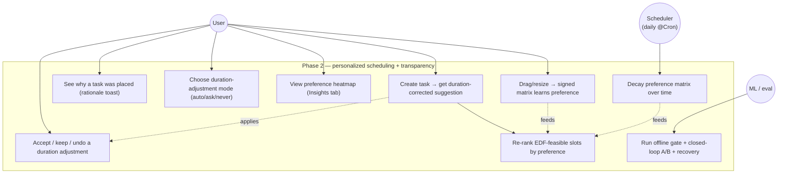
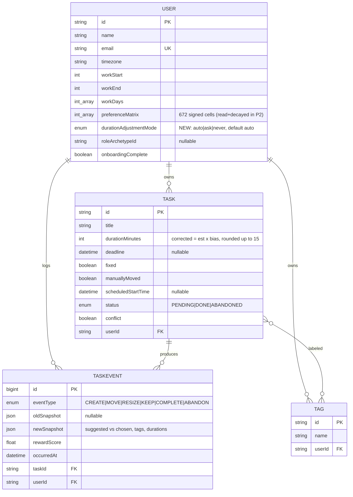
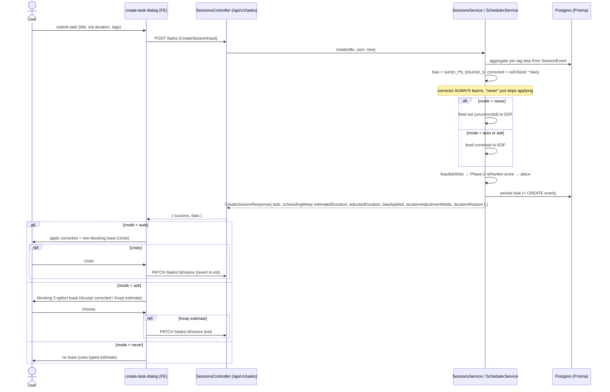
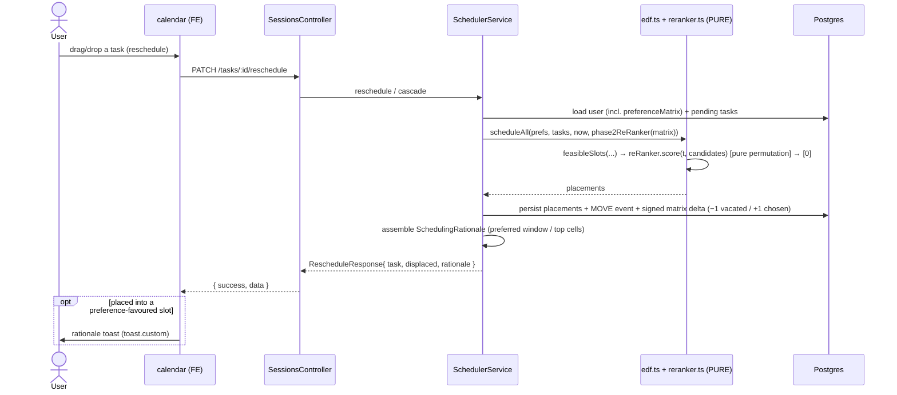
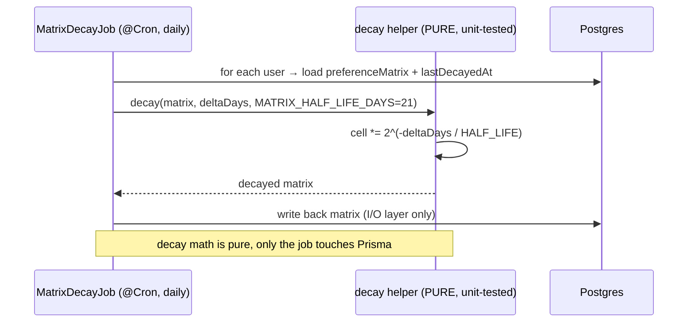

# 0001 — Phase 2 scheduling heuristic: preference-matrix re-ranker + duration corrector (with transparency UI)

- **Status:** Superseded (partially) — 2026-08-20
- **Date:** 2026-06-20
- **Issue:** [alphatrann/zenflow#13](https://github.com/alphatrann/zenflow/issues/13)
- **Owners:** `ml-engineer` (learners + eval), `backend-engineer` (service wiring + API + shared types), `frontend-engineer` (transparency UI)
- **Supersedes / relates to:** [docs/heuristic.md](../heuristic.md) (Phase 2), [docs/phase-2-evaluation-steps.md](../phase-2-evaluation-steps.md)

> **Superseded note (2026-08-20).** This repo has no prior ADR-supersession convention (ADR-0001
> is currently the only ADR), so this header is the convention going forward: a `Status` line
> updated to `Superseded (partially|fully) — <date>` plus a note like this one, left in place
> rather than rewriting history below. **What's superseded:** everything in this ADR about the
> **per-tag duration-bias corrector** — the `blendBias`/`maxBias` design (§"Decision → 2"), the
> `DurationAdjustmentMode` preference and its `auto|ask|never` UX (§"Decision → 4, 7", the data
> model change in §"Data model changes"), and the `durationReason`/`biasApplied`/
> `estimatedDuration` fields on `SchedulingMeta` — has been **removed end-to-end** (backend,
> shared types, web, and mobile). Reason: it's a deliberate simplification ahead of the Phase 3
> LinUCB bandit (`services/bandit/`), which supersedes per-tag duration correction with tags as
> a bandit context feature instead of a separately-maintained per-tag statistic. See
> [`docs/heuristic.md`](../heuristic.md#removed-per-tag-duration-bias-correction) for the current
> explanation. **What still stands:** the **signed preference-matrix re-ranker** (§"Decision →
> 1"), the softmax/Gumbel exploration + propensity logging, the matrix-decay cron (§"Decision →
> 3"), and the `GET /users/me/preference-matrix` endpoint / rationale-toast transparency UI are
> all still live and unaffected — hence "partially" superseded, not fully. Everything below this
> note is left as originally written and should be read as a historical record of the original
> decision, not current design.

---

## Reader's guide / glossary (for newcomers)

New to this codebase? Read this first. It plain-defines the jargon used below and gives the
intuition (what problem each piece solves). It changes no decision — it's a map, not new content.

**Domain & scheduling terms**

- **EDF (Earliest-Deadline-First)** — the Phase-1 scheduler. Given tasks with deadlines and a
  set of legal time slots, it places the most-urgent task first into the earliest slot that fits.
  It is **deterministic** and knows nothing about personal preference. Phase 2 keeps EDF in charge
  of _what's feasible_ and only personalizes _which feasible slot to prefer_.
- **Slot / block / 15-minute grid** — the day is chopped into 15-minute units. A whole day =
  96 blocks; `DAILY_HORIZON = 1440` minutes. Durations and start times must land on this grid
  (positive multiples of 15), so we round to it.
- **Feasible slots / candidates** — the set of slots EDF says a task _could_ legally go in
  (respects deadline, work hours, the grid). Phase 2 never adds or removes from this set; it only
  reorders it.
- **Re-ranker (`SlotReRanker`)** — a pluggable step that takes EDF's feasible candidate list and
  **reorders** it by personal preference, then EDF takes the first one. Phase 1 used an _identity_
  re-ranker (no reordering). The interface (the "seam") is locked; Phase 2 ships a real
  implementation behind it. Intuition: EDF says "any of these slots is legal"; the re-ranker says
  "but you tend to like _this_ one."
- **Preference matrix** — a per-user table that learns _when_ you like to work. It's a signed
  **7×96** grid (7 ISO weekdays × 96 fifteen-minute blocks = **672 cells**), stored flat as
  `User.preferenceMatrix Int[]`. Each cell's score nudges up `+1` when you keep/move a task toward
  that time, down `−1` when you move away. Higher cell = more preferred. The re-ranker sorts
  candidates by their cell scores. Cold start = an empty/neutral matrix → behaves like plain EDF.
- **`preferenceIndex(date, tz)`** — the helper that maps a wall-clock time to its cell in the flat
  672-array: `(isoWeekday−1)·96 + (hour·4 + ⌊minute/15⌋)`. Frontend and backend both use it so the
  heatmap and the scheduler agree on the grid.
- **Duration bias / per-tag duration corrector** — learns _how long_ tasks really take vs. your
  estimate, grouped by **tag**. If your `#backend` tasks historically run ~30% longer than
  estimated, the corrector multiplies the estimate up before scheduling. `bias` is the multiplier
  (`1.0` = no change). Applied as **preprocessing before EDF**, rounded up to the next 15 minutes.
- **Tags** — free-form labels on a task (e.g. `#backend`, `#email`). On the wire they're a
  `string[]`. A task can have several, which is why multi-tag blending (below) matters.
- **Blend vs. max-bias** — ways to combine a multi-tagged task's per-tag biases into one
  multiplier. **Blend** (the default) = sample-weighted average `Σ(nₜ·bₜ)/Σ(nₜ)` (each tag weighted
  by how many samples `nₜ` back it). **Max-bias** = take the single largest multiplier; it
  over-reserves time on multi-tagged tasks, so it's kept only as an opt-in experiment knob.
- **Decay / half-life** — old preferences should fade. A daily job multiplies each matrix cell by
  `2^(−Δdays / 21)`, i.e. a **21-day half-life**: a preference left untouched for 21 days counts
  half as much. Keeps the matrix tracking _current_ habits without hard cutoffs.
- **`pGlobal` / `tagBias` (ground truth)** — in simulation, each synthetic user ("persona") has a
  _hidden true_ time preference (`pGlobal`) and hidden true per-tag duration multipliers
  (`tagBias[tag] = { mu, sigma, bias }`, with `bias = exp(mu)`). These are the answers the learners
  are _supposed_ to discover. "Recovery" (below) measures how close the learned matrix/bias get to
  these hidden truths.
- **Transparency UI** — the product surfaces that _explain_ the learned decisions to the user:
  a "why was this placed here" rationale toast, duration-adjustment toasts, calendar delta styling,
  a preference heatmap, and the settings/onboarding controls. The point is to make personalization
  legible rather than a black box.

**Metrics & evaluation**

- **MAR (Manual Adjustment Rate)** — the north-star metric, **lower is better**. The fraction of
  the scheduler's suggested placements a user manually moves or resizes. Phase 1 sits at
  **MAR ≈ 0.82** (≈82% get adjusted by hand); Phase 2's job is to beat that. Each phase must win
  **offline** (in simulation) before going live.
- **Persona / synthetic population** — simulated users with known hidden preferences, used to test
  the learners offline before real users are involved.
- **Offline gate / closed-loop A/B / significance / recovery / guardrails / ablation / sensitivity**
  — the staged proof an experiment must pass before it ships: it must beat the baseline offline,
  win in a simulated A/B, show a statistically significant and meaningful MAR drop, actually
  recover the hidden truth, not regress any safety metric, and survive turning features off
  (ablation) and parameter sweeps (sensitivity).
- **Softmax / Boltzmann exploration, temperature `T`** — instead of always taking the single
  top-scored slot (greedy argmax), the re-ranker _samples_ a slot with probability proportional to
  `exp(cellScore / T)`. `T` controls randomness: `T → 0` ⇒ greedy (always the top), larger `T` ⇒
  more exploration. Why explore at all? See "stochastic logging policy."
- **Gumbel-top trick** — a way to draw that softmax sample while keeping the function _pure_ (no
  hidden state): add Gumbel noise to each score, sort, take the top. Mathematically identical to
  sampling from the softmax, but it's just a deterministic permutation of the candidates given a
  seed.
- **Propensity** — the probability the logging policy _actually had_ of choosing the slot it chose
  (here the softmax first-choice probability `exp(score_chosen/T) / Σ exp(score_j/T)`). We store it
  so later off-policy evaluation can correct for it.
- **IPS / SNIPS, off-policy / replay** — techniques to estimate "how would a _different_ policy
  have scored?" from logs of the policy we actually ran, by reweighting each logged outcome by
  `1/propensity`. They require the logging policy to be **stochastic with known probabilities** —
  which is exactly why the re-ranker samples and records propensity rather than acting greedily.
- **Pure core / service split** — a hard architectural rule (CLAUDE.md invariant #2). The scheduler
  _core_ (`edf.ts`, `slot.ts`, `horizon.ts`, `reranker.ts`) is **pure**: no I/O, no clock, no
  uncontrolled randomness — same inputs (plus an injected seed) always give the same output, so it's
  trivially testable. Anything stateful (DB reads, the matrix, bias tables, the RNG seed) is computed
  in `scheduler.service.ts` and **passed in**.
- **View / `viewWeights`** — a task is created in a day, week, or month **view**, which bounds its
  candidate slots. Day-view ⇒ candidates all sit in one weekday column of the matrix (re-ranker can
  only reorder by time-of-day); week/month ⇒ candidates span many day-columns (re-ranker can reorder
  across both day-of-week _and_ time). So a persona's mix of views (`viewWeights`) caps how much the
  re-ranker can learn/help.
- **Sidecar / ground-truth file** — a JSON file the simulator writes alongside a run
  (`sim-output/ground-truth-*.json`) holding each persona's hidden `pGlobal` and `tagBias`, so the
  recovery scripts can compare learned vs. true.

---

## Context

Phase 1 ships a **pure Earliest-Deadline-First (EDF)** scheduler (`backend/src/scheduler/edf.ts`,
`slot.ts`, `horizon.ts`) with an identity re-ranker behind a locked `SlotReRanker` seam
(`reranker.ts`). On the synthetic persona population it lands at **MAR ≈ 0.82** — about 82% of
suggested placements get moved or resized by hand. MAR (Manual Adjustment Rate) is the
roadmap's north-star (lower is better); each phase must beat the previous one offline before
going online.

In short: Phase 1 places tasks correctly but impersonally, and users override most placements.
Phase 2's goal is to cut that override rate (MAR) by learning each user's _when_ (placement) and
_how long_ (duration) — while keeping the proven EDF core untouched.

Phase 2 (heuristic.md §Phase 2, phase-2-evaluation-steps.md) introduces **two independent,
tag-blind learners** that personalize _without touching the pure scheduler core_:

1. **Signed 7×96 preference matrix** (placement — "where"). 7 ISO weekdays × 96 fifteen-minute
   blocks = **672 cells/user**, already modelled as `User.preferenceMatrix Int[]` and already
   written from telemetry (move-away `−1`, keep / move-toward `+1`, neutral `0`). It is **not
   yet read** by the scheduler. Phase 2 reads it: a concrete `SlotReRanker` re-orders EDF's
   feasible slots by descending cell score.
2. **Per-tag duration-bias correction** (duration — "how long"). A sample-weighted blend
   `bias = Σ(nₜ·bₜ)/Σ(nₜ)` over a task's tags, applied as **preprocessing before EDF**:
   `corrected = estimated × bias`, rounded **up** to the next 15-minute multiple.

Beyond building and _proving_ the learners (offline gate → closed-loop A/B → significance +
recovery → guardrails → ablation/sensitivity), this issue makes the learned decisions
**transparent in the product**: a scheduling-rationale toast, duration-adjustment toasts gated
by an `auto | ask | never` mode, calendar block delta styling, a redesigned tabbed Settings
dialog, a preference-matrix heatmap, and an onboarding step.

### Constraints (CLAUDE.md invariants this change must honor)

- **#1 — `@zenflow/shared` is the API contract.** New request/response shapes go in
  `packages/shared/src` then `pnpm shared:build`; never duplicated in FE/BE.
- **#2 — the scheduler core is pure.** `edf.ts`, `slot.ts`, `horizon.ts`, `reranker.ts` take
  inputs as parameters and do no I/O. **No _uncontrolled_ randomness:** the core may use
  randomness only via an **injected seed**, so it stays a pure, reproducible function of
  `(inputs + seed)` — never `Math.random()` or the clock. (Phase 2's softmax re-ranker needs
  Gumbel noise; it draws it from a tiny seeded PRNG in `rng.ts`, seeded per-task from the task
  id by the service.) Only `scheduler.service.ts` touches Prisma / telemetry. The matrix, the
  per-tag bias tables, the decay, the temperature, and the RNG seed are all **computed in the
  service and passed IN**. Any pure-fn change updates its `*.spec.ts`.
- **#3 — 15-minute grid.** Durations are positive multiples of 15; `DAILY_HORIZON = 1440`. The
  corrected duration is rounded **up** to the next 15-min unit (no off-grid times).
- **#6 — response envelope** `{ success, message, data }`.
- **#7 — auth** is OTP + Redis sessions; protected routes use `CookieAuthGuard` + `@CurrentUser()`.

### Discrepancies between the issue and the code (resolved in favor of the code)

- The issue calls the duration-correction metadata "create-task response **duration-correction
  metadata**." The create-task response already carries `SchedulingMeta`
  (`packages/shared/src/api.ts`) with `adjustedDuration`, `biasApplied?`, `engine`, `placedAt`.
  **Decision:** extend `SchedulingMeta` (the existing home) rather than introduce a parallel
  shape — see _API schema changes_. `biasApplied` is the bias multiplier (today hard-coded
  `1.0` in `tasks.service.ts`); Phase 2 makes it real.
- The issue uses `b_tag = exp(mu)`. The sidecar (`eval/ground-truth.ts`, `PersonaGroundTruth`)
  already stores `tagBias[tag] = { mu, sigma, bias }` with `bias = exp(mu)`; recovery scores
  against `bias`. No new sidecar fields are needed.
- Shared `Session.tags` is documented as `string[]` (Postgres `text[]`); the DB actually models
  tags as a per-user `Tag` relation. The **wire format stays `string[]`** — unchanged.

---

## Decision

### 1. Concrete `SlotReRanker` (placement, pure)

Add a Phase-2 `SlotReRanker` in `backend/src/scheduler/reranker.ts` behind the existing locked
seam. It is constructed with the user's **672-cell signed matrix** (passed in by the service)
and a pure cell-index function. `score(task, candidates)` returns the **same** candidate set
**re-ordered** toward higher cell scores — a **pure permutation** that adds nothing and drops
nothing. The cell index reuses the existing
`preferenceIndex(date, tz) = (isoWeekday−1)·96 + (hour·4 + ⌊minute/15⌋)` from `slot.ts`, so FE
and BE agree on the grid. `edf.ts` already routes `scheduleAll(..., reRanker)` through
`reRanker.score(t, candidates)[0]`; **no core change to feasibility** is required.

**Softmax/Boltzmann exploration, not greedy argmax.** Intuition: if we always picked the single
best-scoring slot, we'd only ever _see_ outcomes for that one slot and never learn whether the
runner-up slots were actually better — and later off-policy math (IPS, below) breaks without some
randomness. So the re-ranker samples among the good slots, weighted toward the better ones, instead
of deterministically taking the top one. The re-ranker does not pick the single
top-scored slot deterministically. A pure argmax only ever logs outcomes for the top slot,
which biases the telemetry later phases learn from and makes off-policy IPS evaluation
degenerate (it needs a _stochastic_ logging policy with known action probabilities). So
`score` samples via the **Gumbel-top trick** — `logit_i = cellScore_i / T + gumbel(rng)`, sort
by logit, take `[0]` — which draws exactly from the softmax `p_i ∝ exp(cellScore_i / T)` over
the feasible set while remaining a pure permutation. `T` is a tunable constant
(`RERANKER_TEMPERATURE` in `constants.ts`, default `1.0`); `T → 0` recovers the greedy argmax,
larger `T` explores more. The re-ranker also exposes `propensity(task, candidates, chosen)` —
the closed-form softmax first-choice marginal `exp(score_chosen/T) / Σ_j exp(score_j/T)` — and
`SchedulerService` **persists the chosen slot's propensity** onto the CREATE/auto-placement
event snapshot (`SessionEvent.newSnapshot.propensity`, a JSON field — **no Prisma migration, no
`@zenflow/shared` change**) so the IPS/SNIPS replay divides by the true logged probability.

**Cold-start + determinism guarantees.** When every feasible candidate scores equally (an
empty / wrong-length / neutral matrix — the common cold-start case) the re-ranker returns EDF
earliest-fit order **unchanged** (no random shuffle of a new user's tasks); its propensity is
uniform `1/n`. The Gumbel seed is derived from the **task id only** (a stable hash, never
`now`), computed in the service and passed in, so re-packing the same task on an unrelated
cascade yields the same draw — no slot churn (protects the Time-to-stable metric) — and the
core remains a pure, reproducible function of `(inputs + seed)`. `*.spec.ts` covers: `T → 0`
== argmax; cold/neutral == identity earliest-fit; output is always a permutation; same seed →
same result; a peaked matrix picks the peak w.h.p.; and the propensity matches the softmax
marginal.

**View-bounded candidate window.** Intuition: the re-ranker can only reorder the slots it's given,
and how wide that set is depends on whether the task was created in a day, week, or month view.
A day-view task's slots all fall on one weekday, so the re-ranker can only shuffle by time-of-day;
a week/month task's slots span several days, giving it more room to express preference. This is why
the evaluation sweeps must be read against each persona's mix of views. The re-ranker permutes
_only the candidates it is handed_ — a set already shaped by the task's stored `view`. The pure core never sees `view`; it enters
scheduling indirectly via `toEdfSession` (`telemetry.ts`), which derives the period **floor**
(`schedulingAnchor`, start-of-day of the create day) and, for a flexible no-deadline task, the
period **ceiling** (`schedulingDeadline = endOfPeriod(anchor, view, tz, work)` — end of the
viewed day / week / month). Consequence for placement leverage: a **day**-view task's candidates
all share one ISO-weekday column of the 7×96 matrix, so the re-ranker can only reorder by
**block/time**; **week** / **month** views span multiple day-columns, giving it room to reorder
across **day-of-week _and_ block**. The re-ranker's ability to recover the hidden `pGlobal` field
therefore scales with how week/month-heavy a persona's `viewWeights` are — read the §6
sample-complexity / sensitivity sweeps with that in mind. (Note the move/`feasibleSlots` helper
enumerates forward from the anchor floor and is **not** capped at the ceiling — only the
`scheduleAll` cascade enforces it; this is existing Phase-1 behaviour, identical between the
simulator and production, so it is not a substrate defect and requires no Phase-1 re-run.)

### 2. Per-tag duration corrector (preprocessing, pure helper + service blend)

Intuition: users systematically mis-estimate how long certain _kinds_ of work take. This learner
watches actual vs. estimated durations per tag, and scales a new task's estimate by what its tags
historically imply — so the schedule reserves a realistic amount of time.

A pure helper computes `corrected = ceilTo15(estimated × bias)` where
`bias = Σ(nₜ·bₜ)/Σ(nₜ)` (sample-weighted blend). The per-tag `{ bₜ, nₜ }` table is **aggregated
in the service** from `SessionEvent` telemetry (rolling `actual ÷ estimated`, tag names captured
per-event in the snapshot) and passed into the pure blender. **Max-bias** (take the largest
multiplier) is an **opt-in ablation knob, not the default** — default is blend, because
max-bias inflates multi-tagged schedules. When the user's mode is `never` the corrector **still
learns** per-tag bias (for the heatmap / analytics) — it just isn't applied.

### 3. Matrix-decay cron (daily, pure helper + I/O wrapper)

A daily NestJS `@Cron` job (`@nestjs/schedule` is already a dependency, `^6.1.0`) applies an
exponential time-decay per cell: `score *= 2^(−Δdays / MATRIX_HALF_LIFE_DAYS)` with
`MATRIX_HALF_LIFE_DAYS = 21` (≈3-week half-life), a **configurable constant**. The **decay math
is a pure, unit-tested helper**; the cron wrapper (the only I/O layer) loads each user's matrix,
applies the helper, writes it back. `edf.ts` / `reranker.ts` stay pure.

### 4. Live wiring + transparency assembly (service only)

`scheduler.service.ts` / `tasks.service.ts`:

- Compute the matrix + bias tables, **apply the corrector before EDF**, and **pass the matrix
  into `scheduleAll`** via the Phase-2 re-ranker on the real (non-simulation) scheduling path.
- **Assemble the rationale payload** in schedule/reschedule responses (the dominant preferred
  work window, or the top day×block cells that drove the pick).
- **Assemble the duration-correction metadata** in the create-task response (estimated vs
  corrected duration, the active `auto|ask|never` mode, a short reason naming the driving tag(s)).
- Expose a **read endpoint** for the current user's 672-cell signed matrix.

### 5. Simulation + evaluation harness (ml)

- `run.ts`: add a `--reranker=phase2` branch (today `parseArgs` hard-rejects anything but
  `identity`).
- `runner.ts`: thread a concrete `SlotReRanker` + the duration corrector through `RunOptions`
  and the scheduler calls (today `reranker` is a `"identity"` literal that never instantiates).
- `eval/replay.ts`: plug the Phase-2 candidate into the existing IPS/SNIPS `estimateReplay`.
- `eval/recovery.ts` (**new**): score `‖matrix_normalized − pGlobal‖` and `|b̂_tag − b_tag|`
  against the Step-0 sidecar (`sim-output/ground-truth-seed${seed}-days${days}.json`).
- `eval/significance.ts` (**new**): paired Wilcoxon signed-rank on per-persona MAR delta,
  Cliff's δ, 95% CI, plus an outer multi-seed sweep.

### 6. Persist the new preference (data + contract)

Add a single `durationAdjustmentMode` enum column to the user record (`"auto" | "ask" | "never"`,
default `"auto"`), threaded through the preferences/onboarding update path and surfaced on the
shared `User` / `UserPreferences` / `UpdatePreferencesInput` / `OnboardingInput` types.

### 7. Transparency UI (frontend)

Rationale toast (sonner `toast.custom`, mirroring `overflow-toast.tsx`); duration-adjustment
behaviour gated by mode (auto → apply + non-blocking toast with **Undo**; ask → blocking
two-option toast; never → silent); calendar block delta styling in `scheduled-block-item.tsx`
(added/removed minutes rendered distinctly, must not break drag/resize); a Todoist-style tabbed
Settings redesign (`settings-dialog.tsx`: Work hours/days · Scheduling · Insights · Account);
a 7×96 signed-score heatmap in the Insights tab (fetch-on-open, cold-start handled); and the
mode control added to onboarding (`onboarding.tsx`).

### Rejected alternatives

| Decision point                       | Chosen                                                                          | Rejected                                            | Why                                                                                                                                                                                                                |
| ------------------------------------ | ------------------------------------------------------------------------------- | --------------------------------------------------- | ------------------------------------------------------------------------------------------------------------------------------------------------------------------------------------------------------------------ |
| Matrix storage                       | **Materialized** flat 672-int column (`User.preferenceMatrix`), already present | Virtual / recompute-from-`SessionEvent`-on-read     | Recompute is O(events) per schedule call on the hot path; the column already exists, is written from telemetry, and the cron decays it cheaply.                                                                    |
| Duration multi-tag conflict          | **Sample-weighted blend** (default)                                             | Max-bias as default                                 | Max-bias systematically over-reserves multi-tagged tasks (schedule inflation, guardrail §7 risk). Max-bias kept only as an ablation knob.                                                                          |
| Where matrix/bias/decay are computed | **In the service** (passed into the pure core)                                  | In-core (read matrix inside `edf.ts`/`reranker.ts`) | Invariant #2: the core must stay pure/IO-free/testable. The seam already accepts inputs as params.                                                                                                                 |
| Live production wiring scope         | **Wire the live path in this issue**                                            | Defer live wiring (eval-only)                       | The transparency UI _depends_ on the live path emitting rationale + correction metadata; an eval-only path can't drive the product UI. Promotion still gates the _scheduling_ behaviour change (see Consequences). |
| Significance / recovery tooling      | **Runnable `eval/` scripts (`pnpm sim:*`)**                                     | Jest tests                                          | These are analyses over a _fresh_ simulated population (expensive, stochastic, reported as distributions), not pass/fail assertions. Pure helpers (decay, blend, recovery norms) still get `*.spec.ts`.            |
| Re-ranker output contract            | **Pure permutation** (reorder only)                                             | Allow filtering/adding candidates                   | Feasibility is EDF's hard constraint (deadline/work-hours/grid); the re-ranker only expresses _preference_ among already-feasible slots.                                                                           |
| Heatmap freshness                    | **Fetch-on-open**                                                               | Live-refresh / websocket                            | The matrix changes slowly (telemetry + daily decay); on-open fetch is simpler and sufficient.                                                                                                                      |

---

## API schema changes

All under the global prefix `/api/v1`, all in the `{ success, message, data }` envelope, all
protected by `CookieAuthGuard` + `@CurrentUser()`.

### Endpoints

| Method  | Path                          | Change                                                                                   | `data` type                |
| ------- | ----------------------------- | ---------------------------------------------------------------------------------------- | -------------------------- |
| **GET** | `/users/me/preference-matrix` | **New** — current user's 672-cell signed matrix for the Insights heatmap (fetch-on-open) | `PreferenceMatrixResponse` |
| POST    | `/tasks`                      | Response `schedulingMeta` now carries **real** duration-correction metadata              | `CreateSessionResponse`    |
| PATCH   | `/tasks/:id/reschedule`       | Response carries an optional **rationale** payload                                       | `RescheduleResponse`       |
| PATCH   | `/tasks/:id/resize`           | Same `RescheduleResponse` (+ optional rationale)                                         | `RescheduleResponse`       |
| PATCH   | `/tasks/:id/resolve-overflow` | Same `RescheduleResponse` (+ optional rationale)                                         | `RescheduleResponse`       |
| PUT     | `/users/me/preferences`       | Accepts `durationAdjustmentMode`                                                         | `User`                     |
| POST    | `/users/me/onboarding`        | Accepts `durationAdjustmentMode`                                                         | `User`                     |

> The matrix read endpoint lives under `/users/me/…` (it is per-user preference data, alongside
> `/users/me/preferences`). The DTO is validated by the strict global pipe; the enum field is
> validated with `class-validator` `@IsIn(["auto","ask","never"])`.

### `@zenflow/shared` type deltas (`packages/shared/src`)

```ts
// user.ts ─────────────────────────────────────────────────────────────────────
/** How the per-tag duration corrector surfaces its adjustment to the user. */
export type DurationAdjustmentMode = "auto" | "ask" | "never";

export interface UserPreferences {
  workStart: number;
  workEnd: number;
  workDays: number[];
  timezone: string;
  /** Duration-corrector UX mode; default "auto". */ // NEW
  durationAdjustmentMode: DurationAdjustmentMode; // NEW
}
// User extends UserPreferences → inherits the field.
// UpdatePreferencesInput / OnboardingInput gain an OPTIONAL field (partial update):
export interface UpdatePreferencesInput {
  workStart: number;
  workEnd: number;
  workDays: number[];
  timezone: string;
  roleArchetypeId?: string | null;
  durationAdjustmentMode?: DurationAdjustmentMode; // NEW (optional)
}
// OnboardingInput = UpdatePreferencesInput (unchanged alias)

// api.ts ──────────────────────────────────────────────────────────────────────
/** Why the engine put a task where it did (Phase-2 placement re-ranker). */
export interface SchedulingRationale {
  // NEW
  /** Human-readable summary, e.g. "You usually keep work in the morning". */
  summary: string;
  /** Dominant preferred work window (minutes-from-midnight), if any. */
  preferredWindow?: { startMin: number; endMin: number } | null;
  /** Top day×block cells that drove the pick (matrix coords + score). */
  topCells?: { day: number; block: number; score: number }[];
}

export interface SchedulingMeta {
  // EXTENDED
  /** Corrected duration actually fed to EDF (rounded up to 15-min). */
  adjustedDuration: number;
  placedAt: string | null;
  engine: "edf";
  /** Per-tag blended bias multiplier; 1.0 when no bias applied. */
  biasApplied?: number;
  /** User's typed estimate before correction (minutes). */ // NEW
  estimatedDuration?: number;
  /** Active mode at create time (drives the FE toast behaviour). */ // NEW
  durationAdjustmentMode?: DurationAdjustmentMode;
  /** Short reason naming the driving tag(s), e.g. "#backend ~30% longer". */ // NEW
  durationReason?: string | null;
}

export interface RescheduleResponse {
  task: Session;
  displaced: DisplacedSession[];
  /** Present when a preference-favoured slot drove the placement. */ // NEW
  rationale?: SchedulingRationale | null;
}
// CreateSessionResponse is unchanged structurally — it already nests SchedulingMeta,
// which now carries the duration-correction metadata above.

/** 7×96 signed preference matrix for the Insights heatmap. */ // NEW
export interface PreferenceMatrixResponse {
  /** Flat 672-int row-major [day0..6][block0..95], signed scores. */
  matrix: number[];
  /** Grid dims so the FE doesn't hard-code them. */
  days: number; // 7
  blocks: number; // 96
}
```

> After editing these, run `pnpm shared:build` before BE/FE typecheck. No shape is duplicated in
> either app (invariant #1).

---

## Data model changes (Prisma)

**Exactly one new column.** Telemetry (`SessionEvent`) is **already complete** — it carries the
suggested vs chosen slot, per-event tag names, durations, and outcome; Phase 2 needs no
telemetry change. `User.preferenceMatrix Int[]` (672 cells) already exists and is already
written — Phase 2 only starts _reading_ and _decaying_ it.

```prisma
enum DurationAdjustmentMode {
  auto
  ask
  never
}

model User {
  // … existing fields …
  durationAdjustmentMode DurationAdjustmentMode @default(auto)  // NEW
}
```

Migration impact: a single additive column with a default — no backfill needed (existing rows
default to `auto`). The Prisma `ViewMode` enum precedent (a lowercase string enum mirroring a
shared union) is followed.

---

## Consequences

### Trade-offs

- **Hot-path cost.** Each schedule call now reads the 672-int matrix and sorts the feasible set
  by cell score (O(n log n) over a small candidate list) and runs the per-tag blend. Both are
  cheap; the matrix is a single column read already loaded with the `User`.
- **Re-ranker permutation guarantee.** The Phase-2 re-ranker must provably neither add nor drop
  candidates; a `*.spec.ts` asserts the output is a permutation of the input (same multiset)
  for every seed, and that an all-equal / cold-start matrix == identity earliest-fit.
- **Stochastic logging policy.** The re-ranker samples (softmax/Gumbel) rather than taking the
  argmax, so exploration is on by the temperature `T`. This trades a little immediate greedy
  exploitation for the unbiased telemetry + well-defined propensities IPS needs. The §Online
  evaluation guardrail still applies: cap exploration (lower `T`) if a cohort's MAR regresses;
  `T → 0` falls back to greedy.
- **Decay is global per cell, daily.** A 21-day half-life means stale preferences fade without
  hard cutoffs; the constant is configurable for the §8 drift-sensitivity sweep.
- **`never` still learns.** Bias is accumulated regardless of mode so the heatmap/analytics stay
  meaningful — only _application_ is gated. This is a deliberate (documented) surprise.
- **View-bounded re-rank leverage.** The re-ranker's reorder room is set by the task's `view`
  (day = one weekday column, week/month = many) — see §1. The Phase-1 frozen substrate already
  encodes this (the simulator and production place through the same `toEdfSession`), so it is **not**
  a data defect and needs **no Phase-1 re-run**; it only means the §6 sweeps must be read against
  each persona's `viewWeights`, and a day-view-heavy cohort is the natural floor on the achievable
  MAR drop.

### Open questions — RESOLVED

- **(a) Production wiring of the live Phase-2 re-ranker — in this issue, or deferred?**
  **Resolved: wire it live in this issue.** The transparency UI depends on the live scheduling
  path emitting the rationale + correction metadata, so an eval-only path cannot satisfy the FE
  acceptance criteria. **Guard:** the _scheduling-behaviour_ change (re-rank + correct) only
  _promotes_ (ships as the default scheduling policy) when **all** promotion gates pass — offline
  gate (§2), significant MAR drop with meaningful effect (§3–4), recovery improved (§4), no
  guardrail regression (§5), survives ablation + sensitivity (§6). The recommended seam is a
  config/flag so the live path can run Phase-2 while promotion is still being proven, and fall
  back to identity per-cohort if a guardrail regresses.
- **(b) Significance/recovery tooling — `eval/` scripts or tests?**
  **Resolved: runnable `eval/` scripts** invoked via `pnpm sim:*` (alongside `sim:run` /
  `sim:eval`), because they analyse a _fresh, stochastic_ simulated population and report
  distributions/CIs rather than boolean assertions. Pure helpers they call (decay, blend,
  recovery norms, the re-ranker permutation) are still covered by `*.spec.ts`.

### Follow-ups (explicitly out of scope here)

- Tag-conditioned placement (per-tag matrices) → **Phase 3** (enters as bandit features).
- Richer Step-4 candidate reconstruction (re-running `feasibleSlots` per logged decision) →
  Phase-2 follow-up.
- Name/email editing in the Account tab → separate issue.

---

## Diagrams

### Use-case diagram



### Updated DB schema (`erDiagram`)

Only `User.durationAdjustmentMode` is new; `preferenceMatrix` and `SessionEvent` already exist.



### Sequence 1 — create-task duration correction (auto / ask / never branch)



### Sequence 2 — schedule / reschedule re-rank + rationale



### Sequence 3 — daily matrix-decay cron



---

## Scope split for `/implement`

- **ML (`ml-engineer`):** Phase-2 `SlotReRanker` (signed-matrix scorer, pure permutation) +
  pure duration-blend helper + pure decay helper (all with `*.spec.ts`); `run.ts`
  `--reranker=phase2`; `runner.ts` threading; `eval/replay.ts` candidate; new
  `eval/recovery.ts` + `eval/significance.ts` as `pnpm sim:*` scripts.
- **Backend (`backend-engineer`):** `durationAdjustmentMode` Prisma enum column + migration;
  shared-types deltas + `pnpm shared:build`; service-layer matrix/bias aggregation, corrector
  preprocessing, live re-ranker wiring, rationale + correction-metadata assembly; daily `@Cron`
  decay wrapper; `GET /users/me/preference-matrix`; preferences/onboarding DTO + persistence.
- **Frontend (`frontend-engineer`):** rationale toast; auto/ask/never duration toasts + Undo;
  calendar delta styling in `scheduled-block-item.tsx`; tabbed Settings redesign
  (`settings-dialog.tsx`); 7×96 heatmap (Insights, fetch-on-open, cold-start); onboarding mode
  step (`onboarding.tsx`); `src/api/` calls for the new endpoint + fields; Playwright e2e.
