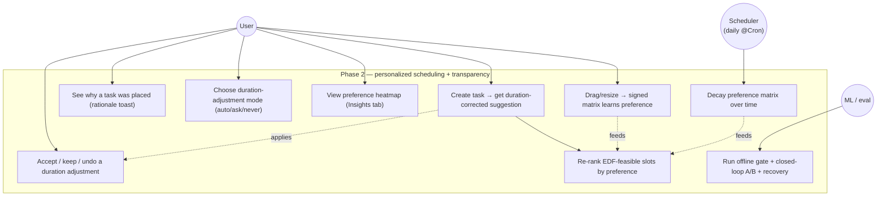
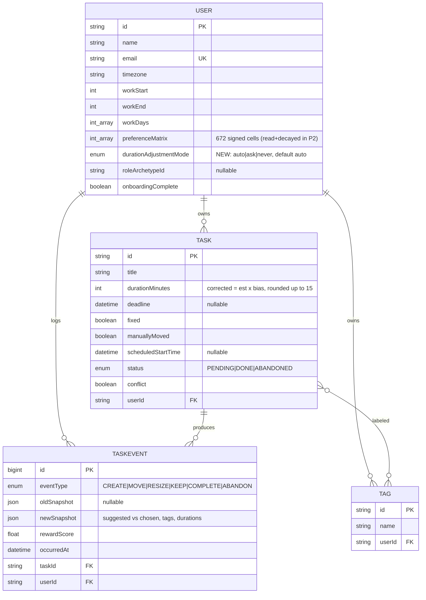
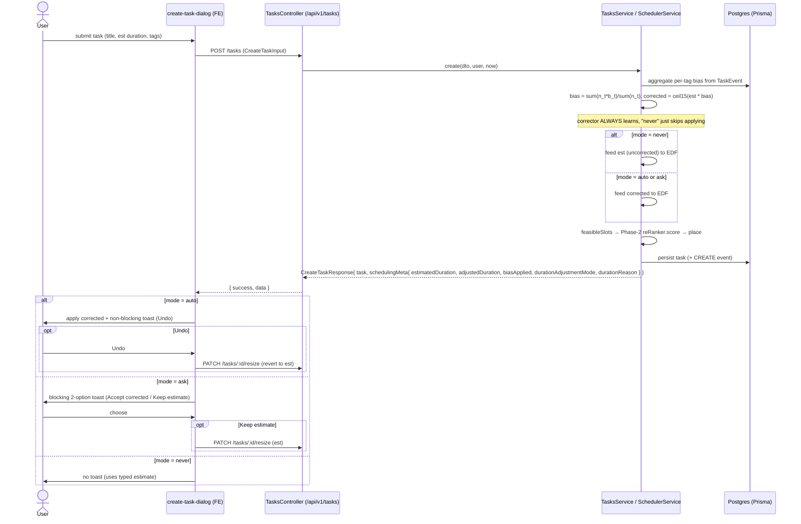
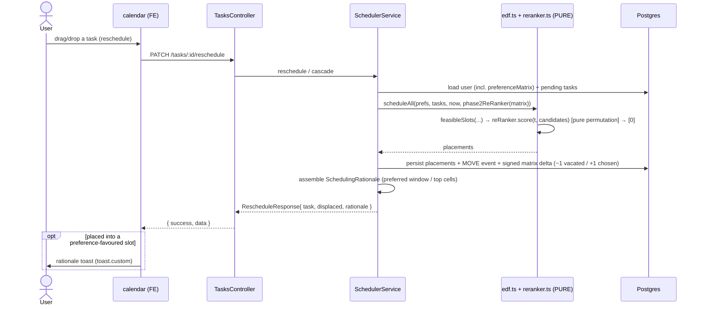
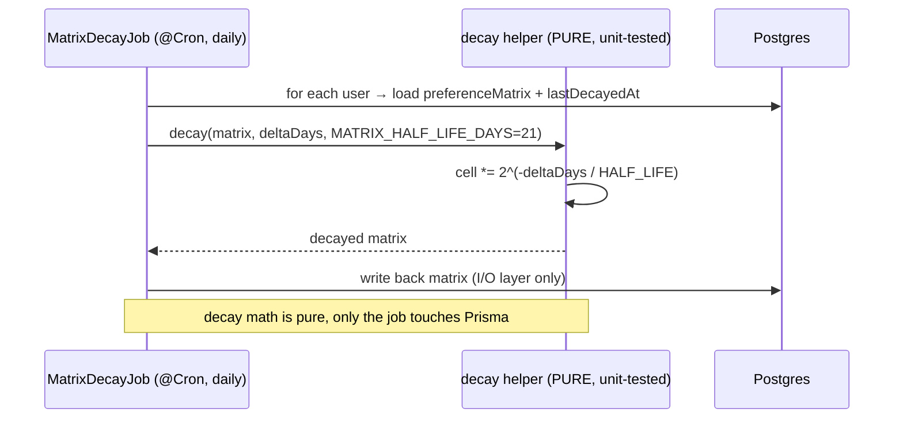

# 0001 — Phase 2 scheduling heuristic: preference-matrix re-ranker + duration corrector (with transparency UI)

- **Status:** Accepted
- **Date:** 2026-06-20
- **Issue:** [alphatrann/zenflow#13](https://github.com/alphatrann/zenflow/issues/13)
- **Owners:** `ml-engineer` (learners + eval), `backend-engineer` (service wiring + API + shared types), `frontend-engineer` (transparency UI)
- **Supersedes / relates to:** [docs/heuristic.md](../heuristic.md) (Phase 2), [docs/phase-2-evaluation-steps.md](../phase-2-evaluation-steps.md)

---

## Context

Phase 1 ships a **pure Earliest-Deadline-First (EDF)** scheduler (`backend/src/scheduler/edf.ts`,
`slot.ts`, `horizon.ts`) with an identity re-ranker behind a locked `SlotReRanker` seam
(`reranker.ts`). On the synthetic persona population it lands at **MAR ≈ 0.82** — about 82% of
suggested placements get moved or resized by hand. MAR (Manual Adjustment Rate) is the
roadmap's north-star (lower is better); each phase must beat the previous one offline before
going online.

Phase 2 (heuristic.md §Phase 2, phase-2-evaluation-steps.md) introduces **two independent,
tag-blind learners** that personalize *without touching the pure scheduler core*:

1. **Signed 7×96 preference matrix** (placement — "where"). 7 ISO weekdays × 96 fifteen-minute
   blocks = **672 cells/user**, already modelled as `User.preferenceMatrix Int[]` and already
   written from telemetry (move-away `−1`, keep / move-toward `+1`, neutral `0`). It is **not
   yet read** by the scheduler. Phase 2 reads it: a concrete `SlotReRanker` re-orders EDF's
   feasible slots by descending cell score.
2. **Per-tag duration-bias correction** (duration — "how long"). A sample-weighted blend
   `bias = Σ(nₜ·bₜ)/Σ(nₜ)` over a task's tags, applied as **preprocessing before EDF**:
   `corrected = estimated × bias`, rounded **up** to the next 15-minute multiple.

Beyond building and *proving* the learners (offline gate → closed-loop A/B → significance +
recovery → guardrails → ablation/sensitivity), this issue makes the learned decisions
**transparent in the product**: a scheduling-rationale toast, duration-adjustment toasts gated
by an `auto | ask | never` mode, calendar block delta styling, a redesigned tabbed Settings
dialog, a preference-matrix heatmap, and an onboarding step.

### Constraints (CLAUDE.md invariants this change must honor)

- **#1 — `@zenflow/shared` is the API contract.** New request/response shapes go in
  `packages/shared/src` then `pnpm shared:build`; never duplicated in FE/BE.
- **#2 — the scheduler core is pure.** `edf.ts`, `slot.ts`, `horizon.ts`, `reranker.ts` take
  inputs as parameters, do no I/O or randomness. Only `scheduler.service.ts` touches Prisma /
  telemetry. The matrix, the per-tag bias tables, and the decay are **computed in the service
  and passed IN**. Any pure-fn change updates its `*.spec.ts`.
- **#3 — 15-minute grid.** Durations are positive multiples of 15; `DAILY_HORIZON = 1440`. The
  corrected duration is rounded **up** to the next 15-min unit (no off-grid times).
- **#6 — response envelope** `{ success, message, data }`.
- **#7 — auth** is OTP + Redis sessions; protected routes use `CookieAuthGuard` + `@CurrentUser()`.

### Discrepancies between the issue and the code (resolved in favor of the code)

- The issue calls the duration-correction metadata "create-task response **duration-correction
  metadata**." The create-task response already carries `SchedulingMeta`
  (`packages/shared/src/api.ts`) with `adjustedDuration`, `biasApplied?`, `engine`, `placedAt`.
  **Decision:** extend `SchedulingMeta` (the existing home) rather than introduce a parallel
  shape — see *API schema changes*. `biasApplied` is the bias multiplier (today hard-coded
  `1.0` in `tasks.service.ts`); Phase 2 makes it real.
- The issue uses `b_tag = exp(mu)`. The sidecar (`eval/ground-truth.ts`, `PersonaGroundTruth`)
  already stores `tagBias[tag] = { mu, sigma, bias }` with `bias = exp(mu)`; recovery scores
  against `bias`. No new sidecar fields are needed.
- Shared `Task.tags` is documented as `string[]` (Postgres `text[]`); the DB actually models
  tags as a per-user `Tag` relation. The **wire format stays `string[]`** — unchanged.

---

## Decision

### 1. Concrete `SlotReRanker` (placement, pure)

Add a Phase-2 `SlotReRanker` in `backend/src/scheduler/reranker.ts` behind the existing locked
seam. It is constructed with the user's **672-cell signed matrix** (passed in by the service)
and a pure cell-index function. `score(task, candidates)` returns the **same** candidate set
**re-ordered** by descending cell score — a **pure permutation** that adds nothing and drops
nothing (a stable tie-break on the original EDF time order keeps it deterministic; an empty /
cold-start matrix degenerates to identity). The cell index reuses the existing
`preferenceIndex(date, tz) = (isoWeekday−1)·96 + (hour·4 + ⌊minute/15⌋)` from `slot.ts`, so FE
and BE agree on the grid. `edf.ts` already routes `scheduleAll(..., reRanker)` through
`reRanker.score(t, candidates)[0]`; **no core change to feasibility** is required.

### 2. Per-tag duration corrector (preprocessing, pure helper + service blend)

A pure helper computes `corrected = ceilTo15(estimated × bias)` where
`bias = Σ(nₜ·bₜ)/Σ(nₜ)` (sample-weighted blend). The per-tag `{ bₜ, nₜ }` table is **aggregated
in the service** from `TaskEvent` telemetry (rolling `actual ÷ estimated`, tag names captured
per-event in the snapshot) and passed into the pure blender. **Max-bias** (take the largest
multiplier) is an **opt-in ablation knob, not the default** — default is blend, because
max-bias inflates multi-tagged schedules. When the user's mode is `never` the corrector **still
learns** per-tag bias (for the heatmap / analytics) — it just isn't applied.

### 3. Matrix-decay cron (daily, pure helper + I/O wrapper)

A daily NestJS `@Cron` job (`@nestjs/schedule` is already a dependency, `^6.1.0`) applies an
exponential time-decay per cell: `score *= 2^(−Δdays / MATRIX_HALF_LIFE_DAYS)` with
`MATRIX_HALF_LIFE_DAYS = 21` (≈3-week half-life), a **configurable constant**. The **decay math
is a pure, unit-tested helper**; the cron wrapper (the only I/O layer) loads each user's matrix,
applies the helper, writes it back. `edf.ts` / `reranker.ts` stay pure.

### 4. Live wiring + transparency assembly (service only)

`scheduler.service.ts` / `tasks.service.ts`:
- Compute the matrix + bias tables, **apply the corrector before EDF**, and **pass the matrix
  into `scheduleAll`** via the Phase-2 re-ranker on the real (non-simulation) scheduling path.
- **Assemble the rationale payload** in schedule/reschedule responses (the dominant preferred
  work window, or the top day×block cells that drove the pick).
- **Assemble the duration-correction metadata** in the create-task response (estimated vs
  corrected duration, the active `auto|ask|never` mode, a short reason naming the driving tag(s)).
- Expose a **read endpoint** for the current user's 672-cell signed matrix.

### 5. Simulation + evaluation harness (ml)

- `run.ts`: add a `--reranker=phase2` branch (today `parseArgs` hard-rejects anything but
  `identity`).
- `runner.ts`: thread a concrete `SlotReRanker` + the duration corrector through `RunOptions`
  and the scheduler calls (today `reranker` is a `"identity"` literal that never instantiates).
- `eval/replay.ts`: plug the Phase-2 candidate into the existing IPS/SNIPS `estimateReplay`.
- `eval/recovery.ts` (**new**): score `‖matrix_normalized − pGlobal‖` and `|b̂_tag − b_tag|`
  against the Step-0 sidecar (`sim-output/ground-truth-seed${seed}-days${days}.json`).
- `eval/significance.ts` (**new**): paired Wilcoxon signed-rank on per-persona MAR delta,
  Cliff's δ, 95% CI, plus an outer multi-seed sweep.

### 6. Persist the new preference (data + contract)

Add a single `durationAdjustmentMode` enum column to the user record (`"auto" | "ask" | "never"`,
default `"auto"`), threaded through the preferences/onboarding update path and surfaced on the
shared `User` / `UserPreferences` / `UpdatePreferencesInput` / `OnboardingInput` types.

### 7. Transparency UI (frontend)

Rationale toast (sonner `toast.custom`, mirroring `overflow-toast.tsx`); duration-adjustment
behaviour gated by mode (auto → apply + non-blocking toast with **Undo**; ask → blocking
two-option toast; never → silent); calendar block delta styling in `scheduled-block-item.tsx`
(added/removed minutes rendered distinctly, must not break drag/resize); a Todoist-style tabbed
Settings redesign (`settings-dialog.tsx`: Work hours/days · Scheduling · Insights · Account);
a 7×96 signed-score heatmap in the Insights tab (fetch-on-open, cold-start handled); and the
mode control added to onboarding (`onboarding.tsx`).

### Rejected alternatives

| Decision point | Chosen | Rejected | Why |
|----------------|--------|----------|-----|
| Matrix storage | **Materialized** flat 672-int column (`User.preferenceMatrix`), already present | Virtual / recompute-from-`TaskEvent`-on-read | Recompute is O(events) per schedule call on the hot path; the column already exists, is written from telemetry, and the cron decays it cheaply. |
| Duration multi-tag conflict | **Sample-weighted blend** (default) | Max-bias as default | Max-bias systematically over-reserves multi-tagged tasks (schedule inflation, guardrail §7 risk). Max-bias kept only as an ablation knob. |
| Where matrix/bias/decay are computed | **In the service** (passed into the pure core) | In-core (read matrix inside `edf.ts`/`reranker.ts`) | Invariant #2: the core must stay pure/IO-free/testable. The seam already accepts inputs as params. |
| Live production wiring scope | **Wire the live path in this issue** | Defer live wiring (eval-only) | The transparency UI *depends* on the live path emitting rationale + correction metadata; an eval-only path can't drive the product UI. Promotion still gates the *scheduling* behaviour change (see Consequences). |
| Significance / recovery tooling | **Runnable `eval/` scripts (`pnpm sim:*`)** | Jest tests | These are analyses over a *fresh* simulated population (expensive, stochastic, reported as distributions), not pass/fail assertions. Pure helpers (decay, blend, recovery norms) still get `*.spec.ts`. |
| Re-ranker output contract | **Pure permutation** (reorder only) | Allow filtering/adding candidates | Feasibility is EDF's hard constraint (deadline/work-hours/grid); the re-ranker only expresses *preference* among already-feasible slots. |
| Heatmap freshness | **Fetch-on-open** | Live-refresh / websocket | The matrix changes slowly (telemetry + daily decay); on-open fetch is simpler and sufficient. |

---

## API schema changes

All under the global prefix `/api/v1`, all in the `{ success, message, data }` envelope, all
protected by `CookieAuthGuard` + `@CurrentUser()`.

### Endpoints

| Method | Path | Change | `data` type |
|--------|------|--------|-------------|
| **GET** | `/users/me/preference-matrix` | **New** — current user's 672-cell signed matrix for the Insights heatmap (fetch-on-open) | `PreferenceMatrixResponse` |
| POST | `/tasks` | Response `schedulingMeta` now carries **real** duration-correction metadata | `CreateTaskResponse` |
| PATCH | `/tasks/:id/reschedule` | Response carries an optional **rationale** payload | `RescheduleResponse` |
| PATCH | `/tasks/:id/resize` | Same `RescheduleResponse` (+ optional rationale) | `RescheduleResponse` |
| PATCH | `/tasks/:id/resolve-overflow` | Same `RescheduleResponse` (+ optional rationale) | `RescheduleResponse` |
| PUT | `/users/me/preferences` | Accepts `durationAdjustmentMode` | `User` |
| POST | `/users/me/onboarding` | Accepts `durationAdjustmentMode` | `User` |

> The matrix read endpoint lives under `/users/me/…` (it is per-user preference data, alongside
> `/users/me/preferences`). The DTO is validated by the strict global pipe; the enum field is
> validated with `class-validator` `@IsIn(["auto","ask","never"])`.

### `@zenflow/shared` type deltas (`packages/shared/src`)

```ts
// user.ts ─────────────────────────────────────────────────────────────────────
/** How the per-tag duration corrector surfaces its adjustment to the user. */
export type DurationAdjustmentMode = "auto" | "ask" | "never";

export interface UserPreferences {
  workStart: number;
  workEnd: number;
  workDays: number[];
  timezone: string;
  /** Duration-corrector UX mode; default "auto". */          // NEW
  durationAdjustmentMode: DurationAdjustmentMode;             // NEW
}
// User extends UserPreferences → inherits the field.
// UpdatePreferencesInput / OnboardingInput gain an OPTIONAL field (partial update):
export interface UpdatePreferencesInput {
  workStart: number;
  workEnd: number;
  workDays: number[];
  timezone: string;
  roleArchetypeId?: string | null;
  durationAdjustmentMode?: DurationAdjustmentMode;            // NEW (optional)
}
// OnboardingInput = UpdatePreferencesInput (unchanged alias)

// api.ts ──────────────────────────────────────────────────────────────────────
/** Why the engine put a task where it did (Phase-2 placement re-ranker). */
export interface SchedulingRationale {                        // NEW
  /** Human-readable summary, e.g. "You usually keep work in the morning". */
  summary: string;
  /** Dominant preferred work window (minutes-from-midnight), if any. */
  preferredWindow?: { startMin: number; endMin: number } | null;
  /** Top day×block cells that drove the pick (matrix coords + score). */
  topCells?: { day: number; block: number; score: number }[];
}

export interface SchedulingMeta {                             // EXTENDED
  /** Corrected duration actually fed to EDF (rounded up to 15-min). */
  adjustedDuration: number;
  placedAt: string | null;
  engine: "edf";
  /** Per-tag blended bias multiplier; 1.0 when no bias applied. */
  biasApplied?: number;
  /** User's typed estimate before correction (minutes). */            // NEW
  estimatedDuration?: number;
  /** Active mode at create time (drives the FE toast behaviour). */   // NEW
  durationAdjustmentMode?: DurationAdjustmentMode;
  /** Short reason naming the driving tag(s), e.g. "#backend ~30% longer". */ // NEW
  durationReason?: string | null;
}

export interface RescheduleResponse {
  task: Task;
  displaced: DisplacedTask[];
  /** Present when a preference-favoured slot drove the placement. */  // NEW
  rationale?: SchedulingRationale | null;
}
// CreateTaskResponse is unchanged structurally — it already nests SchedulingMeta,
// which now carries the duration-correction metadata above.

/** 7×96 signed preference matrix for the Insights heatmap. */         // NEW
export interface PreferenceMatrixResponse {
  /** Flat 672-int row-major [day0..6][block0..95], signed scores. */
  matrix: number[];
  /** Grid dims so the FE doesn't hard-code them. */
  days: number;   // 7
  blocks: number; // 96
}
```

> After editing these, run `pnpm shared:build` before BE/FE typecheck. No shape is duplicated in
> either app (invariant #1).

---

## Data model changes (Prisma)

**Exactly one new column.** Telemetry (`TaskEvent`) is **already complete** — it carries the
suggested vs chosen slot, per-event tag names, durations, and outcome; Phase 2 needs no
telemetry change. `User.preferenceMatrix Int[]` (672 cells) already exists and is already
written — Phase 2 only starts *reading* and *decaying* it.

```prisma
enum DurationAdjustmentMode {
  auto
  ask
  never
}

model User {
  // … existing fields …
  durationAdjustmentMode DurationAdjustmentMode @default(auto)  // NEW
}
```

Migration impact: a single additive column with a default — no backfill needed (existing rows
default to `auto`). The Prisma `ViewMode` enum precedent (a lowercase string enum mirroring a
shared union) is followed.

---

## Consequences

### Trade-offs

- **Hot-path cost.** Each schedule call now reads the 672-int matrix and sorts the feasible set
  by cell score (O(n log n) over a small candidate list) and runs the per-tag blend. Both are
  cheap; the matrix is a single column read already loaded with the `User`.
- **Re-ranker permutation guarantee.** The Phase-2 re-ranker must provably neither add nor drop
  candidates; a `*.spec.ts` asserts the output is a permutation of the input (same multiset),
  and that an empty matrix == identity.
- **Decay is global per cell, daily.** A 21-day half-life means stale preferences fade without
  hard cutoffs; the constant is configurable for the §8 drift-sensitivity sweep.
- **`never` still learns.** Bias is accumulated regardless of mode so the heatmap/analytics stay
  meaningful — only *application* is gated. This is a deliberate (documented) surprise.

### Open questions — RESOLVED

- **(a) Production wiring of the live Phase-2 re-ranker — in this issue, or deferred?**
  **Resolved: wire it live in this issue.** The transparency UI depends on the live scheduling
  path emitting the rationale + correction metadata, so an eval-only path cannot satisfy the FE
  acceptance criteria. **Guard:** the *scheduling-behaviour* change (re-rank + correct) only
  *promotes* (ships as the default scheduling policy) when **all** promotion gates pass — offline
  gate (§2), significant MAR drop with meaningful effect (§3–4), recovery improved (§4), no
  guardrail regression (§5), survives ablation + sensitivity (§6). The recommended seam is a
  config/flag so the live path can run Phase-2 while promotion is still being proven, and fall
  back to identity per-cohort if a guardrail regresses.
- **(b) Significance/recovery tooling — `eval/` scripts or tests?**
  **Resolved: runnable `eval/` scripts** invoked via `pnpm sim:*` (alongside `sim:run` /
  `sim:eval`), because they analyse a *fresh, stochastic* simulated population and report
  distributions/CIs rather than boolean assertions. Pure helpers they call (decay, blend,
  recovery norms, the re-ranker permutation) are still covered by `*.spec.ts`.

### Follow-ups (explicitly out of scope here)

- Tag-conditioned placement (per-tag matrices) → **Phase 3** (enters as bandit features).
- Richer Step-4 candidate reconstruction (re-running `feasibleSlots` per logged decision) →
  Phase-2 follow-up.
- Name/email editing in the Account tab → separate issue.

---

## Diagrams

### Use-case diagram



### Updated DB schema (`erDiagram`)

Only `User.durationAdjustmentMode` is new; `preferenceMatrix` and `TaskEvent` already exist.



### Sequence 1 — create-task duration correction (auto / ask / never branch)



### Sequence 2 — schedule / reschedule re-rank + rationale



### Sequence 3 — daily matrix-decay cron



---

## Scope split for `/implement`

- **ML (`ml-engineer`):** Phase-2 `SlotReRanker` (signed-matrix scorer, pure permutation) +
  pure duration-blend helper + pure decay helper (all with `*.spec.ts`); `run.ts`
  `--reranker=phase2`; `runner.ts` threading; `eval/replay.ts` candidate; new
  `eval/recovery.ts` + `eval/significance.ts` as `pnpm sim:*` scripts.
- **Backend (`backend-engineer`):** `durationAdjustmentMode` Prisma enum column + migration;
  shared-types deltas + `pnpm shared:build`; service-layer matrix/bias aggregation, corrector
  preprocessing, live re-ranker wiring, rationale + correction-metadata assembly; daily `@Cron`
  decay wrapper; `GET /users/me/preference-matrix`; preferences/onboarding DTO + persistence.
- **Frontend (`frontend-engineer`):** rationale toast; auto/ask/never duration toasts + Undo;
  calendar delta styling in `scheduled-block-item.tsx`; tabbed Settings redesign
  (`settings-dialog.tsx`); 7×96 heatmap (Insights, fetch-on-open, cold-start); onboarding mode
  step (`onboarding.tsx`); `src/api/` calls for the new endpoint + fields; Playwright e2e.
