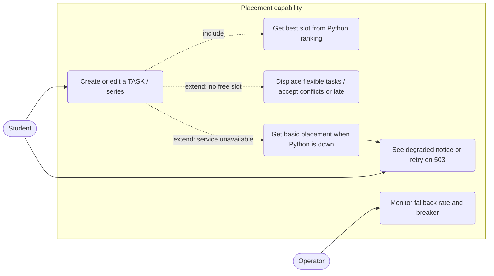
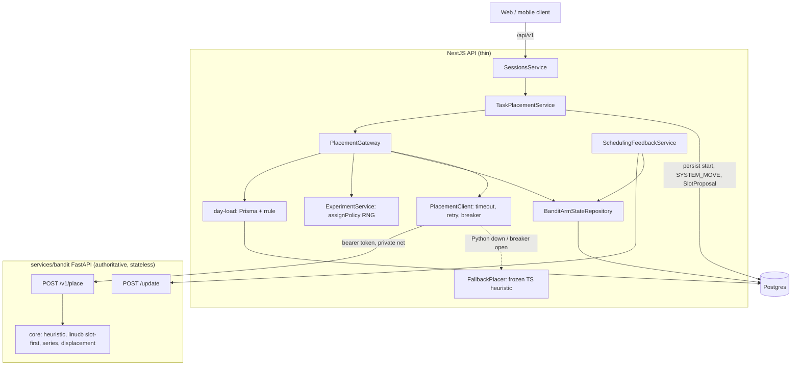
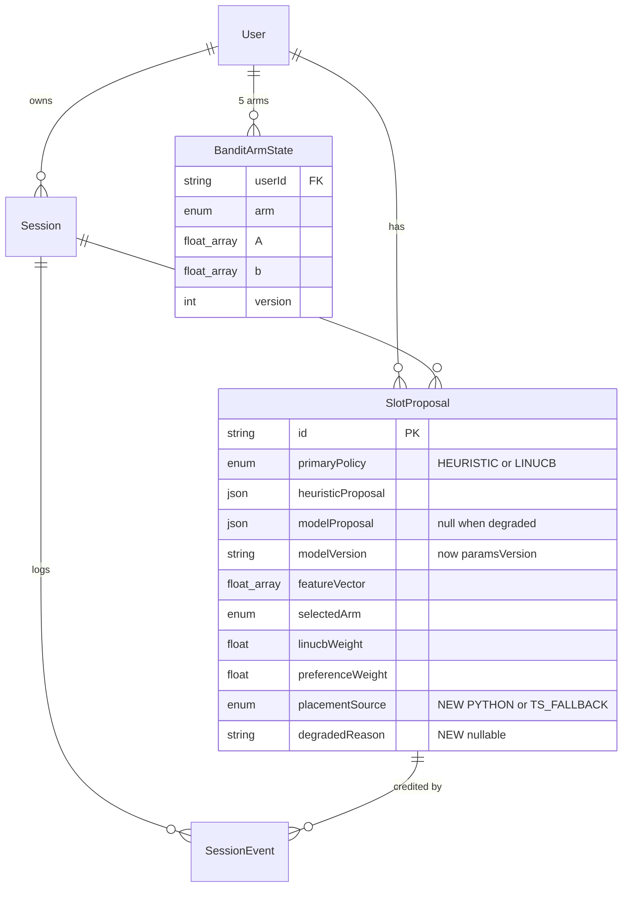
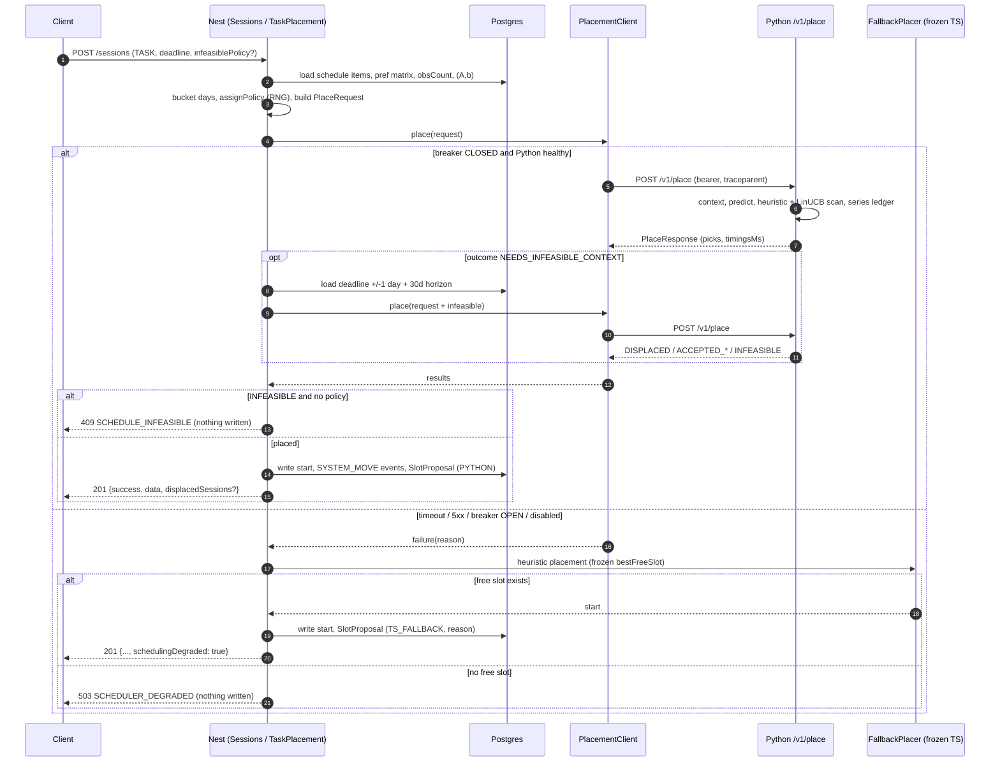
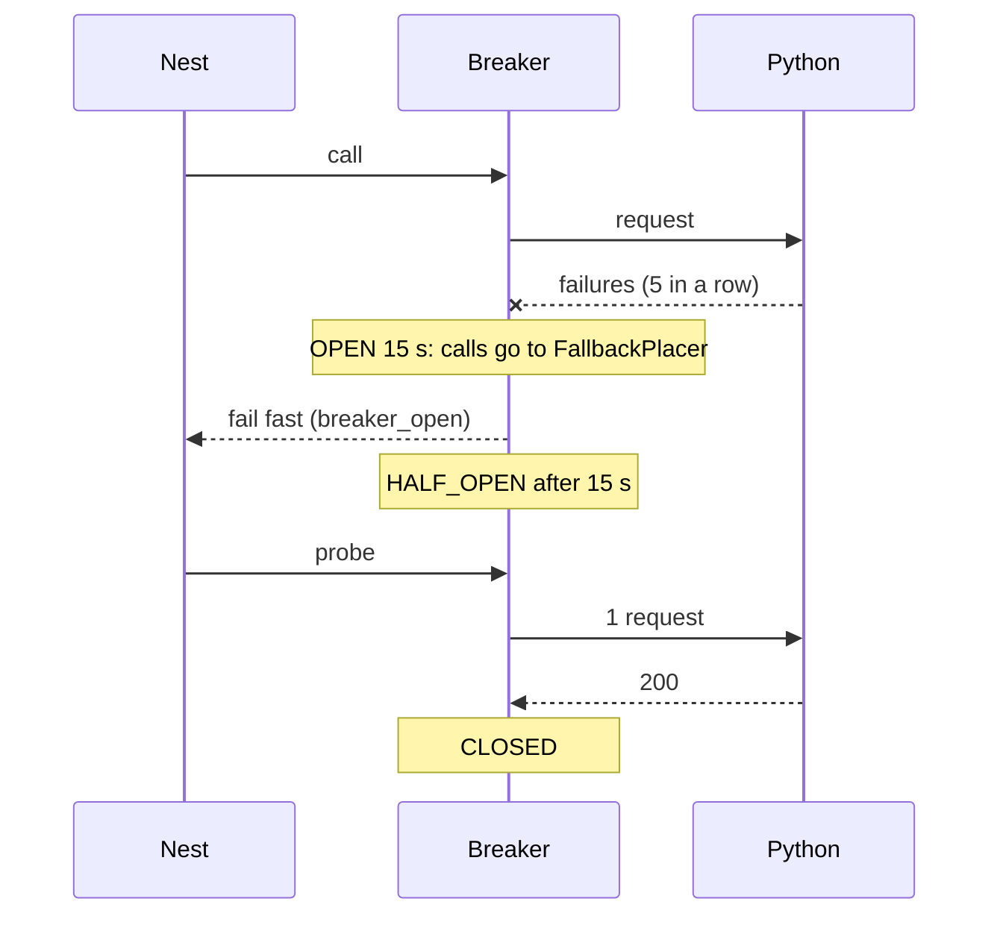

# ADR-0003: Python-Authoritative Placement (thin Nest API, frozen TS heuristic fallback)

**Status:** Proposed
**Date:** 2026-09-21
**Issue:** none filed for this decision; builds on #60 (numpy core port, golden parity) and
#62 (slot-first LinUCB, displacement, batched loads). Supersedes the "TS core is the source of
truth, Python is a parity port" stance of #60 and CLAUDE.md invariant 2's "core change =>
spec + Python port + fixtures" rule.
Related: [ADR-0001](0001-linucb-model-design.md) (+ section 13 addendum),
[ADR-0002](0002-scheduling-simplification.md),
[`docs/scheduler/heuristic.md`](../scheduler/heuristic.md),
[`services/bandit/README.md`](../../services/bandit/README.md).

---

## 1. Context

Since #60 the same ranking math exists twice: `backend/src/scheduler/core/*` (TypeScript, the
source of truth) and `services/bandit/src/core/*` (numpy, vectorized, golden-fixture parity).
Since #62 the TS scan is the slow, load-bearing path (slot-first scoring over up to 30-60 days
of 15-minute starts, EDF displacement), while Python already scans the same space with
prefix-sums and `argmax`. Today the Nest API:

1. loads day loads (Prisma + rrule expansion),
2. runs the heuristic scan in TS,
3. calls Python `/predict` for arm scores only,
4. runs `bestLinucbSlot` / `planDisplacement` in TS,
5. persists.

Costs of the status quo: every core change is written twice and gated by golden fixtures;
the hot CPU loop competes with request handling on the single-threaded Node event loop; and
"which implementation is authoritative" is a recurring question. The user's decision: **Python
becomes the single source of ranking logic**; Nest becomes a thin gather -> call -> apply ->
persist layer. Constraint: Python being down must not stop scheduling, so a **small frozen TS
copy of the old (pre-#62) heuristic** stays as a degraded path.

Invariants touched (CLAUDE.md numbering): **2** (pure core; the core-change rule) is rewritten;
**3** (15-minute grid), **4** (two kinds of series), **5** (tz wall clock, frontend), **6**
(envelope), **1** (`@zenflow/shared` is the contract) are upheld. Invariant 1 gains the new
placement wire types.

## 2. Decision

### 2.1 What moves to Python (authoritative)

`POST /v1/place` in `services/bandit` owns, for one placement request:

- heuristic best-free-slot (preference matrix + overlap + stability),
- LinUCB slot-first scoring, including the context vector build, arm scoring (`predict`
  math, in-process - no second HTTP hop), adaptive weights, tie-break order,
- series orchestration: per-member day windows (`series_day_windows`), sibling ledger,
  `MAX_SERIES_PER_DAY` cap, non-overlap of siblings,
- displacement planning (EDF repack) and the two infeasible fallbacks
  (`ACCEPT_CONFLICTS` min-conflict slot, `ACCEPT_LATE_DEADLINE` late slot),
- all scan constants (`SCAN_CAP_DAYS`, `MAX_SCAN_DAYS`, `MAX_DISPLACED_TASKS`,
  `MAX_SERIES_PER_DAY`, stability, adaptive-weight ramp, alpha/ridge). Nest stops owning these
  except the values the frozen fallback needs (2.3). The response echoes `paramsVersion` (hash
  of the constants) which is stored in `SlotProposal.modelVersion`.

`/update` (delayed-reward fold) stays as is; `/predict` stays for the offline evaluator and
backward compatibility during rollout, then is deprecated (not deleted) after phase 5.

### 2.2 What stays in Nest

Anything that touches Prisma, randomness, the clock, or persistence:

- **Gather**: `loadScheduleItems` / `dayLoadFromItems` (rrule expansion, occupancy, per-type
  workload) - recurrence expansion stays TS (`rrule`), so Nest sends already-bucketed days.
- **Experiment**: `ExperimentService.assignPolicy` (50/50 + pairwise roll; the only RNG),
  `SlotProposal` write, winner selection among the picks Python returns.
- **Bandit state**: `BanditArmStateRepository` (`(A, b)` in Postgres, optimistic version),
  `SchedulingFeedbackService` delayed rewards -> `/update`.
- **Apply**: `scheduledStartTime` writes, `SYSTEM_MOVE` events for displaced tasks, response.
- **Preference-matrix reinforcement and decay** (`preference.ts` reinforce*, `matrix-decay.ts`,
  `reward.ts`): a write path, not ranking; unchanged. (Follow-up, out of scope: if the matrix
  ever becomes model-learned, move it too.)
- `recurrence.ts`, `horizon.ts`, `reminder.ts`, `sync-conflicts.ts`: not placement ranking.

### 2.3 Frozen TS fallback (kept, small)

Kept in `backend/src/scheduler/core/` **exactly as at `bc6636d^`** (verified: `slot-score.ts`,
`preference.ts`, `slot.ts` are byte-identical to that commit; #62 only added constants):

| Kept (frozen) | Why |
| --- | --- |
| `slot.ts`, `slot-score.ts` (`bestFreeSlot`, `slotPreferenceScore`, `stabilityScore`) | the old overlap-weighted matrix scan |
| `preference.ts` (effective matrix, score-at; reinforcement is still live for feedback) | matrix math |
| `series-spread.ts` | per-member windows for a degraded series placement |
| constants: `STABILITY_*`, `MAX_SCAN_DAYS`, `SCAN_CAP_DAYS`, `MAX_SERIES_PER_DAY` | fallback-only copies |

`io/heuristic-placer.service.ts` (batched loads) and a slimmed `io/series-placer.service.ts`
(heuristic-only member loop, no A/B) remain as the fallback driver; call them
`FallbackPlacer`. These files carry a header: `FROZEN FALLBACK (ADR-0003): bug fixes only;
behaviour changes belong in services/bandit`.

**Dead TS code: delete, do not keep** - `linucb-best-slot.ts`, `adaptive-weights.ts`,
`displacement.ts`, `arms.ts`, `context-vector.ts`, `normalize.ts` (+ specs), `BanditPlacer`,
the planning half of `DisplacementService` (its `applyMoves` persistence stays), and the
matching golden cases. Rationale: after cut-over they have no caller and no parity gate, so
they silently rot into a third "truth"; git history and this ADR hold the reference
implementation (`5763a29`). Deletion happens in phase 5, only after a soak release (section 7),
so rollback stays cheap until then.

### 2.4 Degraded behavior (Python down / breaker open / contract-version mismatch)

The fallback answers with the frozen heuristic and never invents policy:

| Situation | Degraded behavior |
| --- | --- |
| Single/series placement, a free slot exists | heuristic slot; `appliedPolicy: "HEURISTIC"`; primary A/B policy recorded as rolled but `SlotProposal.placementSource = TS_FALLBACK`, `modelProposal = null` (excluded from A/B analysis) |
| No free slot before deadline | **no displacement, no accept-conflicts/late.** Reject with `503 SCHEDULER_DEGRADED` (retryable) - the writes for those policies exist only in Python, and guessing produces silent conflicts. Pre-flight rejects before anything is written (same as today's 409 path), so no partial state |
| `infeasiblePolicy` present in a degraded request | ignored; same 503 if infeasible, otherwise normal heuristic placement |
| Series | all-or-nothing pre-flight with the frozen loop; a member with no slot => 503 |
| Response flag | success responses carry `schedulingDegraded: true` (clients show a quiet "placed with basic scheduling" note); absent otherwise |
| Delayed rewards `/update` | unchanged best-effort (skipped when down; already tolerated) |
| Reschedule-all / sync-conflict reschedule | same rules per task |

### 2.5 Alternatives rejected

- **Keep both implementations authoritative (status quo)**: dual maintenance; TS scan on the
  event loop.
- **Python only, no fallback**: a service restart would break task creation; the user
  explicitly asked for a fallback.
- **Fallback = full TS core kept**: keeps the parity burden this ADR removes.
- **Nest sends raw items, Python buckets days**: would port `dayLoadFromItems` (needed anyway
  by the fallback) a second time and add a parity surface; sending bucketed days keeps one
  implementation of occupancy math.
- **Always attach displacement context**: 99% of placements never need it; payload and
  Prisma cost on every call. Chosen: two-phase (2.6 `NEEDS_INFEASIBLE_CONTEXT`).
- **Python owns policy assignment**: it would need randomness and persistence, breaking
  "no randomness at all" and statelessness.

## 3. Wire contract (`@zenflow/shared`, new `packages/shared/src/placement.ts`)

Endpoint: `POST {BANDIT_SERVICE_URL}/v1/place`. JSON, camelCase, epoch-ms integers for
instants (matches the numpy core; ISO only for `dayStr` local dates). Pydantic models in
`services/bandit/src/schemas_place.py` mirror the TS types; both are checked against shared
example fixtures (section 5).

### 3.1 Request

```ts
export const PLACEMENT_CONTRACT_VERSION = 1;

export type PlacementPolicy = "HEURISTIC" | "LINUCB";
export type WorkloadByType = Record<"TASK" | "ASSIGNMENT" | "EXAM" | "LECTURE" | "DND", number>; // minutes
// (use the existing SessionType keys; exact set = WorkloadType in day-load.ts)

export interface IntervalMs { startMs: number; endMs: number }

export interface PlacementDay {
  dayStr: string;          // local 'YYYY-MM-DD'
  dayStartMs: number;      // local midnight (UTC epoch)
  dayEndMs: number;        // next local midnight, exclusive
  occupied: IntervalMs[];  // includes lookahead past dayEndMs for straddling blocks (as today)
  workloadByType: WorkloadByType;
}

export interface PlacementMember {
  id: string;                       // real session id, or "__preflight__-<i>"
  durationMinutes: number;          // positive multiple of 15
  prevStartMs?: number;             // stability anchor (edit path)
  primaryPolicy: PlacementPolicy;   // Nest's A/B roll for THIS member
  computeBoth: boolean;             // true => also return the non-primary pick (pairwise sample)
}

export interface InfeasibleContext {  // only sent on the second call (2.6)
  policy?: "ACCEPT_CONFLICTS" | "ACCEPT_LATE_DEADLINE";
  flexible: { id: string; durationMinutes: number; deadlineMs: number; startMs: number }[];
  fixed: IntervalMs[];              // deadline day +/-1
  horizonOccupied: IntervalMs[];    // now .. deadline + 30d, for the fallback slot pickers
}

export interface PlaceRequest {
  contractVersion: number;          // 1
  requestId: string;                // uuid; log/trace correlation
  mode: "PLACE" | "PREFLIGHT";      // PREFLIGHT: feasibility only, no proposals needed
  nowMs: number;
  timezone: string;                 // IANA
  deadlineMs: number;
  maxScanDays: number;              // load-scope decision owned by Nest (single 30, series 60)
  members: PlacementMember[];       // length 1 = single TASK; >1 = one materialized series
  fixedOccupied: IntervalMs[];      // e.g. a series' already-started sittings
  days: PlacementDay[];             // loaded once for the whole scan range
  user: { preferenceMatrix: number[]; observationCount: number }; // matrix = 168 floats
  bandit?: {                        // required iff any member can run LINUCB
    alpha: number; ridge: number;
    state: Record<SchedulingArm, { A: number[]; b: number[] }>;   // [] = cold prior
  };
  infeasible?: InfeasibleContext;
}
```

One request = one placement event (a single `TASK` or a whole series), so the normal path is
**one HTTP call**, and per-member day-load queries collapse into one range read (already true
after #62 C).

### 3.2 Response

```ts
export type PlacementOutcome =
  | "PLACED"                     // a free slot was found
  | "NEEDS_INFEASIBLE_CONTEXT"   // none free; resend with `infeasible` (Nest can skip if it has no policy and no flexible tasks)
  | "DISPLACED"                  // placed after repacking flexible tasks
  | "ACCEPTED_CONFLICTS"         // policy fallback: min-conflict slot
  | "ACCEPTED_LATE"              // policy fallback: after the deadline
  | "INFEASIBLE";                // none, and no usable policy

export interface HeuristicPick { startMs: number; score: number }
export interface LinucbPick extends HeuristicPick {
  selectedArm: SchedulingArm;
  featureVector: number[];       // length FEATURE_DIM (22), stored on SlotProposal
  weights: { wL: number; wP: number };
}

export interface PlacedMember {
  id: string;
  outcome: PlacementOutcome;
  appliedPolicy: PlacementPolicy | "NONE";   // what Python used to update the sibling ledger
  heuristic: HeuristicPick | null;           // present iff requested/primary
  linucb: LinucbPick | null;                 // present iff requested/primary and bandit state given
  startMs: number | null;                    // Python's recommended start for the primary policy
  moves: { id: string; fromMs: number; toMs: number }[];  // displacement, else []
  late: boolean;                             // ACCEPTED_LATE
  conflicting: boolean;                      // ACCEPTED_CONFLICTS
}

export interface PlaceResponse {
  contractVersion: number;
  requestId: string;
  paramsVersion: string;                     // constants hash -> SlotProposal.modelVersion
  results: PlacedMember[];                   // same order as request.members
  timingsMs: { decode: number; context: number; predict: number; scan: number; displace: number; total: number };
}
```

Nest owns the final winner: for each member it takes `startMs` (Python's primary-policy pick)
and, when `computeBoth`, the other policy's pick for `alternativeSlot` / divergence, then
records `SlotProposal`. If a LinUCB primary produces `linucb: null` (bandit state bad, no
surviving slot) Python falls back to the heuristic pick and reports `appliedPolicy:
"HEURISTIC"` - this mirrors today's semantics.

### 3.3 Two-phase infeasible path

Call 1 returns `NEEDS_INFEASIBLE_CONTEXT` for a member with no free slot. Nest then loads the
deadline-day +/-1 window (`loadScheduleItems`) and the +30-day horizon, and repeats the call
with `infeasible` set (same `requestId` suffixed `-2`). Python is stateless so call 2 re-runs
the scan (cheap relative to loading); it returns `DISPLACED | ACCEPTED_* | INFEASIBLE`.
`INFEASIBLE` with no policy maps to today's `409 SCHEDULE_INFEASIBLE`. Displacement is thus
1 call normally, 2 calls only in the rare infeasible case.

### 3.4 Errors, versioning, timeouts, retries, breaker

- **Versioning**: the path carries the major (`/v1/place`); the body carries
  `contractVersion` (minor-compatible, additive-only within a major). A version the service
  does not speak => `422 {"code":"CONTRACT_VERSION"}`; Nest treats it as a hard failure ->
  fallback + `reason=version` metric. Deploy order for a breaking change: ship the new `/v2`
  in Python first, then Nest, then remove `/v1` a release later. Unknown response fields are
  ignored by Nest; unknown request fields are rejected by Pydantic (`extra="forbid"`) so drift
  fails loudly in tests, not silently in prod.
- **Status codes**: 200 ok; 422 validation (Nest bug -> logged at error, fallback);
  401 bad/missing token (fallback + page); 5xx/timeout/connect error -> transient.
- **Timeouts** (`PlacementClient`, injected clock + fetch for tests): connect 300 ms, total
  `PLACE_TIMEOUT_MS = 2500` (target server p99 < 400 ms); `/update` keeps 2 s.
- **Retries**: `/place` is a pure function of its body, hence idempotent. Retry **once**,
  with 50 ms jitter, only on connect-refused / reset / 502-504 that returned within 300 ms.
  Never retry a timeout (doubles user-visible latency) or a 4xx.
- **Circuit breaker** (per Nest process, small in-repo class, injected clock; `opossum` is an
  acceptable substitute): CLOSED -> OPEN after 5 consecutive failures (no failure-ratio window: it needs
  per-call history and is not worth the memory at scale); OPEN for 15 s (every call goes straight to the fallback with
  `reason=breaker_open`); then HALF_OPEN admits one probe; success closes, failure re-opens
  (backoff doubles to a 60 s cap). State exported as a gauge.

## 4. Data model changes (additive, one migration)

`SlotProposal` gains provenance so A/B analysis can exclude degraded events, and `modelVersion`
starts carrying `paramsVersion`:

```prisma
enum PlacementSource { PYTHON TS_FALLBACK }

model SlotProposal {
  // ...existing fields...
  placementSource PlacementSource @default(PYTHON)
  degradedReason  String?   // "timeout" | "breaker_open" | "connect" | "http_5xx" | "version" | "disabled"
}
```

No index needed (analysis queries scan by `experimentId`). Existing rows default to `PYTHON`,
which is wrong for rows written when the service was off; the migration backfills
`TS_FALLBACK` where `modelProposal IS NULL AND primaryPolicy = 'LINUCB'` (these were already
heuristic fallbacks).

### 4.1 API schema changes (`/api/v1`, client-facing)

No new client endpoints. Additive fields in `@zenflow/shared`:

- create/update session and reschedule responses gain optional `schedulingDegraded?: boolean`.
- new `SCHEDULER_DEGRADED_CODE = "SCHEDULER_DEGRADED"` with `503` body
  `{ success:false, message, code }` next to `SCHEDULE_INFEASIBLE` (`task.ts`).
- new `placement.ts` (3.1/3.2) exported from the package index (internal contract, not used by
  the FE).

## 5. Invariant and testing changes

**CLAUDE.md invariant 2 is rewritten to:**

> **Ranking lives in Python; Nest is thin.** All placement ranking - heuristic best slot,
> LinUCB slot-first scoring, series spreading, displacement - is implemented in
> `services/bandit/src/core/*`, which is pure numpy: `now` is a parameter, no I/O, no clock,
> no randomness. `backend/src/scheduler/io/*` gathers inputs (day loads, preference matrix,
> observation count, bandit `(A, b)`), calls `POST /v1/place` through `PlacementClient`,
> applies and persists the result, and owns the only RNG (`assignPolicy`). `backend/src/
> scheduler/core/*` is the calendar/recurrence/preference-write toolbox plus a **frozen**
> heuristic fallback (`slot.ts`, `slot-score.ts`, `preference.ts`, `series-spread.ts`, the
> pre-#62 behaviour), used only when Python is unavailable; it stays pure (no I/O, clock, or
> randomness) and takes `now` as a parameter. Do not add ranking logic to Nest.

**The core-change rule is replaced by:**

> **Ranking change => Python change + Python tests + contract fixtures.** Behaviour changes to
> scoring or placement go in `services/bandit/src/core/*` with pytest coverage and updated
> `packages/shared/contract/place/*.json` fixtures. The frozen TS fallback does not follow:
> its files change only for bug fixes, and a fix must also keep the golden test green.

What remains of parity/fixtures:

1. **Golden parity, narrowed**: `backend/test/golden/scheduler-core.golden.json` keeps only
   the frozen-fallback cases (`slot`, `slotPreferenceScore`, `stabilityScore`, `bestFreeSlot`,
   `effectivePreferenceMatrix`/`preferenceScoreAt`, `series-spread`). `golden:export` is
   regenerated once at freeze and then treated as a fixture (not re-exported casually).
   `tests/test_golden_ts.py` asserts Python heuristic == frozen TS on those cases. If the
   Python heuristic is ever intentionally changed, the change lands with a documented,
   reviewed golden update (accepting fallback drift) - never silently.
2. **Contract fixtures**: `packages/shared/contract/place/*.json` (request/response pairs:
   single, series, pairwise, cold bandit, displacement, both policies, infeasible two-phase).
   Jest asserts Nest builds the request for a seeded scenario and parses/applies the response;
   pytest asserts Python returns the response for the request. Replaces per-core-function
   golden for LinUCB/displacement.
3. Existing Python tests (`test_core_scan.py`, parity hand fixtures) stay authoritative.
4. TS specs for the frozen files stay; `linucb-best-slot.spec.ts` etc. are deleted with their
   code. `PlacementClient` gets unit tests for timeout, retry rules and each breaker
   transition; `FallbackPlacer` gets the degraded-behavior table (2.4) as tests.

## 6. Service impact (FastAPI, auth, network, observability)

- **Required in prod, optional in tests.** `BANDIT_SERVICE_URL` becomes mandatory when
  `NODE_ENV=production` (config validation fails boot; `.env.prod` already sets
  `http://bandit:8100`). `.env.test` / unit tests leave it unset and use the fallback path
  (`degradedReason="disabled"`, not counted as an incident). Dev keeps it set; running dev
  without the container is legal and degraded.
- **Auth**: shared bearer secret `BANDIT_SERVICE_TOKEN`, sent as `Authorization: Bearer`,
  verified in a FastAPI dependency with `hmac.compare_digest`; `/health` and `/ready` exempt.
  Prod token via secret manager/compose secret; rotation = deploy Python accepting
  `TOKEN` and `TOKEN_PREVIOUS`, then Nest, then drop the old one.
- **Network**: the service listens only on the private compose network `bandit`; remove the
  published `8100:8000` port from `compose.prod.yml` (keep for dev). No TLS inside the
  private network; add mTLS only if it ever leaves it. Payload limit 2 MB (uvicorn/ASGI
  middleware) - a 60-day series request is well under 1 MB.
- **Scaling/readiness**: stateless, so run >= 2 replicas or `uvicorn --workers N` (CPU-bound
  numpy). Add `GET /ready` that succeeds only after numpy import, the per-tz UTC-offset chunk
  cache warm-up for the common zones, and a self-test place; the compose healthcheck uses it.
  Sync `def` endpoints run in the threadpool; do not use `async def` for CPU work.
- **Observability**: W3C `traceparent` propagated Nest -> Python (Python already has OTel);
  `requestId` in every log line on both sides. Nest metrics: `bandit_client_duration`
  gains `operation=place`; new counters `scheduler_placement_source{source=python|ts_fallback,
  reason}`, gauge `scheduler_breaker_state`, `scheduler_placement_shadow_mismatch` (rollout).
  Python histograms per phase (`decode|context|predict|scan|displace`) plus the `timingsMs`
  echoed in the response, which Nest copies to span attributes
  (`placement.python.scan_ms`, ...). Nest phases are spans: `placement.dayload`,
  `placement.http`, `placement.apply`. Dashboard "Scheduler & Bandit" gets fallback rate and
  breaker state; alert when fallback rate > 1% over 5 min in prod or the breaker is open > 2 min.
- **Rate/abuse**: only Nest calls the service; the token is the control. No per-user limits
  added here.

## 7. Migration and rollout (app works at every commit)

Each phase is independently shippable; `SCHEDULER_PLACEMENT_MODE=legacy|shadow|python`
(default `legacy` until phase 3) gates behaviour so `master` is always releasable.

1. **Contract (BE/shared)** - add `placement.ts` types + contract fixtures + migration for
   `placementSource`/`degradedReason` (unused, default). No behaviour change.
2. **Python `/v1/place` (ML)** - schema, orchestration over the existing `core/`, bearer auth,
   `/ready`, timings, pytest against the contract fixtures. Not called yet.
3. **Nest client + gateway (BE)** - `PlacementClient` (timeouts, retry rules, breaker),
   `PlacementGateway` that builds requests from existing loaders. Mode `legacy` = today's code.
   Mode `shadow` runs legacy, also calls Python, logs/metrics the diff (expected equal for
   HEURISTIC; LINUCB differs only through float noise - investigate any mismatch). Ship dark.
4. **Cut-over (BE + FE/mobile)** - mode `python`: gateway path with the frozen fallback
   (`FallbackPlacer`), `503 SCHEDULER_DEGRADED`, `schedulingDegraded` in responses; FE/mobile
   show the degraded note and a retry on 503. Enable in staging, then prod, after shadow
   mismatch ~ 0 for a soak period. Legacy code still present for one-flag rollback.
5. **Prod hardening (BE/ops)** - token auth on, drop the published port, make
   `BANDIT_SERVICE_URL` required in prod, alerts. (May land alongside 4.)
6. **Delete dead TS (BE)** after a full release in mode `python` with no rollbacks: remove
   `legacy`/`shadow` modes, the code listed in 2.3, and the trimmed golden cases; rewrite
   CLAUDE.md invariant 2 and the core-change rule (section 5), `backend/README.md`
   ("Scheduler architecture", golden section), `services/bandit/README.md` (now authoritative;
   `BANDIT_SERVICE_URL` required in prod), `docs/scheduler/heuristic.md`, and add a pointer
   from ADR-0001 section 13.
7. **Benchmark (later, section 9)**; not part of the cut-over gate but scheduled right after
   phase 4 so the BEFORE/AFTER numbers exist before phase 6 deletes the baseline path.

Areas by phase: shared+BE (1), ML (2), BE (3), BE+FE+mobile (4), BE/ops (5), BE+docs (6).

## 8. Consequences

**Positive**: one ranking implementation; the hot loop leaves the Node event loop; Nest
placement code shrinks to gather/apply; the parity burden collapses to a small frozen set;
the A/B experiment sees a single, versioned model (`paramsVersion`).

**Negative / risks**: a new hard runtime dependency for full-quality scheduling (mitigated by
the fallback, but displacement/infeasible policies are unavailable when degraded - a visible
regression during outages); an extra network hop per placement (about 1-3 ms in-cluster, plus
JSON of the day loads); contract drift risk (mitigated by shared fixtures and
`extra="forbid"`); two-phase infeasible flow costs an extra call in rare cases; the frozen
fallback can diverge from the evolving Python heuristic (accepted; it only needs to be
reasonable, and the golden pins the freeze).

**Follow-ups**: consider moving matrix reinforcement/decay to Python if the matrix becomes
learned; deprecate unversioned `/predict`; multi-replica breaker state is per-process (fine at
current scale).

## 9. Benchmark plan (not built now)

Goal: prove the change does not regress latency/throughput and quantify the gain, with
per-phase attribution. A k6 suite in `bench/` (own README, not in the pnpm workspace graph).

**Arms compared**

| Arm | Commit | Meaning |
| --- | --- | --- |
| BEFORE-0 | `bc6636d^` (`f821194`) | last pre-#62 commit: arm-then-minute LinUCB, per-day loads |
| BEFORE-1 | `5763a29` | current: slot-first TS scan, batched loads, Python only scores arms |
| AFTER | phase-4 head (mode `python`) | this ADR |

Also AFTER-degraded (Python killed) to measure the fallback.

**Scales** (seeded, deterministic generator `bench/seed.ts`, same DB snapshot restored per run):

| Scale | Users | Sessions/user in horizon (schedule density) | Deadline horizon | k6 load |
| --- | --- | --- | --- | --- |
| S | 50 | 20 | 3-14 d | 2 req/s, 20 VUs cap |
| M | 500 | 150 | 14-30 d | 10 req/s, 100 VUs |
| L | 5 000 | 600 (dense; some days full) | 30-60 d | 40 req/s, ramp to knee |
| XL-density | 200 | 900 (near-infeasible) | 7 d | 10 req/s (drives displacement) |

Executors: `constant-arrival-rate` for latency at fixed load, `ramping-arrival-rate` to find the
throughput knee (p95 > 1 s or error rate > 1%), a 10-minute soak on M.

**Scenarios**: create single `TASK` (mix of A/B primaries); create series x8; deadline change;
infeasible -> displacement and policy retry (XL-density); reschedule-all. Plus fault
injection: kill/restart the Python container mid-run (breaker open, fallback rate, recovery
time) and `tc`/proxy-added 200 ms latency (timeout/retry behaviour).

**Per-phase timings**: Nest emits `Server-Timing` on placement endpoints when
`BENCH_TIMING=1` (test env only): `dayload`, `http` (HTTP to Python, incl. serialization),
`scan` (TS scan for BEFORE arms; Python `timingsMs.scan` for AFTER), `predict`, `db_apply`,
`total`. k6 parses the header into custom `Trend`s per phase and tags by scale/scenario/arm.
Python `timingsMs` and OTel spans cross-check server-side.

**Method**: pinned container CPU/memory limits identical across arms, 60 s warm-up discarded,
3 repetitions, randomized arm order, results stored as k6 JSON summary + raw. A correctness
side-check runs the same seeded scenarios through BEFORE-1 and AFTER and diffs placements
(HEURISTIC must match exactly; LINUCB reported as agreement rate).

**Report**: `bench/report.mjs` renders a Markdown report - per scale x scenario table of
p50/p95/p99, throughput at the knee, error and fallback rate, and stacked per-phase timing
bars, with BEFORE-0 / BEFORE-1 / AFTER deltas and pass/fail against thresholds (proposed:
AFTER p95 <= BEFORE-1 p95 at M and L; Python `scan` p95 < 50 ms for 30 days; degraded p95
<= BEFORE-0 p95; fallback recovery < breaker window + 15 s).

## 10. Diagrams

### 10.1 Use case



### 10.2 Components



### 10.3 Data model (affected slice)



### 10.4 Sequence: placement (normal, infeasible, fallback)



### 10.5 Sequence: breaker



## 11. Implementation handoff

- **Shared/BE**: `packages/shared/src/placement.ts`, `task.ts` (503 code, `schedulingDegraded`),
  Prisma migration (`PlacementSource`, `degradedReason`), `PlacementClient`, `PlacementGateway`,
  `FallbackPlacer`, mode flag, config validation, metrics, contract-fixture tests, later the
  deletions in 2.3 and doc rewrites.
- **ML**: `/v1/place`, `schemas_place.py`, series/displacement orchestration, auth, `/ready`,
  `timingsMs`, pytest against fixtures, narrowed golden parity.
- **FE/mobile**: degraded notice and 503 retry only.
- **Ops**: compose (private network, no published port in prod, healthcheck on `/ready`,
  secrets), alerts.
