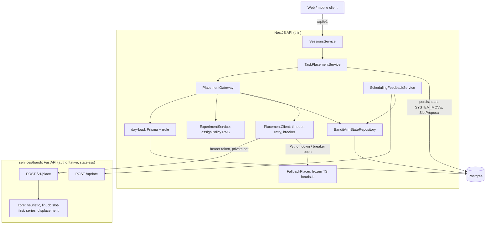
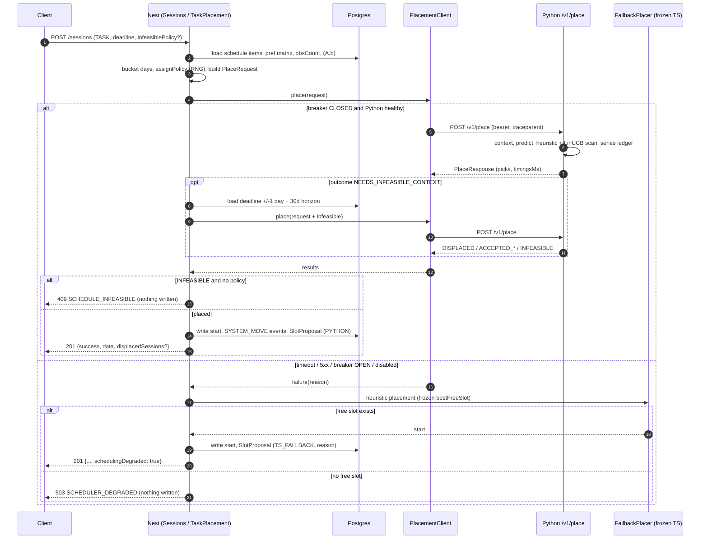
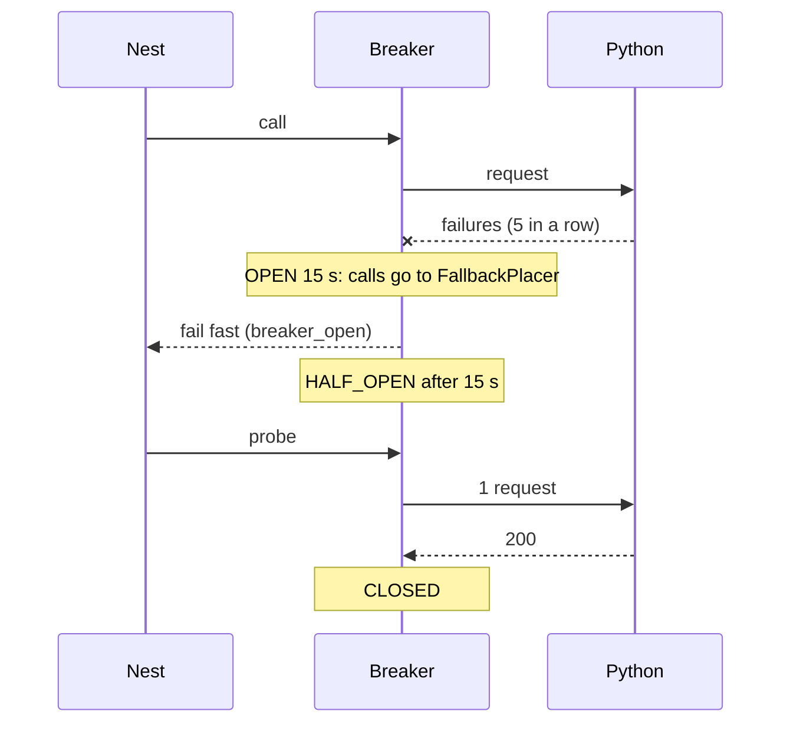

# ADR-0003: Python-Authoritative Placement (thin Nest API, frozen TS heuristic fallback)

**Status:** Accepted — phase 6 executed out of sequence, phases 4/5's soak/validation gates
skipped by explicit product decision; see [§12](#12-phase-6-executed-out-of-sequence).
**Date:** 2026-09-21
**Issue:** none; builds on #60 (numpy core port, golden parity) and #62 (slot-first LinUCB,
displacement, batched loads). Replaces #60's "TS core is the source of truth" stance and the
"core change => spec + Python port + fixtures" rule in CLAUDE.md invariant 2.
Related: [ADR-0001](0001-linucb-model-design.md) (+ section 13),
[ADR-0002](0002-scheduling-simplification.md),
[`services/bandit/README.md`](../../services/bandit/README.md),
[`services/bandit/README.md`](../../services/bandit/README.md).

---

## 1. Context

The same ranking math exists twice: `backend/src/scheduler/core/*` (TypeScript) and
`services/bandit/src/core/*` (numpy, golden-fixture parity). Since #62 the TS scan is the slow
path (up to 30-60 days of 15-minute starts, EDF displacement); Python already scans the same
space with prefix-sums and `argmax`. Today Nest loads day loads, runs the heuristic scan in TS,
calls Python `/predict` for arm scores only, runs `bestLinucbSlot` / `planDisplacement` in TS,
then persists.

Problems: every core change is written twice; the hot loop blocks the Node event loop; nobody
is sure which implementation is authoritative.

**Decision:** Python is the single source of ranking logic. Nest gathers, calls, applies and
persists. A small frozen copy of the pre-#62 TS heuristic stays as a fallback when Python is down.

CLAUDE.md invariants: **2** is rewritten; **1, 3, 4, 5, 6** are unchanged (invariant 1 gains the
placement wire types).

## 2. Decision

### 2.1 Moves to Python

`POST /v1/place` in `services/bandit` owns:

- heuristic best-free-slot (preference matrix, overlap, stability)
- LinUCB slot-first scoring: context vector, arm scoring (in-process, no second HTTP hop),
  adaptive weights, tie-break order
- series orchestration: per-member day windows, sibling ledger, `MAX_SERIES_PER_DAY`, sibling
  non-overlap
- displacement planning (EDF repack) and the two infeasible fallbacks (`ACCEPT_CONFLICTS`,
  `ACCEPT_LATE_DEADLINE`)
- all scan constants (`SCAN_CAP_DAYS`, `MAX_SCAN_DAYS`, `MAX_DISPLACED_TASKS`,
  `MAX_SERIES_PER_DAY`, stability, adaptive-weight ramp, alpha/ridge). Nest keeps only the
  copies the fallback needs. The response returns `paramsVersion` (hash of the constants),
  stored in `SlotProposal.modelVersion`.

`/update` is unchanged. `/predict` was removed on 2026-09-24 (unused since phase 6).

### 2.2 Stays in Nest

Anything that touches Prisma, randomness, the clock or persistence:

- **Gather:** `loadScheduleItems` / `dayLoadFromItems` (rrule expansion stays TS; Nest sends
  already-bucketed days).
- **Experiment:** `ExperimentService.assignPolicy` (50/50 + pairwise roll, the only RNG),
  `SlotProposal` write, winner selection.
- **Bandit state:** `BanditArmStateRepository` (`(A, b)` in Postgres), `SchedulingFeedbackService`
  rewards -> `/update`.
- **Apply:** `scheduledStartTime` writes, `SYSTEM_MOVE` events for displaced tasks, response.
- **Preference-matrix reinforcement and decay** (`preference.ts` reinforce*, `matrix-decay.ts`,
  `reward.ts`): a write path, not ranking. Move it too only if the matrix ever becomes learned.
- `recurrence.ts`, `horizon.ts`, `reminder.ts`, `sync-conflicts.ts`: not ranking.

### 2.3 Frozen TS fallback

Kept in `backend/src/scheduler/core/` exactly as at `bc6636d^` (`slot-score.ts`,
`preference.ts`, `slot.ts` are byte-identical to it; #62 only added constants):

| Kept (frozen) | Purpose |
| --- | --- |
| `slot.ts`, `slot-score.ts` (`bestFreeSlot`, `slotPreferenceScore`, `stabilityScore`) | old overlap-weighted matrix scan |
| `preference.ts` (effective matrix, score-at; reinforcement stays live) | matrix math |
| `series-spread.ts` | per-member windows for degraded series |
| `STABILITY_*`, `MAX_SCAN_DAYS`, `SCAN_CAP_DAYS`, `MAX_SERIES_PER_DAY` | fallback-only copies |

`io/heuristic-placer.service.ts` and a slimmed `io/series-placer.service.ts` (heuristic-only, no
A/B) remain as the fallback driver, called `FallbackPlacer`. They carry the header
`FROZEN FALLBACK (ADR-0003): bug fixes only; behaviour changes belong in services/bandit`.

**Delete the rest:** `linucb-best-slot.ts`, `adaptive-weights.ts`, `displacement.ts`, `arms.ts`,
`context-vector.ts`, `normalize.ts` (+ specs), `BanditPlacer`, the planning half of
`DisplacementService` (`applyMoves` stays), and the matching golden cases. With no caller and no
parity gate they would rot into a third "truth". Git history (`5763a29`) keeps the reference.
Deletion happens in phase 6, after a soak release, so rollback stays cheap until then.

### 2.4 Degraded behavior (Python down, breaker open, or contract-version mismatch)

The fallback uses the frozen heuristic and never invents policy:

| Situation | Behavior |
| --- | --- |
| Single/series, free slot exists | Heuristic slot, `appliedPolicy: "HEURISTIC"`. Saved with `placementSource = TS_FALLBACK`, `modelProposal = null` (excluded from A/B analysis) |
| No free slot before deadline | No displacement. Answered like a Python `INFEASIBLE`: pre-flight `409 SCHEDULE_INFEASIBLE` without a policy; placement leaves the task unplaced. Never a 503 (see addendum) |
| `infeasiblePolicy` in a degraded request | Honoured as "best free slot up to 30 days past the deadline" (no conflicts accepted) |
| Series | Frozen loop, each member in its own day-window first, then spilling over the whole range (one per day, then uncapped). A member with no slot anywhere comes back `null`, like Python |
| Response | Success carries `schedulingDegraded: true` (client shows a quiet "placed with basic scheduling" note); absent otherwise |
| `/update` rewards | Best-effort, skipped when down |
| Reschedule-all / sync-conflict reschedule | Same rules; series sittings are re-spread as a series. A task that cannot move lands in `failedSessionIds` |

**Addendum (2026-09-24):** degraded mode no longer returns `503 SCHEDULER_DEGRADED`; a
fallback miss is answered like Python (409 / unplaced / `null` rows).

### 2.5 Alternatives rejected

- **Keep both authoritative:** dual maintenance, TS scan on the event loop.
- **Python only, no fallback:** a restart would break task creation.
- **Full TS core as fallback:** keeps the parity burden.
- **Python buckets raw items:** ports `dayLoadFromItems` twice.
- **Always send displacement context:** wasteful; chosen two-phase (3.3).
- **Python owns policy assignment:** needs randomness and persistence.

## 3. Wire contract (`@zenflow/shared`, new `packages/shared/src/placement.ts`)

`POST {BANDIT_SERVICE_URL}/v1/place`. JSON, camelCase, epoch-ms integers for instants (ISO only
for `dayStr`). Pydantic models in `services/bandit/src/schemas_place.py` mirror the TS types;
both are checked against shared fixtures (section 5).

### 3.1 Request

```ts
export const PLACEMENT_CONTRACT_VERSION = 1;

export type PlacementPolicy = "HEURISTIC" | "LINUCB";
// per-type workload: total hours and session count
export type WorkloadByType = Record<WorkloadType, { hours: number; count: number }>;

export interface IntervalMs { startMs: number; endMs: number }

export interface PlacementDay {
  dayStr: string;          // local 'YYYY-MM-DD'
  dayStartMs: number;      // local midnight (UTC epoch)
  dayEndMs: number;        // next local midnight, exclusive
  occupied: IntervalMs[];  // includes lookahead past dayEndMs for straddling blocks
  workloadByType: WorkloadByType;
}

export interface PlacementMember {
  id: string;                       // real session id, or "__preflight__-<i>"
  durationMinutes: number;          // positive multiple of 15
  prevStartMs?: number;             // stability anchor (edit path)
  primaryPolicy: PlacementPolicy;   // Nest's A/B roll for THIS member
  computeBoth: boolean;             // true => also return the non-primary pick
}

export interface InfeasibleContext {  // only sent on the second call (3.3)
  policy?: "ACCEPT_CONFLICTS" | "ACCEPT_LATE_DEADLINE";
  flexible: { id: string; durationMinutes: number; deadlineMs: number; startMs: number }[];
  fixed: IntervalMs[];              // deadline day +/-1
  horizonOccupied: IntervalMs[];    // now .. deadline + 30d, for the fallback slot pickers
}

export interface PlaceRequest {
  contractVersion: number;          // 1
  requestId: string;                // uuid; log/trace correlation
  mode: "PLACE" | "PREFLIGHT";      // PREFLIGHT: feasibility only
  nowMs: number;
  timezone: string;                 // IANA
  deadlineMs: number;
  maxScanDays: number;              // owned by Nest (single 30, series 60)
  members: PlacementMember[];       // length 1 = single TASK; >1 = one materialized series
  fixedOccupied: IntervalMs[];      // e.g. a series' already-started sittings
  days: PlacementDay[];             // loaded once for the whole scan range
  user: { preferenceMatrix: number[]; observationCount: number }; // matrix = 168 floats
  bandit?: {                        // required iff any member can run LINUCB
    alpha: number; ridge: number;
    state: Record<SchedulingArm, { A: number[]; b: number[] }>;   // [] = cold prior
  };
  infeasible?: InfeasibleContext;
}
```

One request = one placement event (a single `TASK` or a whole series), so the normal path is
one HTTP call and one range read for day loads.

### 3.2 Response

```ts
export type PlacementOutcome =
  | "PLACED"                     // a free slot was found
  | "NEEDS_INFEASIBLE_CONTEXT"   // none free; resend with `infeasible` (Nest may skip if it has no policy and no flexible tasks)
  | "DISPLACED"                  // placed after repacking flexible tasks
  | "ACCEPTED_CONFLICTS"         // policy fallback: min-conflict slot
  | "ACCEPTED_LATE"              // policy fallback: after the deadline
  | "INFEASIBLE";                // none, and no usable policy

export interface HeuristicPick { startMs: number; score: number }
export interface LinucbPick extends HeuristicPick {
  selectedArm: SchedulingArm;
  featureVector: number[];       // length FEATURE_DIM (22), stored on SlotProposal
  weights: { wL: number; wP: number };
}

export interface PlacedMember {
  id: string;
  outcome: PlacementOutcome;
  appliedPolicy: PlacementPolicy | "NONE";   // what Python used for the sibling ledger
  heuristic: HeuristicPick | null;           // present iff requested/primary
  linucb: LinucbPick | null;                 // present iff requested/primary and bandit state given
  startMs: number | null;                    // recommended start for the primary policy
  moves: { id: string; fromMs: number; toMs: number }[];  // displacement, else []
  late: boolean;                             // ACCEPTED_LATE
  conflicting: boolean;                      // ACCEPTED_CONFLICTS
}

export interface PlaceResponse {
  contractVersion: number;
  requestId: string;
  paramsVersion: string;                     // constants hash -> SlotProposal.modelVersion
  results: PlacedMember[];                   // same order as request.members
  timingsMs: { decode: number; context: number; predict: number; scan: number; displace: number; total: number };
}
```

Nest takes `startMs` per member and, when `computeBoth`, the other policy's pick for
`alternativeSlot` / divergence, then records `SlotProposal`. If a LinUCB primary returns
`linucb: null` (bad bandit state, no surviving slot), Python falls back to the heuristic pick
and reports `appliedPolicy: "HEURISTIC"`, same as today.

### 3.3 Two-phase infeasible path

1. Call 1 returns `NEEDS_INFEASIBLE_CONTEXT` for a member with no free slot.
2. Nest loads the deadline-day +/-1 window and the +30-day horizon, and repeats the call with
   `infeasible` set (`requestId` suffixed `-2`). Python is stateless, so it re-runs the scan.
3. Call 2 returns `DISPLACED | ACCEPTED_* | INFEASIBLE`. `INFEASIBLE` with no policy maps to
   today's `409 SCHEDULE_INFEASIBLE`.

Normally 1 call; 2 only in the rare infeasible case.

### 3.4 Errors, versioning, timeouts, retries, breaker

- **Versioning:** path carries the major (`/v1/place`); body carries `contractVersion`
  (additive-only within a major). Unsupported version => `422 {"code":"CONTRACT_VERSION"}`;
  Nest falls back and records `reason=version`. Breaking change order: `/v2` in Python, then
  Nest, then remove `/v1` a release later. Nest ignores unknown response fields; Pydantic
  rejects unknown request fields (`extra="forbid"`) so drift fails in tests.
- **Status codes:** 200 ok; 422 validation (Nest bug: log at error, fall back); 401 bad token
  (fall back + page); 5xx/timeout/connect error = transient.
- **Timeouts** (`PlacementClient`, injected clock + fetch): connect 300 ms, total
  `PLACE_TIMEOUT_MS = 2500` (target server p99 < 400 ms); `/update` keeps 2 s.
- **Retries:** `/place` is idempotent. Retry once, 50 ms jitter, only on connect-refused /
  reset / 502-504 that returned within 300 ms. Never retry a timeout or a 4xx.
- **Circuit breaker** (per Nest process, small in-repo class, injected clock): CLOSED -> OPEN
  after **5 consecutive failures** (no failure-ratio window). OPEN for 15 s: calls go straight
  to the fallback with `reason=breaker_open`. Then HALF_OPEN admits one probe; success closes,
  failure re-opens (backoff doubles to a 60 s cap). State is exported as a gauge.

## 4. Data model changes (additive, one migration)

```prisma
enum PlacementSource { PYTHON TS_FALLBACK }

model SlotProposal {
  // ...existing fields...
  placementSource PlacementSource @default(PYTHON)
  degradedReason  String?   // "timeout" | "breaker_open" | "connect" | "http_5xx" | "version" | "disabled"
}
```

`modelVersion` now carries `paramsVersion`. No index needed. The migration backfills
`TS_FALLBACK` where `modelProposal IS NULL AND primaryPolicy = 'LINUCB'` (those were already
heuristic fallbacks); other existing rows stay `PYTHON`.

### 4.1 API schema changes (`/api/v1`, client-facing)

No new endpoints. Additive fields in `@zenflow/shared`:

- create/update session and reschedule responses: optional `schedulingDegraded?: boolean`
- `SCHEDULER_DEGRADED_CODE = "SCHEDULER_DEGRADED"`, `503` body `{ success:false, message, code }`,
  next to `SCHEDULE_INFEASIBLE` (`task.ts`)
- `placement.ts` (3.1/3.2) exported from the package index (internal, not used by the FE)

## 5. Invariant and testing changes

**CLAUDE.md invariant 2 becomes:**

> **Ranking lives in Python; Nest is thin.** All placement ranking - heuristic best slot,
> LinUCB slot-first scoring, series spreading, displacement - is implemented in
> `services/bandit/src/core/*`, which is pure numpy: `now` is a parameter, no I/O, no clock,
> no randomness. `backend/src/scheduler/io/*` gathers inputs (day loads, preference matrix,
> observation count, bandit `(A, b)`), calls `POST /v1/place` through `PlacementClient`,
> applies and persists the result, and owns the only RNG (`assignPolicy`). `backend/src/
> scheduler/core/*` is the calendar/recurrence/preference-write toolbox plus a **frozen**
> heuristic fallback (`slot.ts`, `slot-score.ts`, `preference.ts`, `series-spread.ts`, the
> pre-#62 behaviour), used only when Python is unavailable; it stays pure (no I/O, clock, or
> randomness) and takes `now` as a parameter. Do not add ranking logic to Nest.

**The core-change rule becomes:**

> **Ranking change => Python change + Python tests + contract fixtures.** Behaviour changes to
> scoring or placement go in `services/bandit/src/core/*` with pytest coverage and updated
> `packages/shared/contract/place/*.json` fixtures. The frozen TS fallback does not follow:
> its files change only for bug fixes, and a fix must also keep the golden test green.

Tests that remain:

1. **Golden parity, narrowed:** `backend/test/golden/scheduler-core.golden.json` keeps only the
   frozen-fallback cases (`slot`, `slotPreferenceScore`, `stabilityScore`, `bestFreeSlot`,
   `effectivePreferenceMatrix`/`preferenceScoreAt`, `series-spread`). Regenerate once at
   freeze, then treat as a fixture. `tests/test_golden_ts.py` asserts Python heuristic == frozen
   TS on those cases. An intentional Python heuristic change needs a reviewed golden update.
2. **Contract fixtures:** `packages/shared/contract/place/*.json` (single, series, pairwise,
   cold bandit, displacement, both policies, infeasible two-phase). Jest checks Nest builds the
   request and applies the response; pytest checks Python returns the response for the request.
3. Existing Python tests (`test_core_scan.py`, hand fixtures) stay authoritative.
4. TS specs for frozen files stay; specs for deleted code go with it. `PlacementClient` gets
   unit tests for timeout, retry rules and each breaker transition; `FallbackPlacer` gets the
   degraded table (2.4) as tests.

## 6. Service impact (FastAPI, auth, network, observability)

- **Config:** `BANDIT_SERVICE_URL` is required when `NODE_ENV=production` (boot fails
  otherwise). Tests leave it unset and use the fallback (`degradedReason="disabled"`, not an
  incident). Dev without the container is legal and degraded.
- **Auth:** bearer secret `BANDIT_SERVICE_TOKEN`, checked with `hmac.compare_digest`;
  `/health` and `/ready` exempt. Rotation: Python accepts `TOKEN` and `TOKEN_PREVIOUS`, deploy
  Nest, drop the old one.
- **Network:** private compose network only; remove the published `8100:8000` port from
  `compose.prod.yml` (keep for dev). Payload limit 2 MB.
- **Scaling:** stateless; >= 2 replicas or `uvicorn --workers N`. Add `GET /ready` (numpy
  import, tz cache warm-up, self-test place) for the compose healthcheck. Use sync `def`
  endpoints for CPU work.
- **Observability:** `traceparent` Nest -> Python; `requestId` in every log line. New
  metrics: `operation=place` on `bandit_client_duration`,
  `scheduler_placement_source{source,reason}`, `scheduler_breaker_state`,
  `scheduler_placement_shadow_mismatch`. Python per-phase histograms; Nest copies `timingsMs`
  to span attributes and adds `placement.dayload|http|apply` spans. Alert when fallback rate
  > 1% over 5 min in prod or the breaker is open > 2 min.

## 7. Migration and rollout (app works at every commit)

Each phase ships on its own. `SCHEDULER_PLACEMENT_MODE=legacy|shadow|python` (default `legacy`
until phase 4) keeps `master` releasable.

1. **Contract (shared/BE):** `placement.ts` types, contract fixtures, migration for
   `placementSource`/`degradedReason` (unused). No behaviour change.
2. **Python `/v1/place` (ML):** schema, orchestration over existing `core/`, bearer auth,
   `/ready`, timings, pytest against fixtures. Not called yet.
3. **Nest client + gateway (BE):** `PlacementClient`, `PlacementGateway`. `legacy` = today's
   code. `shadow` runs legacy, also calls Python, and logs the diff (HEURISTIC should match;
   LINUCB only float noise; investigate any mismatch). Ship dark.
4. **Cut-over (BE + FE/mobile):** mode `python` with `FallbackPlacer`, `503 SCHEDULER_DEGRADED`,
   `schedulingDegraded`; FE/mobile show the degraded note and a retry on 503. Staging, then
   prod, once shadow mismatch is ~0 over a soak. Legacy code stays for one-flag rollback.
5. **Prod hardening (BE/ops):** token auth on, drop the published port, require
   `BANDIT_SERVICE_URL` in prod, alerts. May land with 4.
6. **Delete dead TS (BE):** after a full release in mode `python` with no rollbacks, remove
   `legacy`/`shadow`, the code in 2.3 and trimmed golden cases. Rewrite CLAUDE.md invariant 2
   and the core-change rule, `backend/README.md` (scheduler architecture, golden section),
   `services/bandit/README.md`; add a pointer from ADR-0001
   section 13.
7. **Benchmark (section 9):** not a cut-over gate, but run right after phase 4 so BEFORE/AFTER
   numbers exist before phase 6 deletes the baseline.

Areas: shared+BE (1), ML (2), BE (3), BE+FE+mobile (4), BE/ops (5), BE+docs (6).

## 8. Consequences

**Good:** one ranking implementation; hot loop off the Node event loop; smaller Nest code;
one versioned model (`paramsVersion`) for the A/B experiment.

**Costs:**
- Hard dependency for full-quality scheduling; displacement and infeasible policies are
  unavailable when degraded.
- One extra network hop per placement (about 1-3 ms in-cluster, plus day-load JSON).
- Contract drift risk (shared fixtures and `extra="forbid"` mitigate it).
- The frozen fallback can drift from the Python heuristic (accepted; the golden pins the freeze).

**Follow-ups:** move matrix reinforcement/decay to Python if the matrix becomes learned;
breaker state is per-process (fine at current scale).

## 9. Benchmark plan (not built now)

Goal: no latency/throughput regression, measured gain, per-phase attribution. A k6 suite in `bench/` (own README, outside the pnpm workspace graph).

**Arms**

| Arm | Commit | Meaning |
| --- | --- | --- |
| BEFORE-0 | `bc6636d^` (`f821194`) | last pre-#62: arm-then-minute LinUCB, per-day loads |
| BEFORE-1 | `5763a29` | slot-first TS scan, batched loads, Python only scores arms |
| AFTER | phase-4 head (mode `python`) | this ADR |

Plus AFTER-degraded (Python killed) to measure the fallback.

**Scales** (deterministic seed `bench/seed.ts`, same DB snapshot per run):

| Scale | Users | Sessions/user in horizon | Deadline horizon | k6 load |
| --- | --- | --- | --- | --- |
| S | 50 | 20 | 3-14 d | 2 req/s, 20 VUs cap |
| M | 500 | 150 | 14-30 d | 10 req/s, 100 VUs |
| L | 5 000 | 600 (dense; some days full) | 30-60 d | 40 req/s, ramp to knee |
| XL-density | 200 | 900 (near-infeasible) | 7 d | 10 req/s (drives displacement) |

Executors: `constant-arrival-rate` (latency at fixed load), `ramping-arrival-rate` (knee: p95 > 1 s or errors > 1%), 10-minute soak on M.

**Scenarios:** create single `TASK` (mixed A/B primaries); create series x8; deadline change; infeasible -> displacement and policy retry (XL-density); reschedule-all. Fault injection: kill/restart Python mid-run; add 200 ms latency.

**Per-phase timings:** with `BENCH_TIMING=1` (test env only) Nest emits `Server-Timing`: `dayload`, `http`, `scan`, `predict`, `db_apply`, `total`. k6 turns each into a `Trend` tagged by scale/scenario/arm.

**Method:** identical container limits per arm, 60 s warm-up discarded, 3 runs, random arm order. A correctness check diffs BEFORE-1 vs AFTER placements on the same seeded scenarios (HEURISTIC must match; LINUCB reported as agreement rate).

**Report:** `bench/report.mjs` renders Markdown (p50/p95/p99 per scale x scenario, knee throughput, error and fallback rate, per-phase bars, arm deltas) and checks proposed thresholds:

- AFTER p95 <= BEFORE-1 p95 at M and L
- Python `scan` p95 < 50 ms for 30 days
- degraded p95 <= BEFORE-0 p95
- fallback recovery < breaker window + 15 s

## 10. Diagrams

### 10.1 Components



### 10.2 Data model (affected slice)


### 10.3 Sequence: placement (normal, infeasible, fallback)



### 10.4 Sequence: breaker



## 11. Implementation handoff

- **Shared/BE:** `placement.ts`, `task.ts` (503 code, `schedulingDegraded`), migration,
  `PlacementClient`, `PlacementGateway`, `FallbackPlacer`, mode flag, config validation,
  metrics, contract tests; later the 2.3 deletions and doc rewrites.
- **ML:** `/v1/place`, `schemas_place.py`, orchestration, auth, `/ready`, `timingsMs`, pytest,
  narrowed golden parity.
- **FE/mobile:** degraded notice and 503 retry.
- **Ops:** compose (private network, no prod port, `/ready` healthcheck, secrets), alerts.

## 12. Phase 6 executed (out of sequence)

Phase 6 ("Delete dead TS") landed directly, skipping phases 4/5's cut-over gate as originally
specified in §7: no environment had ever run `SCHEDULER_PLACEMENT_MODE=python` in production
(`.env.dev/.staging/.prod/.test` and every docker-compose config omitted the flag; the Joi
default was `legacy`), and no shadow-mode soak evidence exists showing Python's picks matched
legacy's within tolerance before this landed. This is a real, accepted reduction in safety
margin — the user was told explicitly and chose "full deletion now" over waiting for a soak.
Rationale: `legacy`/`shadow` mode were a rollback path that had never actually been exercised
in anger, so the cost of keeping them (double-maintained ranking code, `TaskPlacementService`
staying mode-branched, a soon-to-be-orphaned golden-fixture surface) outweighed the value of a
rollback nobody had validated.

**What was deleted:** `SCHEDULER_PLACEMENT_MODE`/`PlacementMode`/`parsePlacementMode` (kept
`DegradedReason`); the `legacy`/`shadow` branches of `TaskPlacementService` (now a thin
pass-through to `PythonPlacer`) and its `coordinator`/`heuristic`/`bandit`/`seriesPlacer`
dependencies; `SeriesPlacer`, `BanditPlacer`, `SchedulingExperimentCoordinator` (+ specs);
`core/linucb-best-slot.ts`, `core/arms.ts`, `core/adaptive-weights.ts`, `core/normalize.ts`,
`core/context-vector.ts` (the math file — `types/context-vector.types.ts` is a separate,
types-only file, kept, still used by `day-load.ts`/`heuristic-placer.service.ts`), and
`core/displacement.ts` (+ all specs). `DisplacementService.plan()`/`.fallbackStart()` were
deleted; `.applyMoves()`/`isFlexible`/`AppliedMove` were kept (used by
`python-placer.service.ts` and `conflict-reschedule.service.ts`). The golden fixture set
(`backend/test/golden/scheduler-core.golden.json`) was narrowed to `slotPreferenceScore`,
`stabilityScore`, `bestFreeSlot`, and `findConflictingTaskIds` — the frozen-fallback surface
plus mode-independent `sync-conflicts.ts` — matched by a trimmed
`services/bandit/tests/test_golden_ts.py`.

**What stayed, and why it isn't "legacy mode":** `HeuristicPlacer` and `FallbackPlacer` are
Python's own degraded-mode driver, not a parallel TS ranking implementation — they only run
when `PlacementClient` reports a failure (timeout, 5xx, connect error, breaker open, contract
mismatch, or `BANDIT_SERVICE_URL` unset/disabled). The existing 5xx/timeout/breaker-triggers-
fallback logic in `PlacementClient`/`PythonPlacer` was verified unchanged by this deletion — no
new code was needed for "fall back to heuristic TS on a bandit 503," since `PythonPlacer`
already routed every `PlacementClient` failure to `FallbackPlacer` before this change.

**Remaining mitigations, given the skipped soak (§8 "Costs" already named the general risk;
this is the specific instance)**:

1. No fallback to a parallel TS implementation exists any more if `PythonPlacer`/
   `FallbackPlacer` has an undiscovered bug — only git history (`5763a29`) has the deleted
   code, not a live rollback flag.
2. `FallbackPlacer` + `PlacementClient`'s breaker/retry/timeout are the degraded-mode safety
   net — see [§2.4](#24-degraded-behavior-python-down-breaker-open-or-contract-version-mismatch).
3. Contract fixtures (`packages/shared/contract/place/*.json`) and `test_golden_ts.py`'s
   narrowed parity check remain as the drift guards on the surfaces that still have two
   implementations (the fallback) or a documented contract (the wire types).
4. Golden-fixture narrowing removes TS↔Python parity coverage for LinUCB/arm/displacement math
   entirely (expected — that logic no longer exists in TS) — no test besides Python's own
   (`services/bandit`) catches a Python-side regression in that code going forward.

If a production issue surfaces that the missing shadow-soak would have caught, the mitigation
is a forward fix in `services/bandit` (or, in the worst case, reverting to the commit before
this ADR's phase 6 landed), not restoring `legacy` mode — that code is gone.
