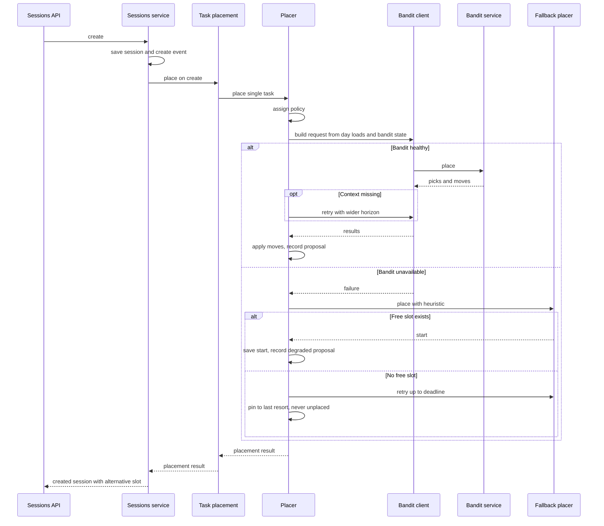
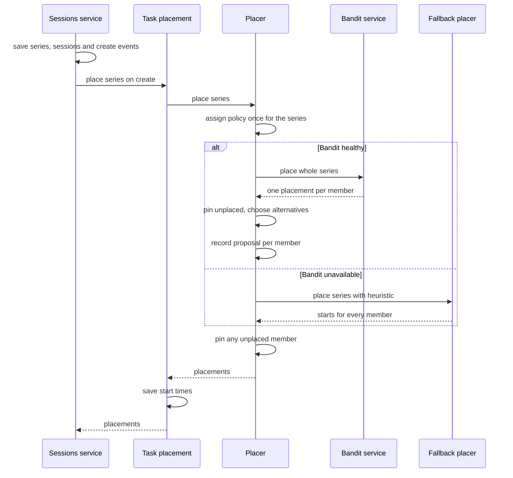
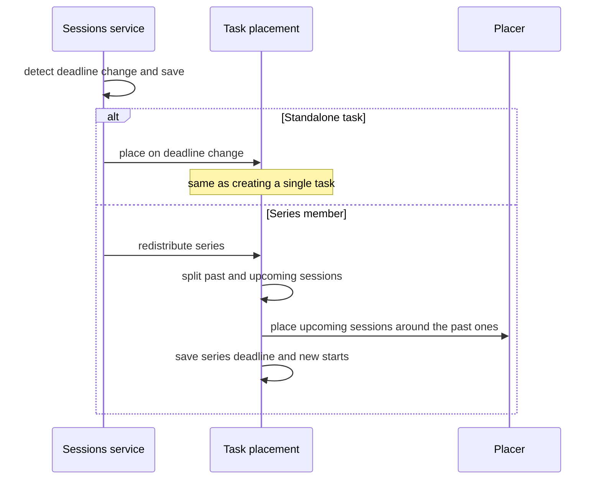
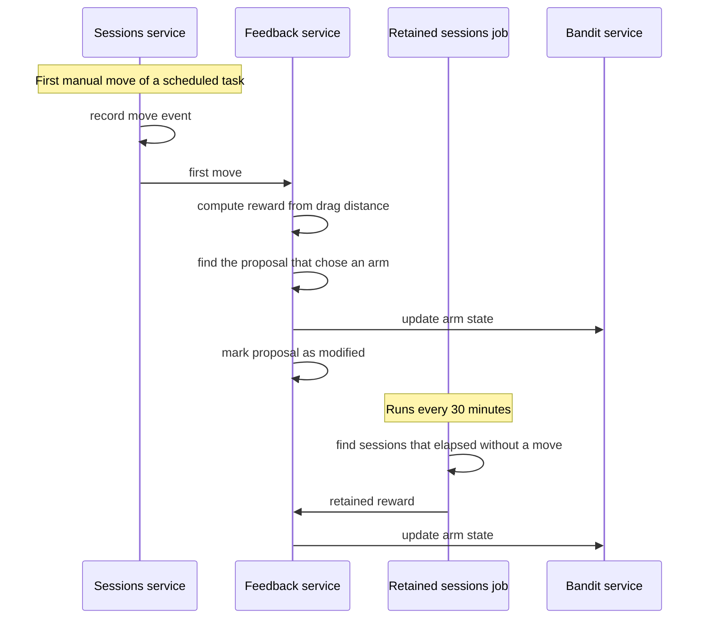
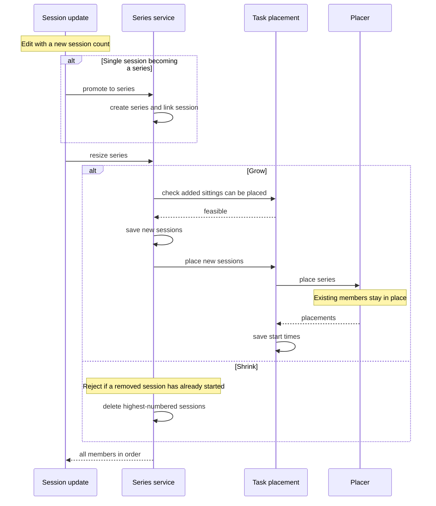

# Scheduler sequence flows

Companion to [ARCHITECTURE.md](../../ARCHITECTURE.md), which has the component-level
picture; this one has the call sequences. See
[docs/backend/scheduler.md](../backend/scheduler.md) for the file map and
[ADR-0003](../adr/0003-python-authoritative-placement.md) for why ranking lives in Python.

## Create a single task

A pairwise-sampled event also carries an alternative slot, which the client can offer as a
pick. See [docs/scheduler/ab-testing.md](../scheduler/ab-testing.md).

## Create a task series

A series is one A/B event. The policy is assigned once for the whole series. On a sampled
series the Bandit service runs two independent plans and the API offers a bounded set of
non-overlapping sittings as swaps. A swap is rejected if a sibling has since taken the slot.

## Deadline edit and redistribute

## Delayed reward

## Resize or promote a series

