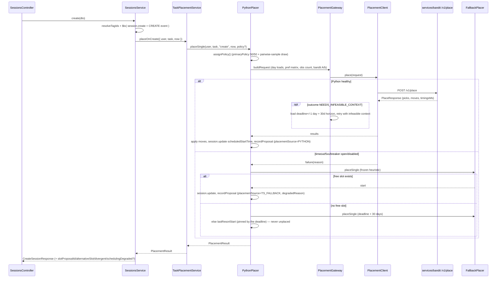

# Scheduler sequence flows

Companion to [ARCHITECTURE.md](../../ARCHITECTURE.md) — that doc has the component-level
picture; this one has the call sequences. See
[backend/README.md](../../backend/README.md) for the module map and
[ADR-0003](../adr/0003-python-authoritative-placement.md) for why ranking lives in Python.

## Create a single `TASK`



A pairwise-sampled event's `alternativeSlot`/`divergent` let the client offer a pick via
`POST /sessions/:id/slot-pick` — see [docs/scheduler/ab-testing.md](../scheduler/ab-testing.md).

## Create a `TASK` series (`sessionCount > 1`)

```mermaid
sequenceDiagram
  participant S as SessionsService.createTaskSeries
  participant T as TaskPlacementService
  participant P as PythonPlacer
  participant PY as services/bandit /v1/place
  participant FB as FallbackPlacer
  S->>S: $tx( sessionSeries.create + N× session.create + N× CREATE event )
  S->>T: placeSeriesOnCreate({ seriesId, members, deadline })
  T->>P: placeSeries({ members, deadline, trigger: "create" })
  P->>P: assignPolicy() ONCE for the series (shared primaryPolicy + seed)
  P->>PY: POST /v1/place (members.length > 1 = one materialized series, sibling ledger server-side; computeBoth = sampled)
  alt Python healthy
    PY-->>P: one PlacedMember per member (sampled: primary plan + other plan's pick)
    P->>P: pinUnplaced, selectSeriesAlternatives (≤ MAX_SERIES_ALTERNATIVES)
    P->>P: recordProposal per member (placementSource=PYTHON, pairwiseShown on shown ones)
  else degraded
    P->>FB: placeSeries (frozen loop — seriesDayWindows, then spillover; siblings, day cap)
    FB-->>P: rows[] (null start = no slot anywhere)
  end
  P->>P: pinUnplaced (lastResortStart, back-to-back) — no null rows
  P-->>T: rows[]
  T->>T: $tx( session.update scheduledStartTime for every row )
  T-->>S: rows[]
```

A series is one A/B event (issue #58): one `assignPolicy()` roll for the whole series, and
on a sampled series Python runs two full independent series plans and Nest
(`scheduler/io/series-alternatives.ts`, a pure filter) picks up to `MAX_SERIES_ALTERNATIVES`
(5) non-overlapping sittings to offer as swaps via `POST /sessions/:id/slot-pick`, which
answers `409 SLOT_TAKEN` if the alternative has since been taken by a sibling.

## Deadline edit → redistribute

```mermaid
sequenceDiagram
  participant S as SessionsService.update
  participant T as TaskPlacementService
  participant P as PythonPlacer
  S->>S: $tx( applyFieldDiff detects newDeadline → session.update )
  alt standalone TASK
    S->>T: placeOnDeadlineChange({ task, now })
    Note over T: identical to Flow 1, trigger "deadline-change"
  else TASK series member
    S->>T: redistributeSeries({ seriesId, members, newDeadline })
    T->>T: partition past / upcoming;  past → fixedOccupied
    T->>P: placeSeries(upcoming, fixedOccupied, trigger "deadline-change")
    T->>T: $tx( sessionSeries.deadline + session.updateMany deadline + upcoming starts )
  end
```

## Delayed LinUCB reward

```mermaid
sequenceDiagram
  participant S as SessionsService.update / SlotPickService
  participant F as SchedulingFeedbackService
  participant R as RetainedSessionsService (@Cron)
  participant BA as Bandit (/update + BanditArmState)
  Note over S: first user MOVE of a scheduled TASK (a drag, or a slot-pick "alternative")
  S->>S: $tx( MOVE SessionEvent + lastMovedAt );  existing.lastMovedAt == null → firstMove
  S->>F: onFirstMove(userId, sessionId, moveEventId, dragMinutes)
  F->>F: applyDelayedReward(reward = dragDistanceReward(dragMinutes), modificationType = MOVE)
  F->>F: slotProposal.findFirst(primaryPolicy LINUCB, selectedArm != null)
  F->>BA: loadAll → /update(reward) → save → link event
  F->>F: firstModifiedAt still null? stamp firstModifiedAt/firstModificationType/acceptedWithoutModification=false
  Note over R: every 30 min
  R->>R: sweep — elapsed, never-moved USER TASK → RETAINED event (+1)
  R->>F: applyDelayedReward(SESSION_RETAINED_REWARD, modificationType = null)
  F->>BA: same loadAll → /update(+1) → save → link event
```

## Edit-mode `sessionCount` resize/promote

```mermaid
sequenceDiagram
  participant S as SessionUpdateService.update
  participant SR as SeriesService
  participant T as TaskPlacementService
  participant P as PythonPlacer
  Note over S: PATCH /sessions/:id with sessionCount
  alt no existing seriesId AND sessionCount > 1
    S->>SR: promoteToSeries(sessionId, deadline, user)
    SR->>SR: $tx( sessionSeries.create + session.update seriesId/sessionIndex=1/sessionTotal=1 )
  end
  S->>SR: resizeSessionCount(seriesId, targetCount, user, now)
  alt grow (targetCount > memberCount)
    SR->>T: canPlaceSeries({ sessionCount: added })  // pre-flight, added sittings only
    T-->>SR: feasible?
    SR->>SR: $tx( session.updateMany sessionTotal + N× session.create + N× CREATE event )
    SR->>T: placeSeriesOnCreate({ seriesId, members: newMembers, deadline })
    T->>P: placeSeries(trigger "create")
    Note over P: day-load naturally schedules around the already-persisted existing members
    P-->>T: rows[]
    T->>T: $tx( session.update scheduledStartTime for placed rows )
  else shrink (targetCount < memberCount)
    Note over SR: candidates = highest-sessionIndex members;<br/>any already started (scheduledStartTime ≤ now) → reject, write nothing
    SR->>SR: $tx( session.deleteMany + session.updateMany sessionTotal )
  end
  SR-->>S: every member, sessionIndex order
```
