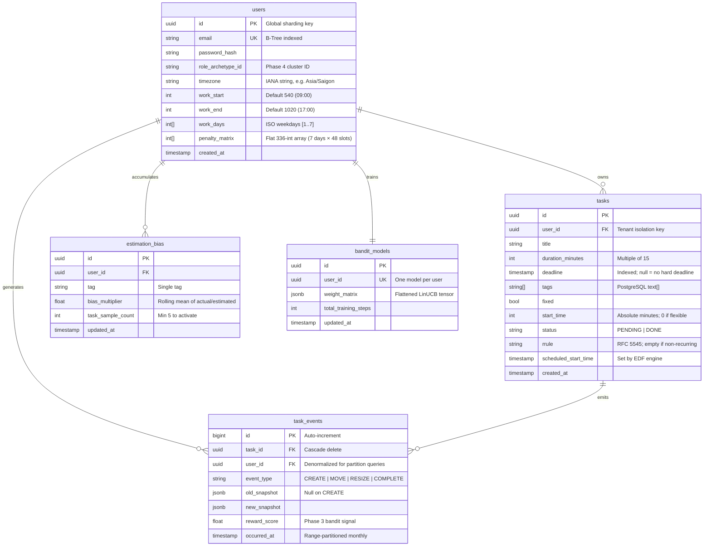

# Database Design

---

## Entity-Relationship Diagram



---

## Index Strategy

```sql
-- users
CREATE UNIQUE INDEX idx_users_email ON users(email);

-- tasks
CREATE INDEX idx_tasks_user_deadline ON tasks(user_id, deadline ASC NULLS LAST);
CREATE INDEX idx_tasks_user_status   ON tasks(user_id, status);
CREATE INDEX idx_tasks_user_scheduled ON tasks(user_id, scheduled_start_time);

-- task_events (partitioned table)
CREATE INDEX idx_events_user_time ON task_events(user_id, occurred_at DESC);
CREATE INDEX idx_events_task      ON task_events(task_id);

-- estimation_bias
CREATE UNIQUE INDEX idx_bias_user_tag ON estimation_bias(user_id, tag);
```

---

## Data Flow: End-to-End Example

### Input: Create a flexible task

```json
POST /tasks
{
  "title": "Index Refactor",
  "duration_minutes": 45,
  "deadline": "2026-06-02T17:00:00Z",
  "tags": ["backend", "critical"],
  "fixed": false,
  "rrule": ""
}
```

### Step 1: Bias blending (NestJS)

User constraints: `work_start: 540`, `work_end: 1020`, `timezone: "Asia/Saigon"`.  
Bias lookup: `#backend` → ×1.2, `#critical` → ×1.5. Max = ×1.5.  
Adjusted duration: `45 × 1.5 = 67.5` → rounded up → **75 minutes**.

### Step 2: Bandit prediction (Phase 3)

```json
POST http://bandit:8000/predict
{
  "user_id": "7f8e9d0c-...",
  "hours_to_deadline": 28.5,
  "current_day_load_hours": 3.0,
  "context_vector": [1, 28.5, 3.0, 1, 0, 1, 0]
}

Response:
{
  "recommended_start_time": "2026-06-01T09:15:00+07:00",
  "assigned_arm_index": 37
}
```

### Step 3: Atomic write

```json
tasks row:
{
  "duration_minutes": 75,
  "scheduled_start_time": "2026-06-01T09:15:00+07:00",
  "status": "PENDING"
}

task_events row:
{
  "event_type": "CREATE",
  "old_snapshot": null,
  "new_snapshot": { "scheduled_start_time": "2026-06-01T09:15:00+07:00", "duration_minutes": 75 },
  "reward_score": 1.0
}
```

### Step 4: User moves the task to 01:00 PM

```json
PATCH /tasks/:id/reschedule
{ "requested_start_time": "2026-06-01T13:00:00+07:00" }
```

System writes MOVE event:

```json
{
  "event_type": "MOVE",
  "old_snapshot": { "scheduled_start_time": "2026-06-01T09:15:00+07:00" },
  "new_snapshot":  { "scheduled_start_time": "2026-06-01T13:00:00+07:00" },
  "reward_score": 0.0
}
```

System increments `penalty_matrix[index_for_09:15_Monday]`.

### Step 5: Cascade realignment

"Index Refactor" at 01:00 PM collides with a fixed `Team Standup` (`fixed: true`, `start_time: 780`).  
Engine backs Index Refactor to the next open slot: **02:30 PM**.

```json
[
  { "title": "Team Standup", "fixed": true, "scheduled_start_time": "...13:00..." },
  { "title": "Index Refactor", "fixed": false, "scheduled_start_time": "...14:30..." }
]
```

---

## Penalty Matrix

A flat 336-integer array on the `users` row. Zero-indexed:

```
Array Index = (day × 48) + time_block
  day:        0=Mon … 6=Sun
  time_block: 0=00:00, 1=00:30 … 47=23:30
```

Sample heatmap (higher = user avoids this slot):

| Slot | Mon | Tue | Wed | Thu | Fri | Sat | Sun |
|---|---|---|---|---|---|---|---|
| 09:00 (idx 18) | 0 | 0 | 0 | 0 | 0 | 5 | 12 |
| 09:30 (idx 19) | 0 | 1 | 0 | 0 | 0 | 7 | 15 |
| 13:00 (idx 26) | 4 | 2 | 0 | 1 | 0 | 20 | 25 |
| 16:30 (idx 33) | 2 | 1 | 3 | 5 | **42** | 30 | 35 |

**Cost function (Phase 2):**
```
Score(slot) = urgency_weight × hours_to_deadline + penalty_matrix[slot_index]
```

---

## Partitioning

`task_events` is range-partitioned monthly by `occurred_at`:

```sql
CREATE TABLE task_events (
    ...
    occurred_at TIMESTAMP NOT NULL
) PARTITION BY RANGE (occurred_at);

CREATE TABLE task_events_2026_06 PARTITION OF task_events
    FOR VALUES FROM ('2026-06-01') TO ('2026-07-01');
```

Maintenance: A cron job creates next-month partitions on the 25th of each month. Partitions older than 24 months are archived to cold storage.
